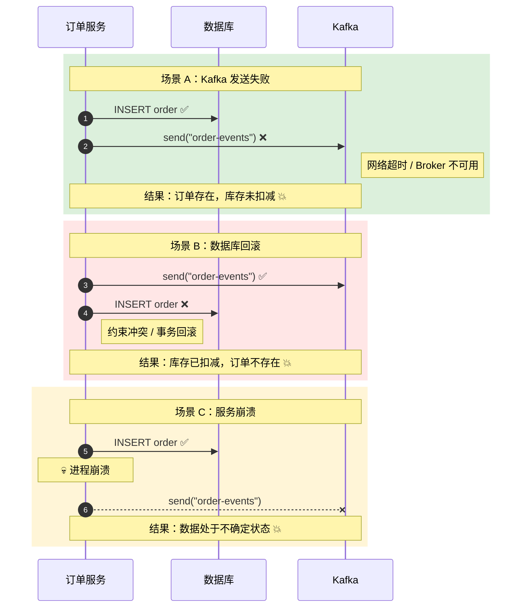
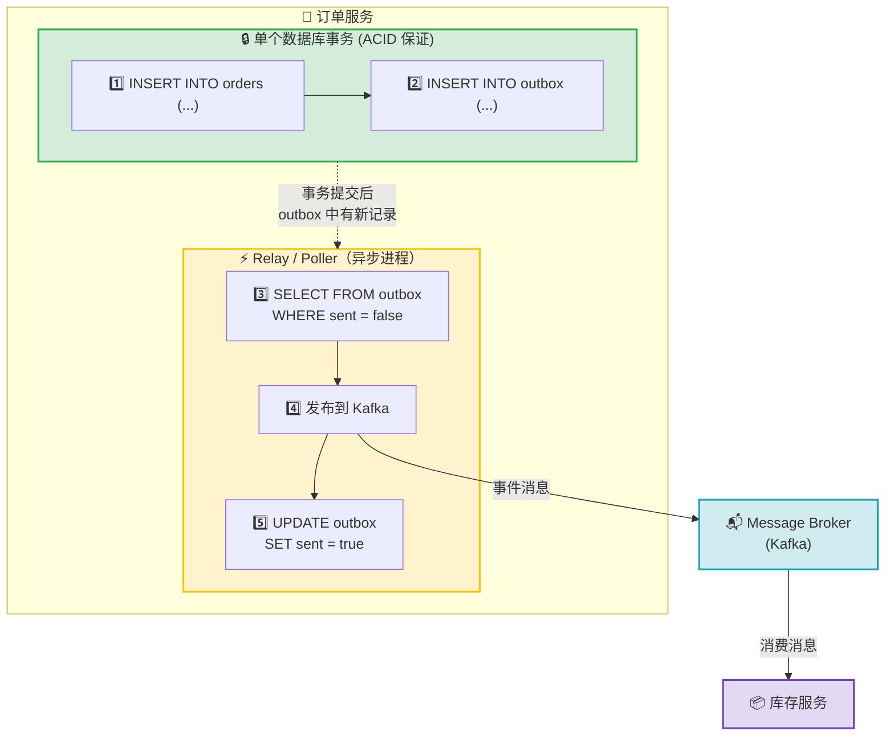
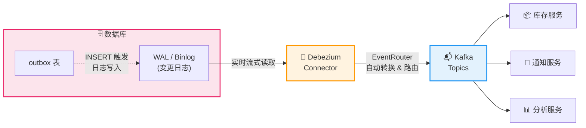
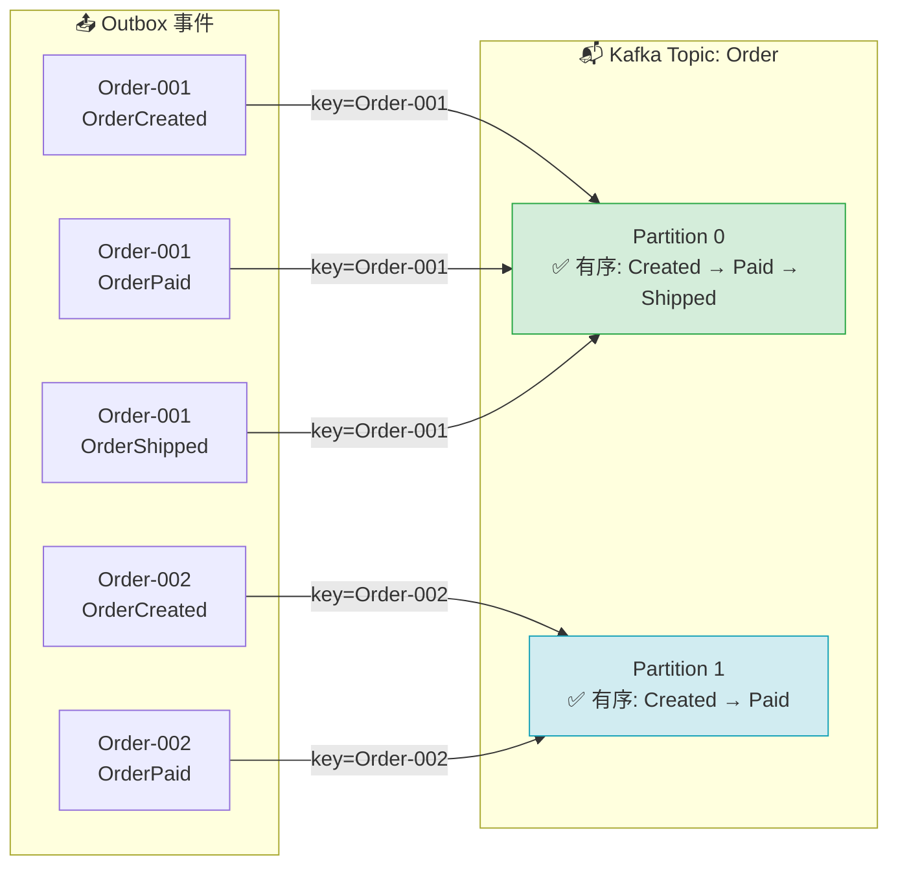
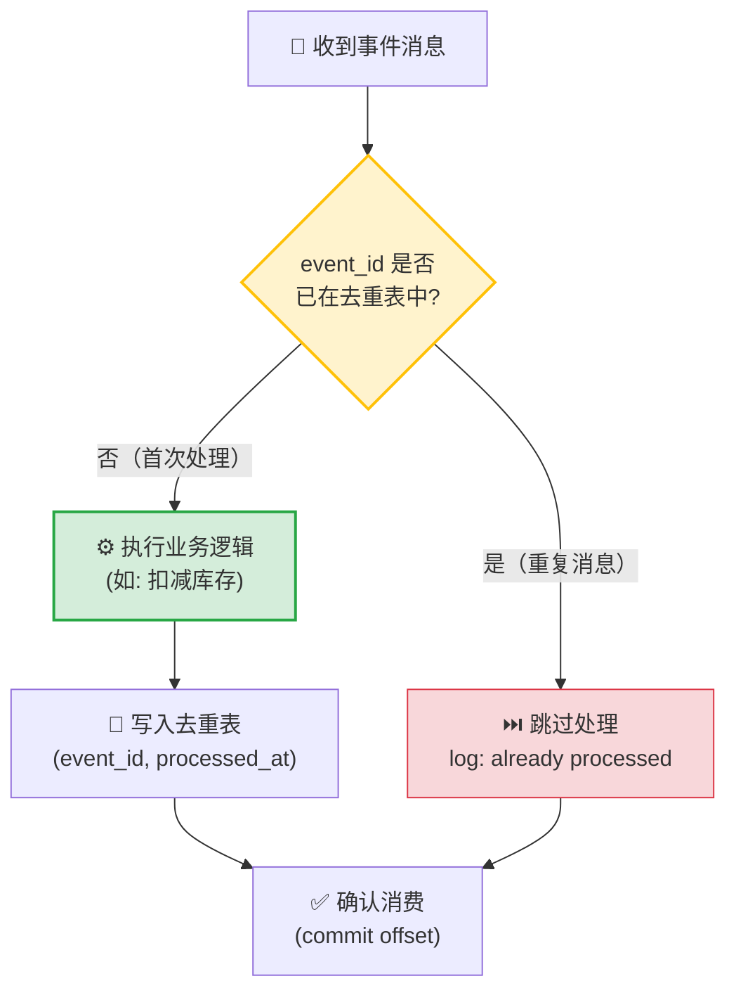
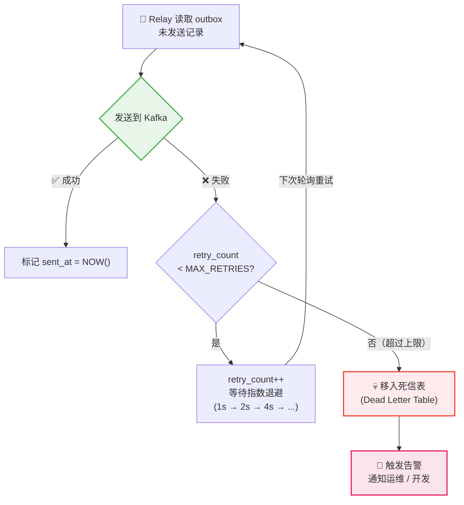
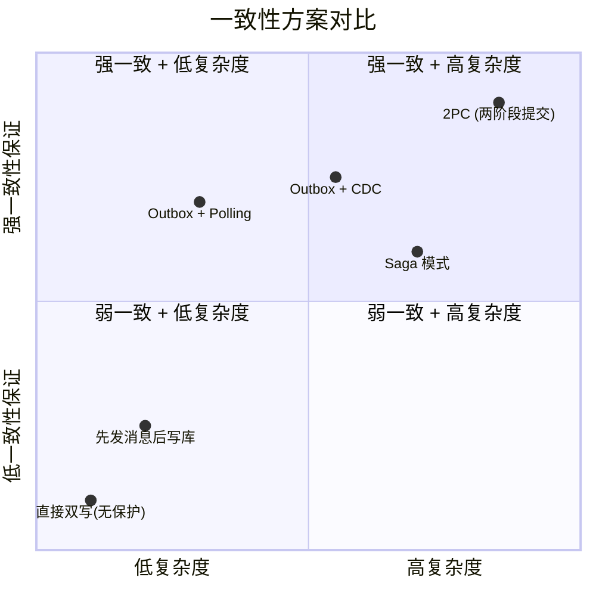
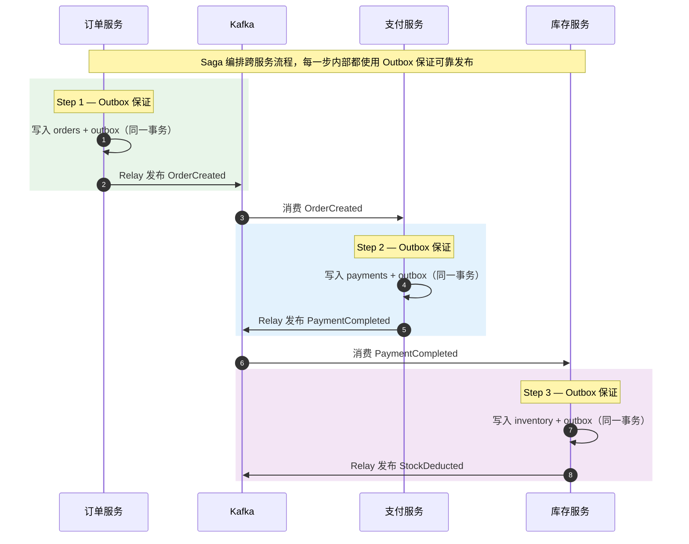

无论你是在准备系统设计面试，还是在生产环境中构建微服务架构，Outbox Pattern 都是你工具箱中不可或缺的一员。本文将从"为什么需要它"讲起，带你深入理解这一模式的原理、实现和最佳实践。

<!-- more -->

## 从一个真实的问题说起

假设你在构建一个电商系统。用户下单后，订单服务需要做两件事：

1. 将订单写入数据库
2. 发送一条消息到 Kafka，通知库存服务扣减库存

代码可能长这样：

```java
@Transactional
public void placeOrder(Order order) {
    orderRepository.save(order);           // Step 1: 写数据库
    kafkaProducer.send("order-events", order); // Step 2: 发消息
}
```

看起来很直观，对吧？但这里隐藏着一个经典的分布式系统陷阱——**双写问题（Dual Write Problem）**。

### 双写问题：到底会出什么错？

在分布式环境中，数据库和消息队列是两个独立的系统，它们无法参与同一个事务。这意味着：

- **场景 A**：数据库写入成功，但 Kafka 发送失败 → 订单已创建，但库存没有扣减。用户以为下单成功了，但库存数据不对。
- **场景 B**：Kafka 发送成功，但数据库写入失败（或事务回滚）→ 库存被扣减了，但订单根本不存在。
- **场景 C**：服务在两步之间崩溃 → 数据处于一种不确定的中间状态。

下面的时序图清晰地展示了这三种失败场景：



这不是理论上的"可能"——在高并发、网络抖动、服务重启的生产环境中，这些问题**必然**会发生。只是频率和影响大小的问题。

---

## Outbox Pattern：核心思想

Outbox Pattern 的核心思想非常优雅：**不要直接往消息队列发消息，而是把"要发的消息"当作数据的一部分，写进同一个数据库事务里。**

具体来说：

1. 在业务数据库中创建一张 `outbox` 表
2. 在同一个数据库事务中，既写业务数据，也往 `outbox` 表插入一条待发送的事件记录
3. 一个独立的进程（Relay/Poller）异步地从 `outbox` 表中读取未发送的记录，发布到消息队列
4. 发送成功后，标记该记录为已处理（或删除）



**为什么这解决了问题？** 因为业务数据和事件记录在同一个数据库事务中写入，要么一起成功，要么一起失败——不存在中间状态。消息的发送变成了异步且可重试的操作。

---

## Outbox 表设计

一个典型的 `outbox` 表结构如下：

```sql
CREATE TABLE outbox (
    id            UUID PRIMARY KEY DEFAULT gen_random_uuid(),
    aggregate_type VARCHAR(255) NOT NULL,   -- 聚合类型，如 'Order'
    aggregate_id   VARCHAR(255) NOT NULL,   -- 聚合 ID，如订单 ID
    event_type     VARCHAR(255) NOT NULL,   -- 事件类型，如 'OrderCreated'
    payload        JSONB NOT NULL,          -- 事件内容（JSON 格式）
    created_at     TIMESTAMP NOT NULL DEFAULT NOW(),
    sent_at        TIMESTAMP,               -- 发送时间，NULL 表示未发送
    retry_count    INT DEFAULT 0            -- 重试次数
);

CREATE INDEX idx_outbox_unsent ON outbox (created_at) WHERE sent_at IS NULL;
```

几个设计要点：

- **`aggregate_type` + `aggregate_id`**：借鉴 DDD 中的聚合概念，方便按业务实体查询和路由消息。在面试中提到这一点会给面试官留下很好的印象。
- **`payload` 使用 JSONB**：灵活且支持查询，适合存储不同类型的事件。
- **部分索引（Partial Index）**：只对未发送的记录建索引，读写性能最优。
- **`retry_count`**：用于实现退避策略（backoff），避免反复重试失败的消息。

---

## 两种实现方式

### 方式一：Polling Publisher（轮询模式）

最直观的实现方式——一个后台进程定期查询 `outbox` 表中未发送的记录，发送到消息队列。

```java
@Scheduled(fixedDelay = 1000) // 每秒执行
public void publishOutboxEvents() {
    List<OutboxEvent> events = outboxRepo.findUnsentEvents(BATCH_SIZE);

    for (OutboxEvent event : events) {
        try {
            kafkaProducer.send(event.getAggregateType(), event.getPayload());
            outboxRepo.markAsSent(event.getId());
        } catch (Exception e) {
            outboxRepo.incrementRetryCount(event.getId());
            log.warn("Failed to publish event {}: {}", event.getId(), e.getMessage());
        }
    }
}
```

**优点**：实现简单，容易理解和调试，不依赖特定数据库功能。

**缺点**：轮询间隔导致延迟（通常是秒级），频繁轮询可能对数据库造成压力。

**适用场景**：对实时性要求不高（秒级延迟可接受）、系统规模较小的情况。

### 方式二：Change Data Capture（CDC，变更数据捕获）

CDC 通过监听数据库的变更日志（如 MySQL 的 binlog、PostgreSQL 的 WAL）来捕获 `outbox` 表的插入操作，然后将变更事件发布到消息队列。

最常用的 CDC 工具是 **Debezium**，它可以作为 Kafka Connect 的 connector 运行。



**Debezium 配置示例（简化版）**：

```json
{
  "name": "outbox-connector",
  "config": {
    "connector.class": "io.debezium.connector.postgresql.PostgresConnector",
    "database.hostname": "db-host",
    "database.port": "5432",
    "database.dbname": "orderservice",
    "table.include.list": "public.outbox",
    "transforms": "outbox",
    "transforms.outbox.type": "io.debezium.transforms.outbox.EventRouter",
    "transforms.outbox.table.field.event.key": "aggregate_id",
    "transforms.outbox.table.field.event.type": "event_type",
    "transforms.outbox.table.field.event.payload": "payload",
    "transforms.outbox.route.by.field": "aggregate_type"
  }
}
```

Debezium 内置了一个专门的 `EventRouter` SMT（Single Message Transform），能自动将 outbox 表的记录转换为结构良好的 Kafka 消息，并根据 `aggregate_type` 路由到不同的 topic。

**优点**：近乎实时（毫秒级延迟）、对数据库压力小、不需要轮询。

**缺点**：引入了额外的基础设施依赖（Debezium + Kafka Connect），运维复杂度更高，需要对数据库 replication 有一定了解。

**适用场景**：对实时性要求高、系统规模较大、已有 Kafka 基础设施的团队。

---

## 面试重点：你需要讨论的关键问题

在系统设计面试中，仅仅说出"用 Outbox Pattern"是不够的。面试官期望你能深入讨论以下问题：

### 1. 消息的有序性保证

如果同一个订单有多个事件（创建 → 支付 → 发货），消费者需要按顺序处理。

**解决方案**：使用 `aggregate_id` 作为 Kafka 的 partition key。这样同一个聚合的所有事件都会进入同一个 partition，Kafka 保证 partition 内的消息有序。



```java
kafkaProducer.send(
    new ProducerRecord<>(topic, event.getAggregateId(), event.getPayload())
);
```

### 2. 幂等消费（Idempotent Consumer）

Outbox Pattern 保证了 **at-least-once** 的消息投递。这意味着消费者可能收到重复消息。消费者端必须实现幂等性。



常见做法：

- **消息去重表**：在消费者数据库中维护一张已处理消息 ID 的表，处理前先检查是否已处理过。
- **业务层幂等**：例如"扣减库存"可以通过乐观锁或条件更新来实现幂等（`UPDATE inventory SET stock = stock - 1 WHERE order_id != ?`）。

```java
@Transactional
public void handleOrderCreated(OrderEvent event) {
    // 检查是否已处理过
    if (processedEventRepo.existsById(event.getId())) {
        log.info("Event {} already processed, skipping", event.getId());
        return;
    }

    // 执行业务逻辑
    inventoryService.deductStock(event.getOrderId(), event.getItems());

    // 记录已处理
    processedEventRepo.save(new ProcessedEvent(event.getId()));
}
```

### 3. Outbox 表的清理策略

Outbox 表会不断增长，需要定期清理。

- **删除已发送的记录**：定时任务删除 `sent_at` 不为空且超过一定保留期的记录。
- **分区表**：按时间分区，直接 drop 旧分区，性能远好于 DELETE。
- **保留期**：建议保留 3-7 天，便于排查问题。

```sql
-- 清理 7 天前已发送的记录
DELETE FROM outbox WHERE sent_at IS NOT NULL AND sent_at < NOW() - INTERVAL '7 days';

-- 或者使用分区表（PostgreSQL）
CREATE TABLE outbox (
    ...
) PARTITION BY RANGE (created_at);

CREATE TABLE outbox_2025_01 PARTITION OF outbox
    FOR VALUES FROM ('2025-01-01') TO ('2025-02-01');
```

### 4. 失败处理与死信队列

当某条 outbox 记录反复发送失败时，需要避免它阻塞其他消息：

- 设置最大重试次数（如 10 次）
- 实现指数退避策略（1s → 2s → 4s → ...）
- 超过重试上限后，将记录移入死信表（Dead Letter Table），并触发告警



---

## Outbox Pattern vs 其他方案

面试中面试官可能会问你"为什么不用其他方案"，这里做一个对比：

下面这张图展示了 Outbox Pattern 与其他常见方案在一致性、性能和复杂度上的定位：



### 与分布式事务（2PC）的对比

两阶段提交（2PC）是经典的分布式事务协议，但在微服务场景中有明显缺陷：跨服务的协调器成为单点瓶颈，锁持有时间长，性能差，且并非所有中间件都支持 XA 协议。Outbox Pattern 基于最终一致性，性能好得多，也更适合微服务的去中心化理念。

### 与 Saga 模式的对比

Saga 和 Outbox 并不冲突——它们解决的问题层次不同。Saga 编排跨服务的业务事务（如下单流程涉及订单服务、支付服务、库存服务），而 Outbox 确保单个服务内的"状态变更 + 事件发布"是原子性的。在实际项目中，Saga 的每一步通常都会用 Outbox Pattern 来保证可靠的事件发布。



### 与先发消息再写库的对比

有些团队会尝试反过来——先发 Kafka 消息，再写数据库。这种方式的问题是：如果数据库写入失败，消息已经发出去了，且 Kafka 不支持回滚已发送的消息。Outbox Pattern 利用数据库事务的 ACID 特性，从根本上避免了这个问题。

---

## 生产环境的实践建议

### 1. 监控指标

在生产环境中，你需要关注以下指标：

- **Outbox 延迟**：从记录写入到成功发布的时间差
- **未发送记录数**：如果持续增长，说明消费速度跟不上
- **重试率**：反映消息队列或消费者的健康状况
- **死信记录数**：需要告警和人工介入

### 2. 性能优化

- **批量发送**：一次查询多条未发送记录，批量发布到 Kafka，减少数据库和网络开销
- **连接池调优**：Relay 进程的数据库连接池和 Kafka producer 配置需要根据吞吐量调整
- **outbox 表瘦身**：payload 存储大对象时，考虑只存引用（如 S3 URL），减小表体积

### 3. 多实例部署

当服务有多个实例时，需要避免多个 Relay 重复发送同一条消息：

- **悲观锁**：`SELECT ... FOR UPDATE SKIP LOCKED`（PostgreSQL），只有一个实例能获取到某条记录
- **分片处理**：每个实例处理不同范围的 `aggregate_id`
- **单 Leader 模式**：通过分布式锁（如 Redis 或 ZooKeeper）选举一个 Leader 来运行 Relay

```sql
-- PostgreSQL: 使用 SKIP LOCKED 实现无阻塞的并发消费
SELECT * FROM outbox
WHERE sent_at IS NULL
ORDER BY created_at
LIMIT 100
FOR UPDATE SKIP LOCKED;
```

---

## 一个完整的 Spring Boot 示例

最后，提供一个简化但完整的实现，帮你串联所有概念：

```java
// === 实体 ===
@Entity
@Table(name = "outbox")
public class OutboxEvent {
    @Id
    @GeneratedValue(strategy = GenerationType.UUID)
    private UUID id;

    private String aggregateType;
    private String aggregateId;
    private String eventType;

    @JdbcTypeCode(SqlTypes.JSON)
    private String payload;

    private Instant createdAt = Instant.now();
    private Instant sentAt;
    private int retryCount;
}

// === 业务服务 ===
@Service
public class OrderService {

    @Transactional  // 关键：单个事务同时写入两张表
    public Order placeOrder(CreateOrderRequest request) {
        // 1. 保存订单
        Order order = orderRepository.save(Order.from(request));

        // 2. 写入 Outbox（同一个事务！）
        OutboxEvent event = new OutboxEvent();
        event.setAggregateType("Order");
        event.setAggregateId(order.getId().toString());
        event.setEventType("OrderCreated");
        event.setPayload(objectMapper.writeValueAsString(order));
        outboxRepository.save(event);

        return order;
    }
}

// === 消息发布 Relay ===
@Component
public class OutboxRelay {

    @Scheduled(fixedDelay = 500)
    @Transactional
    public void publishPendingEvents() {
        List<OutboxEvent> events = outboxRepository
            .findUnsentEventsForUpdate(100); // SELECT ... FOR UPDATE SKIP LOCKED

        for (OutboxEvent event : events) {
            try {
                kafkaTemplate.send(
                    event.getAggregateType(),   // topic
                    event.getAggregateId(),     // key (保证有序)
                    event.getPayload()          // value
                ).get(5, TimeUnit.SECONDS);     // 同步等待确认

                event.setSentAt(Instant.now());
            } catch (Exception e) {
                event.setRetryCount(event.getRetryCount() + 1);
                if (event.getRetryCount() > MAX_RETRIES) {
                    moveToDeadLetter(event);
                }
            }
        }
    }
}
```

---

## 总结

Outbox Pattern 解决的是分布式系统中一个非常基础但关键的问题：**如何保证状态变更和事件发布的原子性**。

几个要记住的核心点：

- 双写问题是它存在的根本原因——数据库和消息队列无法共享事务
- 核心思想是"把消息写进数据库事务"，然后异步可靠地投递
- 两种实现方式：Polling（简单）和 CDC（高性能）
- 消费者端必须实现幂等，因为投递语义是 at-least-once
- 在面试中，讨论有序性、幂等性、清理策略和失败处理会让你脱颖而出
- 它与 Saga 互补而非互斥——Saga 编排跨服务事务，Outbox 保证单服务内的可靠事件发布

希望这篇文章能帮助你在面试中从容地讨论 Outbox Pattern，也能在实际工作中正确地应用它。如果你有任何问题或想进一步讨论某个方面，欢迎留言交流。
