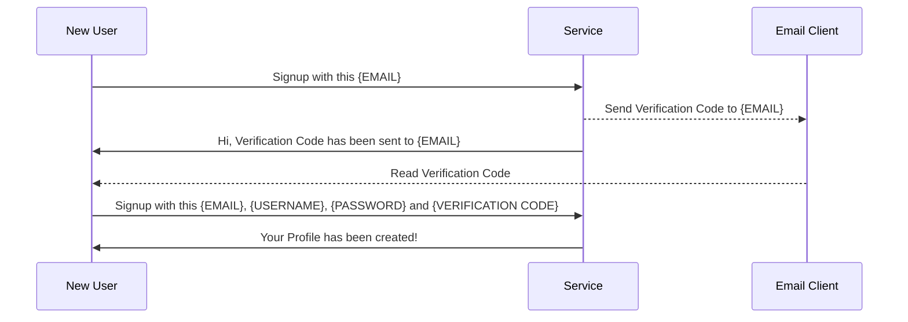

[SaltyNote](https://saltynote.com/) is a Chrome Extension that provides the immersive page notes taken experience.
The users can view all the notes taken on the current page from the right sidebar without leaving the page.

In this article, I will introduce the implementation of the SaltyNote service.

<!-- more -->
The Code base: https://github.com/SaltyNote/saltynote-service

### High Level Overview of the Service

## Implementation details

1. The service is implemented in Java 17 with SpringBoot V3 framework. (In case I need to migrate it to GraalVM Native
   Image in the future)
2. The Auth flow is implemented with Spring Security and JWT, and the whole service is stateless and no cookie or
   session are used, which means it can be horizontally scaled easily. For now, I only have one instance of the service,
   since I do not have much traffic yet.
3. The Auth model is based on **access token** and **refresh token**. The access token is short-lived(an hour or a
   single day, depending on your security level), and the refresh
   token is long-lived(month to year, maybe). You can use
   these [configurations](https://github.com/SaltyNote/saltynote-service/blob/6038ca5c3ad41ec621c454c979c0aadbafbab832/src/main/resources/application.properties#L30-L35)
   to set the TTL(The config here is for dev purpose, so I set them small). The access token is needed to access the
   protected resources(e.g. user's profile and their notes), and the refresh token is used to refresh the access
   token when access token expired.
4. The service provides 3 controllers for RESTful APIs:
    * **Public Controller**: The APIs in this controller are public, which means no authentication is needed. For now,
      it
      only provides the welcome API for health check.
    * **User Controller**: The APIs in this controller are used operations. For example, the user can register, login(
      request for access token and refresh token),
      change password, delete account, etc.
    * **Note Controller**: The APIs in this controller are used to manage the user's notes. For example, the user can
      create, update, delete, and get their notes(for a given url or all of them).

#### Notes

1. **Access token** is not persisted in the database nor in the Redis cache. In this case, user cannot revoke the access
   token. So if it is leaked, the attacker can access the data on
   behalf on the access token owner until it is expired. This is why we should have it short-lived. (*JWT contains user
   identity information in
   the JWT token payload. So once the server validates the access token(Not expired, and the signature is correct), it
   will allow the request.*)
2. Since user may log in frequently from different devices, instead to create a new refresh token anytime when user
   login, the service will re-use the refresh token if it still has 80% of its TTL.
3. **Refresh token** are stored in database, so if user feel their refresh token is leaked, they can delete it from the
   database, and the attacker cannot use it anymore.
4. For easily user information validation, JWT is also used for refresh token in this service, but it is not required.
   While JWT token can store used information in the payload, it could save me a lot of code for MVP. And I am not aware
   of any security issue for this. If you know any, please let me know.
5. To protect the service from batch user registration attack, a verification code is needed during signup flow, and the
   code will be sent to the user via email asynchronously by Application Event, with which they want to register. (The
   verification code can be stored in redis
   with TTL.) 

6. For Redis cache, if the cache object's schema has been changed, the de/serialization may fail. As a workaround, when
   the service is deployed, it will clean all cache before serving the traffic. (I know it is not a good solution, but
   since I am still actively developing the service, it benefits more. Once the service is stable, and the schema is
   finalized, the cache cleaning can be removed.)

## The Infrastructure

1. The service is deployed on a VPS with enough CPU cores and memory when traffic is low. And it is managed by
   systemd.
2. [GitHub Action](https://github.com/SaltyNote/saltynote-service/tree/master/.github/workflows) is used for CI/CD. The
   service is built and tested on every push to the main branch. And it will be
   deployed to the VPS manually for now. (It can be switched to automatically deploy if the build and test are passed.)
3. For load balancing, I use Nginx as the reverse proxy. And it is also configured to serve as
   the [rate limiter](https://github.com/SaltyNote/saltynote-service/blob/master/script/nginx-rate-limit.conf).
4. For Data Storage, the Mariadb(relational database) is used. Since the data model is simple for now, there are only 4
   main
   tables: `User`, `Note`, `Vault`, `Login History`. While, I may migrate it to NoSQL as mongodb in the future.
5. For performance concern, the Redis is used as the cache layer. The cache is used to cache the user profile, user's
   notes and vaults.