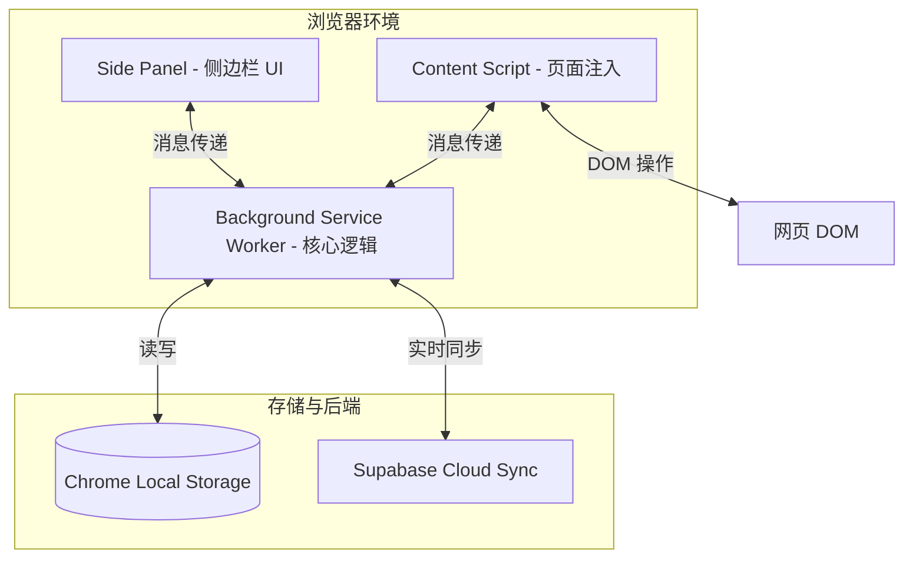
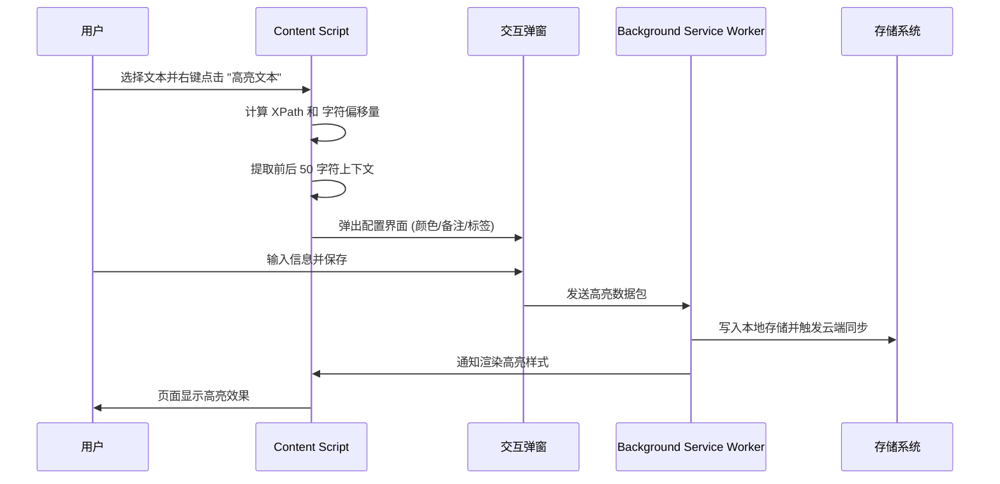
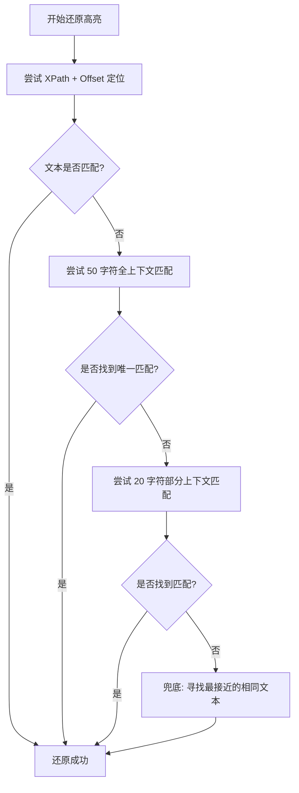

# 鲨雕高亮 (Shark Eagle Highlighter)：打造您的网页知识库

在信息爆炸的时代，我们每天都会在浏览器中阅读大量的文章、文档和教程。然而，网页内容往往是瞬态的，关闭标签页后，那些触动我们的文字便难以寻觅。为了解决这一痛点，我开发了 **鲨雕高亮 (Shark Eagle Highlighter)** —— 一款基于 Chrome Manifest V3 架构的开源网页高亮插件，旨在帮助用户持久化记录网页灵感，构建个人知识库。
<!-- more -->

## 什么是鲨雕高亮？

鲨雕高亮是一款功能强大的 Chrome 浏览器扩展，允许用户在任何网页上选择文本并进行高亮标注。与普通的高亮工具不同，它不仅能保存高亮内容，还能通过先进的定位算法确保在您下次访问该页面时，高亮内容能够精准还原。

## 核心功能特性

1.  **多色高亮标注**：提供五种精心挑选的颜色（黄色、红色、绿色、浅蓝色、浅紫色），满足不同维度的标注需求。
2.  **持久化存储**：所有高亮数据默认存储在本地，即使关闭浏览器或重启电脑，标注依然存在。
3.  **侧边栏管理**：通过 Chrome 侧边栏（Side Panel）集中展示当前页面的所有高亮，支持点击跳转、编辑备注和标签管理。
4.  **便捷操作**：支持右键菜单快速高亮，以及 Alt+点击 快速删除高亮（带确认提示）。
5.  **云端同步**：集成 Supabase 后端，支持跨设备实时同步，确保您的知识库在任何地方都能触手可及。

## 技术架构深度解析

鲨雕高亮采用了现代化的扩展开发框架 **WXT**，并使用 **TypeScript** 编写，确保了代码的可维护性和健壮性。

### 整体架构设计

插件由 Background Service Worker、Content Script 和 Side Panel 三大部分组成，通过消息机制进行高效协作。

### 高亮保存工作流

当用户在网页上选择文本并触发高亮时，插件会经历一系列复杂的处理流程，包括坐标计算、上下文提取和数据持久化。

## 核心技术：三层定位追踪策略

网页内容是动态变化的，简单的索引定位极易失效。鲨雕高亮采用了一套稳健的三层定位策略，确保高亮在各种复杂的 DOM 环境下都能精准还原。

1.  **主定位 (XPath + Offset)**：通过生成容器元素的唯一 XPath 路径，结合文本节点内的字符偏移量进行初步定位。
2.  **校验层 (Context Verification)**：在还原时，对比存储的文本内容与当前位置的文本。如果匹配失败，则进入回退机制。
3.  **回退匹配 (Fuzzy Matching)**：
    *   **全上下文匹配**：利用存储的前后各 50 个字符的上下文进行全文搜索。
    *   **部分上下文匹配**：如果全匹配失败，尝试使用前后各 20 个字符进行模糊匹配。
    *   **兜底方案**：寻找页面中所有相同文本的出现位置，选择距离原始偏移量最近的一个。

## 云端同步与离线支持

为了满足多设备办公的需求，鲨雕高亮集成了 Supabase。

*   **实时同步**：利用 Supabase Realtime 功能，当您在一台电脑上添加高亮时，另一台登录了相同账号的设备会立即更新。
*   **离线优先**：插件采用离线优先的设计理念。在没有网络的情况下，高亮会先保存在本地，待网络恢复后自动同步到云端。
*   **安全性**：通过 Supabase Auth 进行身份验证，并利用 PostgreSQL 的行级安全策略 (RLS) 确保每个用户只能访问自己的数据。

## 如何开始使用？

1.  **安装**：从 [Chrome 应用商店](https://chromewebstore.google.com/detail/shark-eagle-highlighter/mlnadmkfclihckoajiinghfcpejeedan)下载并安装鲨雕高亮。
2.  **高亮**：在网页上选中感兴趣的文字，右键选择“高亮文本”。在弹出的窗口中，您可以选择颜色（黄、红、绿、蓝、紫），并添加备注或标签。
3.  **查看与管理**：点击浏览器右上角的插件图标打开侧边栏。在这里，您可以查看所有已保存的高亮，点击任何一条记录，页面将自动滚动到对应位置并伴有闪烁动画。
4.  **删除**：如果您想移除某个高亮，可以按住 Alt 键并点击该高亮区域，或者在侧边栏中点击删除按钮。
5.  **开启同步**：在侧边栏的“账号”选项卡中注册并登录，即可开启跨设备同步功能。

## 未来展望

鲨雕高亮目前仍处于快速迭代中。未来，计划引入更多强大的功能。

鲨雕高亮不仅是一个工具，更是您在数字阅读海洋中的导航仪。欢迎尝试并提出您的宝贵建议！

Github: https://github.com/SharkEagleUS/shark-eagle-highlighter

