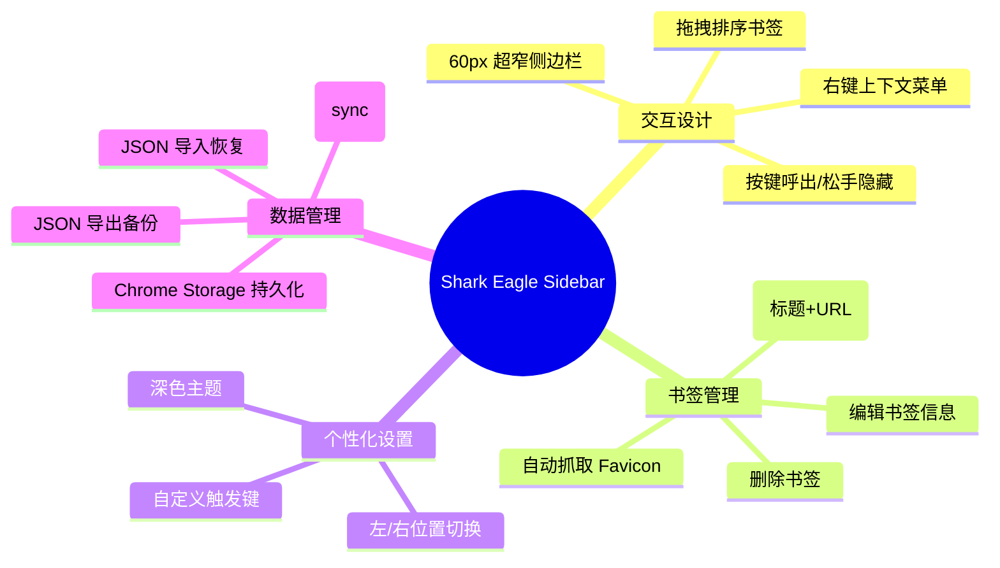
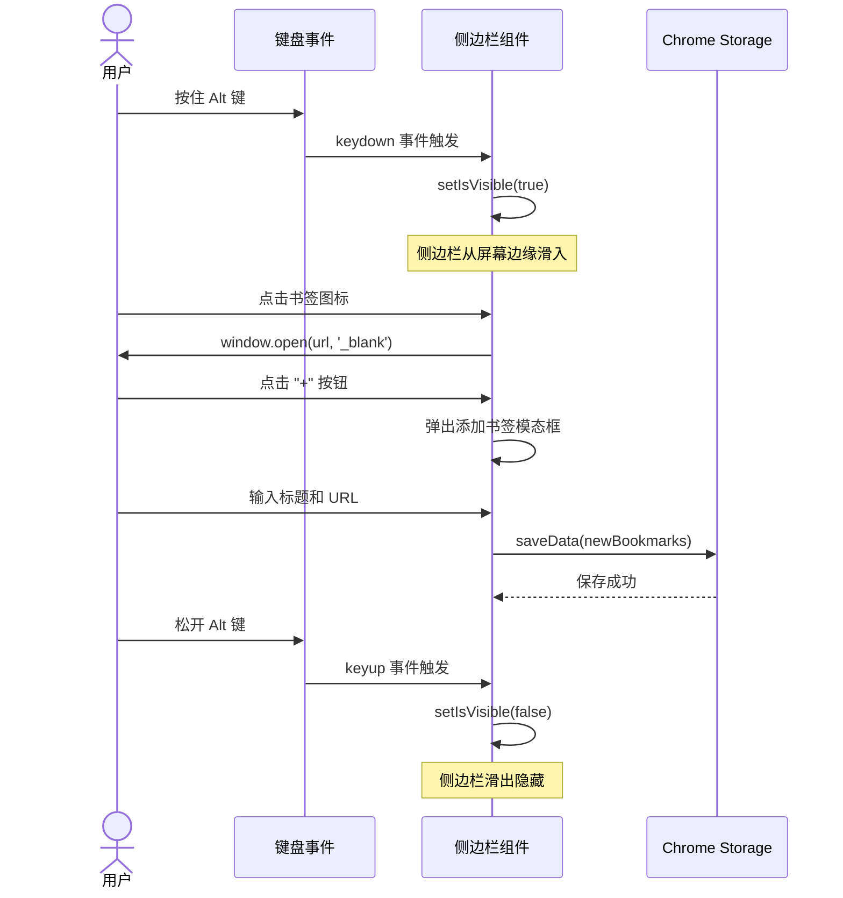
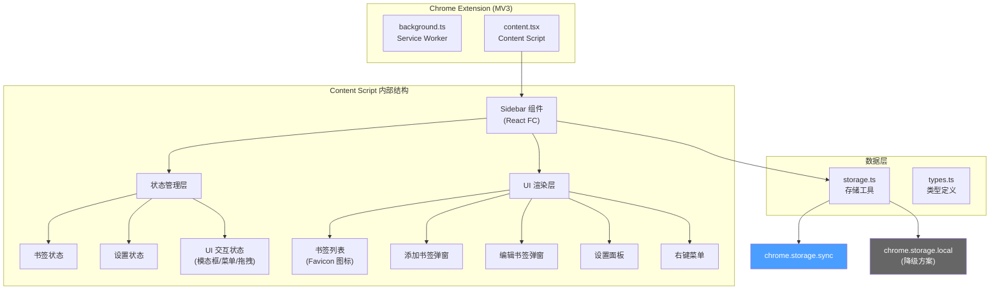
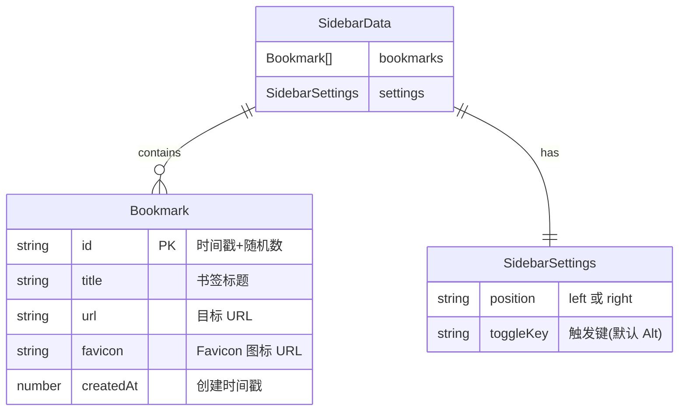
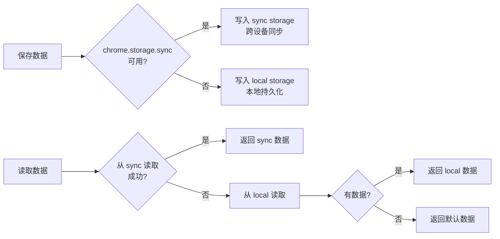
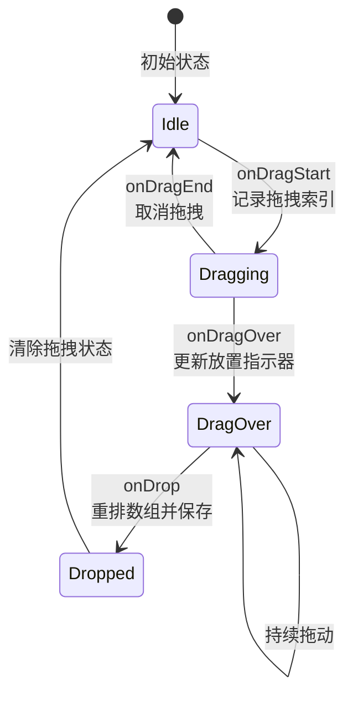
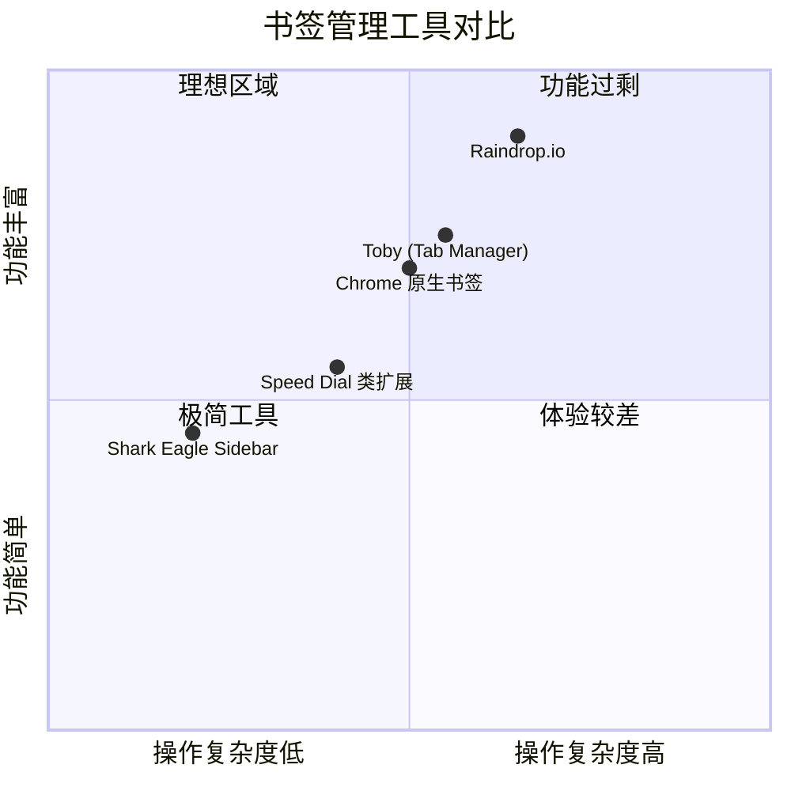

浏览器自带的书签管理器臃肿、层级深、操作繁琐。你只是想快速打开几个常用网站，却要经历 "点击书签栏 → 展开文件夹 → 找到目标" 这三步曲。**[Shark Eagle Sidebar(鲨雕侧边栏)](https://chromewebstore.google.com/detail/shark-eagle-sidebar/afglnkmlbipmcepinaodkjifnajlmmka)** 的答案很简单：一个 60px 宽的侧边栏，按住 Alt 键呼出，松手即隐——就像桌面 Dock 一样自然。
<!-- more -->

这是我自己开发的一个 Chrome Extension，我讲将从用户体验、技术架构和核心实现三个维度简单介绍一下。

## 核心功能一览



与传统书签管理器不同，Shark Eagle Sidebar 追求的是**零干扰**——它不会占据你的屏幕空间，只在你需要时出现。

## 用户交互流程

一个典型的使用场景如下：



这种 **"按住显示，松手隐藏"** 的交互模式是 Shark Eagle Sidebar 的灵魂。它不需要你记住复杂的快捷键组合，不需要点击工具栏图标，只需要一个手指就能完成所有操作。

## 技术架构

### 技术栈

Shark Eagle Sidebar 采用了现代化的浏览器扩展开发方案：

| 层级 | 技术选型 | 选型理由 |
|------|---------|---------|
| 框架 | [WXT](https://wxt.dev/) | 下一代浏览器扩展框架，内置 HMR |
| UI | React 18 + TypeScript | 类型安全的声明式 UI |
| 构建 | Vite (via WXT) | 极速开发体验 |
| 样式 | Inline CSS-in-JS | 零外部依赖，无 CSS 冲突 |
| 存储 | Chrome Storage API | 原生同步，跨设备支持 |

### 架构设计



整个扩展的架构极为精简——**没有 popup 页面、没有 options 页面、没有额外的 CSS 文件**。所有 UI 都通过 Content Script 直接注入到当前网页中，作为一个 React 组件树渲染。

### 数据模型



数据结构扁平且直观。`SidebarData` 作为唯一的顶层数据对象，包含书签数组和设置信息，整体序列化后存入 Chrome Storage。

## 关键实现细节

### 存储策略：sync 优先，local 降级



这套降级机制确保了数据在任何环境下都不会丢失。当 `chrome.storage.sync` 不可用时（例如用户未登录 Chrome 账户），自动回退到本地存储。

### Favicon 自动获取

每当用户添加或编辑书签时，扩展会自动通过 Google 的 Favicon 服务获取网站图标：

```
https://www.google.com/s2/favicons?domain={domain}&sz=32
```

这意味着用户不需要手动上传图标——添加 URL 后，对应网站的 Favicon 会自动出现在侧边栏中。

### 拖拽排序

书签列表支持原生 HTML5 Drag & Drop API 实现的拖拽排序。拖拽过程中通过视觉反馈（透明度变化、蓝色边框指示器）告诉用户书签将被放置的位置，松手后自动更新顺序并持久化到 Storage。



### 样式隔离策略

作为 Content Script，Shark Eagle Sidebar 的 CSS 必须与宿主页面完全隔离。项目选择了 **Inline CSS-in-JS** 方案——所有样式都以 `React.CSSProperties` 对象的形式内联到组件中。这意味着：

- 不会被宿主页面的全局 CSS 污染
- 不需要 CSS Modules 或 Shadow DOM 的额外复杂度
- 打包体积极小，零外部样式依赖

唯一的代价是 `z-index: 2147483647`（32 位整数最大值），确保侧边栏始终浮于页面最顶层。

## 与同类产品的对比



Shark Eagle Sidebar 定位于**极简高效**象限——功能克制但操作成本极低，适合那些只需要快速访问 10-20 个常用网站的用户。

## 开发与安装

### 本地开发

```bash
git clone https://github.com/SharkEagleUS/shark-eagle-sidebar.git
cd shark-eagle-sidebar
pnpm install
pnpm dev          # 启动开发服务器，支持 HMR
```

开发模式下，WXT 会自动在 `.output/chrome-mv3` 目录生成可加载的扩展文件。在 Chrome 中打开 `chrome://extensions/`，启用开发者模式并加载该目录即可。

### 生产构建

```bash
pnpm build        # 构建生产版本
pnpm zip          # 打包为可分发的 zip 文件
```

整个项目依赖极少（仅 React 18 + WXT），构建产物轻量且快速。

## 写在最后
如果你也厌倦了臃肿的书签管理器，不妨试试这个只有 60 像素宽的小工具。

*项目地址: [github.com/SharkEagleUS/shark-eagle-sidebar](https://github.com/SharkEagleUS/shark-eagle-sidebar) | 基于 MIT 协议开源*
