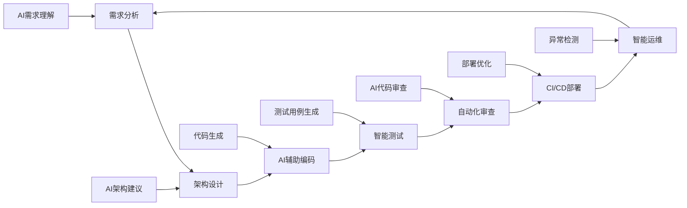

2025年标志着AI代码生成工具进入全面成熟期。据Checkmarx即将发布的全球调查显示，近70%的企业估计其2024年超过40%的代码由AI生成，Stack Overflow 2024年开发者调查则显示，76%的开发者已在日常工作中使用AI工具[1]。这场由GitHub Copilot开启、Cursor和Codeium等后起之秀加速推进的技术革命，正在从根本上重塑现代软件开发的理念和实践。
<!-- more -->

从最初的智能代码补全到如今的全栈应用生成，AI代码工具经历了三代演进：第一代专注于简单的语法补全，第二代实现了上下文感知的代码生成，而当前的第三代已具备理解项目架构、生成复杂业务逻辑甚至自动化测试的能力。这不仅是工具的升级，更是开发范式的根本性转变——从"人写代码"向"人指导AI写代码"的模式转换。

然而，这场革命并非没有挑战。安全性、代码质量、开发者技能变化、企业治理等问题日益突出。本文将深入剖析主流AI代码生成工具的技术原理、对比其特性优劣，并提供企业级部署的完整指南，帮助技术管理者和高级开发者在AI原生时代构建更高效、更安全的开发体系。

## 一、AI代码生成工具的技术原理和演进历史

### 1.1 技术基础：从Transformer到专用代码模型

AI代码生成的核心技术基于Transformer架构的大语言模型（LLM）。这些模型通过在大规模代码库上进行预训练，学习编程语言的语法规则、编程模式和最佳实践。与通用文本生成不同，代码生成模型需要理解编程语言的严格语法约束、变量作用域、函数调用关系以及复杂的程序控制流。

**技术演进路径**：

- **2020年：GPT-3时代启蒙**：OpenAI发布GPT-3，首次展示了大模型在代码生成方面的潜力，但准确性和实用性有限。

- **2021年：Codex专业化**：OpenAI基于GPT-3开发Codex，专门针对代码生成进行优化，成为GitHub Copilot的核心引擎。

- **2022年：生态爆发**：Amazon CodeWhisperer、Tabnine、Codeium等竞品涌现，代码生成从概念验证转向商业应用。

- **2023年：上下文革命**：模型上下文窗口显著扩大，从2K tokens扩展到8K-32K tokens，实现项目级代码理解。

- **2024年：多模态整合**：集成自然语言对话、代码审查、测试生成、文档写作等多种能力。

- **2025年：企业级成熟**：工具链集成、安全治理、ROI量化等企业级特性日趋完善。

### 1.2 核心技术机制

**自回归生成**：基于前文上下文预测下一个token（词元），通过概率分布选择最可能的代码片段。

**注意力机制**：模型能够关注到代码中的关键信息，如变量定义、函数签名、依赖关系等。

**上下文学习**：利用Few-shot和In-context Learning技术，根据当前文件和项目结构提供个性化建议。

**代码理解**：不仅生成语法正确的代码，还能理解程序意图、遵循编码规范、保持风格一致性。

```python
# 示例：AI理解的代码生成过程
class AICodeGenerator:
    def __init__(self, model_name="codegen-350M"):
        self.model = load_model(model_name)
        self.context_window = 8192
    
    def generate_code(self, prompt, context):
        # 1. 上下文编码
        encoded_context = self.encode_context(context)
        
        # 2. 注意力计算
        attention_weights = self.model.attention(prompt + encoded_context)
        
        # 3. 概率分布生成
        token_probs = self.model.forward(attention_weights)
        
        # 4. 解码输出
        generated_code = self.decode_tokens(token_probs)
        
        return generated_code
    
    def encode_context(self, context):
        """编码项目上下文：文件结构、API定义、编码风格"""
        return {
            'file_structure': context.get('files'),
            'api_definitions': context.get('apis'), 
            'coding_style': context.get('style_guide'),
            'dependencies': context.get('imports')
        }
```

### 1.3 演进趋势分析

**模型规模持续扩大**：从早期的1B参数发展到当前的340B+参数规模，代码理解和生成能力显著提升。

**专业化分工明确**：通用代码生成、特定语言优化、特定框架支持等不同定位的模型并存。

**多模态融合深化**：结合自然语言、代码、图表、架构图等多种输入形式。

**实时交互增强**：从批量生成转向实时对话式编程体验。

## 二、主流工具深度对比：GitHub Copilot vs Cursor vs Codeium vs Amazon CodeWhisperer

### 2.1 GitHub Copilot：行业标杆的成熟选择

**技术特色**：基于OpenAI Codex模型，拥有最大的训练数据集（包括GitHub上数百万公开代码库）。

**核心优势**：
- **广泛集成**：支持VS Code、IntelliJ IDEA、Vim、Neovim等主流IDE
- **语言覆盖**：支持数十种编程语言，Python、JavaScript、TypeScript表现最佳
- **企业级功能**：Copilot Business提供使用分析、安全策略、管理控制等企业特性
- **稳定可靠**：经过大规模用户验证，代码建议准确性和稳定性较高

**性能表现**：
- 代码补全准确率：约37%的建议被开发者接受
- 开发效率提升：平均26%，初级开发者可达40%
- 响应延迟：通常在100-300ms内提供建议

```javascript
// GitHub Copilot 集成示例
const { Copilot } = require('@github/copilot-node');

class CopilotIntegration {
    constructor(apiKey) {
        this.copilot = new Copilot({
            apiKey: apiKey,
            model: 'copilot-codegen'
        });
    }
    
    async getCodeSuggestion(context, cursor_position) {
        try {
            const suggestion = await this.copilot.complete({
                prompt: context.substring(0, cursor_position),
                suffix: context.substring(cursor_position),
                language: context.language,
                max_tokens: 150
            });
            
            return suggestion.choices[0].text;
        } catch (error) {
            console.error('Copilot API error:', error);
            return null;
        }
    }
}
```

**价格策略**：
- Individual: $10/月
- Business: $19/用户/月
- Enterprise: 定制价格

### 2.2 Cursor：面向AI原生开发的新范式

**技术特色**：专为AI辅助开发设计的完整IDE环境，集成Chat、Composer、Codebase等创新功能。

**核心优势**：
- **项目级理解**：能够理解整个代码库的架构和上下文关系
- **对话式编程**：Chat功能支持自然语言交互式开发
- **智能重构**：Composer功能能够进行大规模代码重构和架构调整
- **个性化学习**：根据开发者习惯和项目特点提供定制化建议

**创新特性**：
- **Codebase Chat**：与整个代码库对话，获取架构级别的解答
- **Auto-debug**：自动识别和修复bug，提供修复建议
- **Smart Rename**：智能重命名变量、函数，保证引用一致性
- **Context-aware Generation**：基于项目上下文生成高质量代码

```typescript
// Cursor API集成示例
interface CursorConfig {
    projectPath: string;
    apiKey: string;
    model: 'gpt-4' | 'claude-3' | 'custom';
}

class CursorIDE {
    private config: CursorConfig;
    
    constructor(config: CursorConfig) {
        this.config = config;
    }
    
    async chatWithCodebase(query: string): Promise<string> {
        const codebaseContext = await this.indexCodebase();
        
        const response = await fetch('/api/cursor/chat', {
            method: 'POST',
            headers: {
                'Authorization': `Bearer ${this.config.apiKey}`,
                'Content-Type': 'application/json'
            },
            body: JSON.stringify({
                query: query,
                context: codebaseContext,
                model: this.config.model
            })
        });
        
        return response.json();
    }
    
    async generateCode(prompt: string, file_path: string) {
        return await this.makeRequest('/api/cursor/generate', {
            prompt,
            file_path,
            project_context: await this.getProjectContext()
        });
    }
    
    private async indexCodebase(): Promise<any> {
        // 索引整个代码库，建立语义搜索能力
        return {
            files: await this.scanFiles(),
            dependencies: await this.analyzeDependencies(),
            architecture: await this.extractArchitecture()
        };
    }
}
```

**价格策略**：
- Free: 基础功能
- Pro: $20/月
- Business: $40/用户/月

### 2.3 Codeium：开源友好的高性价比选择

**技术特色**：提供免费个人版本，支持70+编程语言，专注于高质量代码补全。

**核心优势**：
- **完全免费**：个人使用完全免费，无使用限制
- **隐私友好**：支持本地部署，代码不离开企业环境
- **多语言支持**：支持Python、Java、JavaScript、C++等70+语言
- **快速响应**：优化的推理引擎，响应速度快

**技术架构**：
- 基于自研的代码理解模型
- 支持企业私有部署
- 提供API接口和多种集成方式

```python
# Codeium Python SDK 集成示例
from codeium import CodeiumClient
import asyncio

class CodeiumIntegration:
    def __init__(self, api_key: str):
        self.client = CodeiumClient(api_key=api_key)
    
    async def get_completions(self, 
                             code_context: str, 
                             cursor_position: int,
                             language: str = "python"):
        try:
            completions = await self.client.complete(
                text=code_context,
                cursor_position=cursor_position,
                language=language,
                max_results=3,
                timeout=5.0
            )
            
            return [comp.text for comp in completions.items]
        except Exception as e:
            print(f"Codeium completion error: {e}")
            return []
    
    async def explain_code(self, code_snippet: str):
        """使用Codeium解释代码功能"""
        return await self.client.explain(
            code=code_snippet,
            explanation_type="function"
        )
    
    def setup_enterprise_deployment(self, config: dict):
        """企业级部署配置"""
        return {
            'deployment_type': 'on_premise',
            'security_settings': {
                'data_retention': 'zero_retention',
                'encryption': 'end_to_end',
                'audit_logging': True
            },
            'performance_settings': {
                'max_concurrent_requests': config.get('max_requests', 100),
                'cache_size': config.get('cache_size', '10GB'),
                'gpu_acceleration': config.get('use_gpu', True)
            }
        }

# 企业级使用示例
async def enterprise_usage_example():
    codeium = CodeiumIntegration(api_key="your_enterprise_key")
    
    # 获取代码建议
    suggestions = await codeium.get_completions(
        code_context="""
        def calculate_fibonacci(n: int) -> int:
            if n <= 1:
                return n
            # 光标位置在此
        """,
        cursor_position=85
    )
    
    print("代码建议:", suggestions)
```

**价格策略**：
- Individual: 免费
- Teams: $12/用户/月
- Enterprise: 定制价格

### 2.4 Amazon CodeWhisperer（现Amazon Q Developer）：云原生的企业级选择

**技术特色**：深度集成AWS服务，专为云原生开发优化。

**核心优势**：
- **AWS集成**：深度集成AWS服务，自动生成云基础设施代码
- **安全扫描**：内置安全漏洞检测，符合企业安全标准
- **合规支持**：提供代码引用检测，确保许可证合规
- **多IDE支持**：支持VS Code、IntelliJ、AWS Cloud9等

**技术特性**：
- 基于Amazon Titan等自研模型
- 支持15+编程语言
- 企业级安全和合规功能

```python
# Amazon Q Developer (CodeWhisperer) 集成示例
import boto3
from typing import List, Dict, Optional

class AmazonQDeveloper:
    def __init__(self, aws_access_key: str, aws_secret_key: str, region: str = 'us-east-1'):
        self.client = boto3.client(
            'codewhisperer',
            aws_access_key_id=aws_access_key,
            aws_secret_access_key=aws_secret_key,
            region_name=region
        )
    
    def generate_code_suggestions(self, 
                                 file_context: str, 
                                 programming_language: str,
                                 max_results: int = 5) -> List[Dict]:
        """获取代码建议"""
        try:
            response = self.client.generate_recommendations(
                fileContext={
                    'filename': 'temp.py',
                    'programmingLanguage': {'languageName': programming_language},
                    'leftFileContent': file_context
                },
                maxResults=max_results
            )
            
            return response.get('recommendations', [])
        except Exception as e:
            print(f"CodeWhisperer API error: {e}")
            return []
    
    def scan_for_security_issues(self, code_content: str) -> Dict:
        """安全漏洞扫描"""
        try:
            response = self.client.create_code_scan(
                artifacts=[{
                    'sourceCode': code_content
                }]
            )
            
            scan_name = response['codeScanName']
            
            # 获取扫描结果
            results = self.client.get_code_scan(codeScanName=scan_name)
            
            return {
                'scan_status': results['status'],
                'findings': results.get('findings', []),
                'security_score': results.get('securityScore', 0)
            }
        except Exception as e:
            print(f"Security scan error: {e}")
            return {'error': str(e)}
    
    def generate_aws_infrastructure(self, requirements: str) -> str:
        """生成AWS基础设施代码"""
        prompt = f"""
        Generate AWS CloudFormation template for:
        {requirements}
        
        Include:
        - Best practices for security
        - Cost optimization
        - High availability setup
        """
        
        suggestions = self.generate_code_suggestions(prompt, 'yaml')
        
        if suggestions:
            return suggestions[0].get('content', '')
        return ""

# AWS集成使用示例
async def aws_integration_example():
    q_dev = AmazonQDeveloper(
        aws_access_key="your_key",
        aws_secret_key="your_secret"
    )
    
    # 生成Lambda函数
    lambda_code = q_dev.generate_aws_infrastructure("""
    A serverless API using:
    - API Gateway
    - Lambda function (Python)
    - DynamoDB table
    - CloudWatch logging
    """)
    
    # 安全扫描
    security_results = q_dev.scan_for_security_issues(lambda_code)
    
    print("Generated Infrastructure:", lambda_code)
    print("Security Scan:", security_results)
```

**价格策略**：
- Free Tier: 基础功能
- Pro: $19/用户/月
- Enterprise: 定制价格

### 2.5 工具对比矩阵

| 特性 | GitHub Copilot | Cursor | Codeium | Amazon Q Developer |
|------|----------------|--------|---------|-------------------|
| **代码质量** | ⭐⭐⭐⭐ | ⭐⭐⭐⭐⭐ | ⭐⭐⭐⭐ | ⭐⭐⭐⭐ |
| **响应速度** | ⭐⭐⭐⭐ | ⭐⭐⭐ | ⭐⭐⭐⭐⭐ | ⭐⭐⭐ |
| **项目理解** | ⭐⭐⭐ | ⭐⭐⭐⭐⭐ | ⭐⭐⭐ | ⭐⭐⭐⭐ |
| **多语言支持** | ⭐⭐⭐⭐⭐ | ⭐⭐⭐⭐ | ⭐⭐⭐⭐⭐ | ⭐⭐⭐⭐ |
| **企业功能** | ⭐⭐⭐⭐ | ⭐⭐⭐ | ⭐⭐⭐⭐⭐ | ⭐⭐⭐⭐⭐ |
| **价格友好** | ⭐⭐⭐ | ⭐⭐ | ⭐⭐⭐⭐⭐ | ⭐⭐⭐ |
| **安全特性** | ⭐⭐⭐⭐ | ⭐⭐⭐ | ⭐⭐⭐⭐⭐ | ⭐⭐⭐⭐⭐ |
| **IDE集成** | ⭐⭐⭐⭐⭐ | ⭐⭐⭐⭐⭐ | ⭐⭐⭐⭐ | ⭐⭐⭐⭐ |

### 2.6 选型建议

**GitHub Copilot适合**：
- 需要稳定可靠的代码补全
- 多IDE环境的团队
- 重视工具成熟度和用户基础

**Cursor适合**：
- 追求最新AI技术体验
- 需要项目级代码理解
- 愿意投入更高成本获得先进功能

**Codeium适合**：
- 成本敏感的团队
- 需要私有部署
- 重视数据隐私和安全

**Amazon Q Developer适合**：
- AWS重度用户
- 需要云原生开发支持
- 企业级安全和合规要求

## 三、AI驱动开发流程设计和团队合作模式

### 3.1 AI原生开发流程重构

传统的软件开发流程正在被AI工具重新定义。从需求分析到代码部署，每个环节都可以融入AI能力，形成"人机协作"的新模式。

**AI驱动的开发生命周期**：



**1. 需求到代码的AI转换流水线**：

```python
# AI驱动开发流程实现
class AIDevWorkflow:
    def __init__(self):
        self.requirement_analyzer = RequirementAnalyzer()
        self.architect = ArchitectureGenerator()
        self.code_generator = CodeGenerator()
        self.test_generator = TestGenerator()
        
    async def develop_feature(self, requirement: str) -> dict:
        """完整的AI驱动特性开发流程"""
        
        # 1. 需求分析和拆解
        analysis = await self.requirement_analyzer.analyze(requirement)
        
        # 2. 生成技术方案
        architecture = await self.architect.design_solution(analysis)
        
        # 3. 生成代码实现
        code_files = {}
        for component in architecture.components:
            code_files[component.name] = await self.code_generator.generate_code(
                specification=component.spec,
                context=architecture.context
            )
        
        # 4. 生成测试用例
        tests = {}
        for file_name, code in code_files.items():
            tests[f"test_{file_name}"] = await self.test_generator.create_tests(
                code=code,
                coverage_target=0.8
            )
        
        return {
            'requirement_analysis': analysis,
            'architecture': architecture,
            'implementation': code_files,
            'tests': tests,
            'estimated_completion_time': self._estimate_time(architecture)
        }
    
    def _estimate_time(self, architecture) -> str:
        # AI辅助时间估算
        complexity_score = architecture.complexity_analysis.score
        ai_acceleration_factor = 0.6  # AI工具平均提升60%效率
        
        base_time = complexity_score * 2  # 小时
        ai_adjusted_time = base_time * ai_acceleration_factor
        
        return f"{ai_adjusted_time:.1f} hours"

# 需求分析器实现
class RequirementAnalyzer:
    async def analyze(self, requirement: str) -> dict:
        """AI驱动的需求分析"""
        return {
            'functional_requirements': await self._extract_functions(requirement),
            'non_functional_requirements': await self._extract_nfrs(requirement),
            'technical_constraints': await self._identify_constraints(requirement),
            'suggested_architecture': await self._suggest_architecture(requirement),
            'risk_assessment': await self._assess_risks(requirement)
        }
    
    async def _extract_functions(self, requirement: str) -> list:
        """提取功能性需求"""
        prompt = f"""
        分析以下需求，提取所有功能性要求：
        
        需求：{requirement}
        
        请按照以下格式输出：
        - 功能名称：具体描述
        - 输入输出：明确接口
        - 业务规则：约束条件
        """
        
        # 调用AI API分析
        return await self.ai_client.analyze(prompt)
```

### 3.2 团队协作新模式：人机混合开发

**角色重新定义**：

- **AI协调师（AI Orchestrator）**：负责AI工具选择、提示工程优化、AI输出质量控制
- **架构审查师（Architecture Reviewer）**：专注于AI生成代码的架构合理性、可维护性评估  
- **安全验证师（Security Validator）**：确保AI生成代码的安全性、合规性
- **产品指挥官（Product Commander）**：通过自然语言指导AI完成复杂业务逻辑实现

**协作工作流程**：

```yaml
# AI团队协作配置
ai_team_workflow:
  roles:
    - name: "ai_orchestrator"
      responsibilities:
        - "AI工具配置和优化"
        - "提示工程和模板管理"  
        - "AI输出质量监控"
      tools: ["cursor", "copilot", "custom_prompts"]
      
    - name: "architecture_reviewer"
      responsibilities:
        - "代码架构评估"
        - "设计模式验证"
        - "可维护性分析"
      tools: ["sonarqube", "architecture_scanner", "ai_reviewer"]
      
    - name: "security_validator"  
      responsibilities:
        - "安全漏洞检测"
        - "合规性验证"
        - "隐私保护审查"
      tools: ["checkmarx", "veracode", "ai_security_scanner"]
  
  workflow_stages:
    1. "需求输入和AI分析"
    2. "多AI工具并行生成"
    3. "人工筛选和优化"
    4. "架构和安全审查" 
    5. "集成测试和部署"
    
  collaboration_protocols:
    - "AI生成代码标记机制"
    - "人工审查必要性判断"
    - "质量门禁设置"
    - "反馈循环优化"
```

### 3.3 提示工程最佳实践

**企业级提示模板库**：

```python
# 企业级提示工程系统
class EnterprisePromptEngine:
    def __init__(self):
        self.templates = self._load_prompt_templates()
        self.context_manager = ContextManager()
        
    def _load_prompt_templates(self) -> dict:
        return {
            'api_generation': {
                'template': """
                基于以下API规范生成Python FastAPI代码：
                
                业务域：{business_domain}
                API端点：{endpoints}  
                数据模型：{models}
                认证方式：{auth_type}
                
                要求：
                1. 遵循RESTful设计原则
                2. 包含完整的错误处理
                3. 添加适当的日志记录
                4. 使用Pydantic进行数据验证
                5. 包含API文档注释
                
                企业编码标准：
                - 使用type hints
                - 遵循PEP 8规范
                - 包含单元测试示例
                """,
                'variables': ['business_domain', 'endpoints', 'models', 'auth_type']
            },
            
            'database_schema': {
                'template': """
                为以下业务场景设计数据库模式：
                
                业务描述：{business_description}
                主要实体：{entities}
                业务规则：{business_rules}
                性能要求：{performance_requirements}
                
                设计要求：
                1. 遵循第三范式
                2. 考虑查询性能优化
                3. 包含适当的索引策略
                4. 考虑数据完整性约束
                5. 包含审计字段设计
                
                输出格式：
                - SQL DDL语句
                - ER图描述
                - 索引建议
                - 查询优化建议
                """,
                'variables': ['business_description', 'entities', 'business_rules', 'performance_requirements']
            },
            
            'test_generation': {
                'template': """
                为以下代码生成全面的测试用例：
                
                代码功能：{function_description}
                代码实现：
                ```{language}
                {code_content}
                ```
                
                测试要求：
                1. 单元测试覆盖率 > 80%
                2. 包含正常场景测试
                3. 包含边界条件测试  
                4. 包含异常情况测试
                5. 使用pytest框架
                6. 包含mock和fixture
                
                测试风格：
                - 使用AAA模式（Arrange, Act, Assert）
                - 测试函数命名清晰
                - 包含适当的测试文档
                """,
                'variables': ['function_description', 'language', 'code_content']
            }
        }
    
    async def generate_code(self, template_name: str, **variables) -> str:
        """使用模板生成代码"""
        template = self.templates.get(template_name)
        if not template:
            raise ValueError(f"Template {template_name} not found")
        
        # 验证所有必需变量
        missing_vars = set(template['variables']) - set(variables.keys())
        if missing_vars:
            raise ValueError(f"Missing variables: {missing_vars}")
        
        # 填充模板
        prompt = template['template'].format(**variables)
        
        # 添加企业上下文
        context = await self.context_manager.get_enterprise_context()
        enhanced_prompt = self._add_context(prompt, context)
        
        # 调用AI生成
        return await self.ai_client.generate(enhanced_prompt)
    
    def _add_context(self, prompt: str, context: dict) -> str:
        """添加企业上下文信息"""
        context_section = f"""
        企业上下文：
        - 技术栈：{context.get('tech_stack', 'Not specified')}
        - 编码规范：{context.get('coding_standards', 'Standard practices')}
        - 安全要求：{context.get('security_requirements', 'Basic security')}
        - 性能目标：{context.get('performance_targets', 'Standard performance')}
        
        ---
        """
        return context_section + prompt

# 使用示例
async def team_collaboration_example():
    prompt_engine = EnterprisePromptEngine()
    
    # API生成示例
    api_code = await prompt_engine.generate_code(
        'api_generation',
        business_domain='用户管理系统',
        endpoints=['GET /users', 'POST /users', 'PUT /users/{id}'],
        models=['User', 'UserProfile', 'UserSettings'],
        auth_type='JWT Bearer Token'
    )
    
    print("生成的API代码：", api_code)
```

### 3.4 知识管理和学习体系

**AI增强的知识库构建**：

```python
# AI驱动的企业知识管理系统
class AIKnowledgeManagement:
    def __init__(self):
        self.vector_db = VectorDatabase()
        self.code_analyzer = CodeAnalyzer()
        self.documentation_generator = DocumentationGenerator()
    
    async def index_codebase(self, repo_path: str):
        """智能索引代码库，构建知识图谱"""
        code_files = await self._scan_repository(repo_path)
        
        for file_path, content in code_files.items():
            # 代码理解和分析
            analysis = await self.code_analyzer.analyze(content)
            
            # 生成文档
            documentation = await self.documentation_generator.generate(
                code=content,
                analysis=analysis
            )
            
            # 向量化存储
            embedding = await self._generate_embedding(content + documentation)
            
            await self.vector_db.store(
                id=file_path,
                embedding=embedding,
                metadata={
                    'file_path': file_path,
                    'analysis': analysis,
                    'documentation': documentation,
                    'last_updated': datetime.now()
                }
            )
    
    async def query_knowledge(self, query: str) -> dict:
        """智能知识查询"""
        # 语义搜索相关代码
        relevant_code = await self.vector_db.similarity_search(
            query=query,
            top_k=5
        )
        
        # AI生成回答
        context = self._prepare_context(relevant_code)
        answer = await self.ai_client.generate_answer(
            question=query,
            context=context
        )
        
        return {
            'answer': answer,
            'relevant_files': [item['file_path'] for item in relevant_code],
            'confidence_score': self._calculate_confidence(relevant_code)
        }
    
    async def suggest_improvements(self, file_path: str) -> list:
        """AI驱动的代码改进建议"""
        file_content = await self._read_file(file_path)
        
        # 寻找相似的高质量代码示例
        similar_code = await self.vector_db.similarity_search(
            query=file_content,
            filters={'quality_score': {'$gt': 0.8}}
        )
        
        # 生成改进建议
        improvements = await self.ai_client.suggest_improvements(
            current_code=file_content,
            best_practices=similar_code
        )
        
        return improvements
```

## 四、代码生成与代码审查的最佳实践

### 4.1 AI代码生成质量保证体系

确保AI生成代码的质量需要建立系统性的质量保证体系，从生成到部署的每个环节都要有相应的检查机制。

**质量评估框架**：

```python
# AI代码质量评估系统
class AICodeQualityAssurance:
    def __init__(self):
        self.syntax_analyzer = SyntaxAnalyzer()
        self.logic_analyzer = LogicAnalyzer()  
        self.security_scanner = SecurityScanner()
        self.performance_analyzer = PerformanceAnalyzer()
        self.maintainability_checker = MaintainabilityChecker()
        
    async def evaluate_generated_code(self, code: str, context: dict) -> dict:
        """全面评估AI生成的代码质量"""
        
        results = {}
        
        # 1. 语法正确性检查
        results['syntax'] = await self.syntax_analyzer.check(code)
        
        # 2. 逻辑正确性分析
        results['logic'] = await self.logic_analyzer.analyze(
            code=code,
            expected_behavior=context.get('expected_behavior')
        )
        
        # 3. 安全性扫描
        results['security'] = await self.security_scanner.scan(code)
        
        # 4. 性能分析
        results['performance'] = await self.performance_analyzer.analyze(code)
        
        # 5. 可维护性检查
        results['maintainability'] = await self.maintainability_checker.check(code)
        
        # 6. 综合评分
        results['overall_score'] = self._calculate_overall_score(results)
        
        return results
    
    def _calculate_overall_score(self, results: dict) -> float:
        """计算综合质量分数"""
        weights = {
            'syntax': 0.2,
            'logic': 0.3, 
            'security': 0.25,
            'performance': 0.15,
            'maintainability': 0.1
        }
        
        total_score = 0
        for category, weight in weights.items():
            category_score = results.get(category, {}).get('score', 0)
            total_score += category_score * weight
            
        return total_score
    
    async def generate_improvement_suggestions(self, code: str, results: dict) -> list:
        """基于评估结果生成改进建议"""
        suggestions = []
        
        # 针对不同问题类型提供具体建议
        for category, result in results.items():
            if result.get('score', 1.0) < 0.7:  # 低于70分需要改进
                category_suggestions = await self._generate_category_suggestions(
                    category=category,
                    issues=result.get('issues', []),
                    code=code
                )
                suggestions.extend(category_suggestions)
        
        return suggestions

# 逻辑分析器实现
class LogicAnalyzer:
    async def analyze(self, code: str, expected_behavior: str = None) -> dict:
        """分析代码逻辑正确性"""
        
        issues = []
        
        # 1. 控制流分析
        control_flow_issues = await self._analyze_control_flow(code)
        issues.extend(control_flow_issues)
        
        # 2. 数据流分析  
        data_flow_issues = await self._analyze_data_flow(code)
        issues.extend(data_flow_issues)
        
        # 3. 边界条件检查
        boundary_issues = await self._check_boundary_conditions(code)
        issues.extend(boundary_issues)
        
        # 4. 异常处理分析
        exception_issues = await self._analyze_exception_handling(code)
        issues.extend(exception_issues)
        
        return {
            'score': self._calculate_logic_score(issues),
            'issues': issues,
            'suggestions': await self._generate_logic_suggestions(issues)
        }
    
    async def _analyze_control_flow(self, code: str) -> list:
        """控制流分析"""
        issues = []
        
        # 检查无限循环风险
        if "while True" in code and "break" not in code:
            issues.append({
                'type': 'infinite_loop_risk',
                'severity': 'high',
                'description': '发现可能的无限循环，缺少退出条件'
            })
        
        # 检查不可达代码
        unreachable_code = await self._detect_unreachable_code(code)
        if unreachable_code:
            issues.append({
                'type': 'unreachable_code',
                'severity': 'medium', 
                'description': f'发现不可达代码：{unreachable_code}'
            })
            
        return issues
```

### 4.2 智能代码审查系统

**AI增强的代码审查流程**：

```python
# AI驱动的代码审查系统
class AICodeReviewSystem:
    def __init__(self):
        self.ai_reviewer = AIReviewer()
        self.rule_engine = ReviewRuleEngine()
        self.human_reviewer_assigner = HumanReviewerAssigner()
        
    async def review_pull_request(self, pr_data: dict) -> dict:
        """完整的PR审查流程"""
        
        review_results = {
            'ai_review': None,
            'human_review_required': False,
            'human_reviewers': [],
            'overall_recommendation': 'pending'
        }
        
        # 1. AI初步审查
        ai_review = await self.ai_reviewer.review_changes(
            files_changed=pr_data['files_changed'],
            commit_message=pr_data['commit_message'],
            pr_description=pr_data['description']
        )
        
        review_results['ai_review'] = ai_review
        
        # 2. 判断是否需要人工审查
        needs_human = await self._needs_human_review(ai_review, pr_data)
        review_results['human_review_required'] = needs_human
        
        if needs_human:
            # 3. 分配人工审查员
            reviewers = await self.human_reviewer_assigner.assign_reviewers(
                pr_data=pr_data,
                ai_review=ai_review
            )
            review_results['human_reviewers'] = reviewers
        
        # 4. 生成最终建议
        review_results['overall_recommendation'] = await self._generate_recommendation(
            ai_review=ai_review,
            needs_human=needs_human
        )
        
        return review_results
    
    async def _needs_human_review(self, ai_review: dict, pr_data: dict) -> bool:
        """判断是否需要人工审查"""
        
        # 自动触发人工审查的条件
        triggers = [
            # 安全相关变更
            ai_review.get('security_score', 1.0) < 0.8,
            
            # 架构重大变更
            len(pr_data['files_changed']) > 10,
            
            # 核心业务逻辑修改
            any('core' in file for file in pr_data['files_changed']),
            
            # AI置信度较低
            ai_review.get('confidence_score', 1.0) < 0.7,
            
            # 复杂度过高
            ai_review.get('complexity_score', 0) > 0.8
        ]
        
        return any(triggers)

# AI审查员实现
class AIReviewer:
    def __init__(self):
        self.code_analyzer = CodeAnalyzer()
        self.pattern_matcher = PatternMatcher()
        self.best_practice_checker = BestPracticeChecker()
        
    async def review_changes(self, files_changed: list, commit_message: str, pr_description: str) -> dict:
        """AI代码审查主流程"""
        
        review_result = {
            'issues': [],
            'suggestions': [],
            'positive_feedback': [],
            'security_score': 1.0,
            'maintainability_score': 1.0,
            'confidence_score': 1.0,
            'summary': ''
        }
        
        for file_path in files_changed:
            file_content = await self._read_file(file_path)
            
            # 文件级别的审查
            file_review = await self._review_file(file_path, file_content)
            
            # 合并审查结果
            review_result['issues'].extend(file_review['issues'])
            review_result['suggestions'].extend(file_review['suggestions'])
            
        # 计算整体评分
        review_result['security_score'] = await self._calculate_security_score(files_changed)
        review_result['maintainability_score'] = await self._calculate_maintainability_score(files_changed)
        review_result['confidence_score'] = await self._calculate_confidence_score(review_result)
        
        # 生成审查摘要
        review_result['summary'] = await self._generate_review_summary(review_result)
        
        return review_result
    
    async def _review_file(self, file_path: str, content: str) -> dict:
        """单文件审查"""
        issues = []
        suggestions = []
        
        # 1. 模式匹配检查
        pattern_issues = await self.pattern_matcher.check_anti_patterns(content)
        issues.extend(pattern_issues)
        
        # 2. 最佳实践检查
        best_practice_issues = await self.best_practice_checker.check(content, file_path)
        issues.extend(best_practice_issues)
        
        # 3. 生成改进建议
        if issues:
            file_suggestions = await self._generate_file_suggestions(content, issues)
            suggestions.extend(file_suggestions)
        
        return {
            'issues': issues,
            'suggestions': suggestions
        }

# 审查规则引擎
class ReviewRuleEngine:
    def __init__(self):
        self.rules = self._load_review_rules()
    
    def _load_review_rules(self) -> dict:
        """加载企业级审查规则"""
        return {
            'security_rules': [
                {
                    'name': 'sql_injection_check',
                    'pattern': r'.*\+.*\+.*sql.*',
                    'severity': 'critical',
                    'message': '检测到可能的SQL注入风险'
                },
                {
                    'name': 'hardcoded_secrets',
                    'pattern': r'(password|secret|key)\s*=\s*["\'][^"\']+["\']',
                    'severity': 'high', 
                    'message': '发现硬编码的敏感信息'
                }
            ],
            
            'performance_rules': [
                {
                    'name': 'n_plus_one_query',
                    'pattern': r'for.*in.*:.*\.get\(',
                    'severity': 'medium',
                    'message': '可能存在N+1查询问题'
                }
            ],
            
            'maintainability_rules': [
                {
                    'name': 'function_complexity',
                    'condition': 'cyclomatic_complexity > 10',
                    'severity': 'medium',
                    'message': '函数复杂度过高，建议拆分'
                }
            ]
        }
```

### 4.3 代码生成模板和标准

**企业级代码模板库**：

```python
# 企业代码模板管理系统
class EnterpriseCodeTemplates:
    def __init__(self):
        self.templates = self._initialize_templates()
        self.style_guide = self._load_style_guide()
        
    def _initialize_templates(self) -> dict:
        return {
            'microservice_template': {
                'description': '微服务项目模板',
                'structure': {
                    'src/': {
                        'api/': ['__init__.py', 'routes.py', 'middlewares.py'],
                        'services/': ['__init__.py', 'business_logic.py'],
                        'models/': ['__init__.py', 'data_models.py'],
                        'utils/': ['__init__.py', 'helpers.py']
                    },
                    'tests/': {
                        'unit/': ['test_services.py', 'test_models.py'],
                        'integration/': ['test_api.py']
                    },
                    'config/': ['settings.py', 'logging.conf'],
                    'requirements.txt': None,
                    'Dockerfile': None,
                    'docker-compose.yml': None
                },
                'code_templates': {
                    'fastapi_service': '''
from fastapi import FastAPI, Depends, HTTPException
from pydantic import BaseModel
from typing import List, Optional
import logging

# 配置日志
logging.basicConfig(level=logging.INFO)
logger = logging.getLogger(__name__)

app = FastAPI(
    title="{service_name}",
    description="{service_description}",
    version="1.0.0"
)

# 数据模型
class {model_name}(BaseModel):
    {model_fields}

# 依赖注入
async def get_database():
    # 数据库连接逻辑
    pass

# API路由
@app.{http_method}("/{endpoint}")
async def {function_name}(
    {function_parameters},
    db = Depends(get_database)
) -> {return_type}:
    """
    {function_description}
    """
    try:
        logger.info(f"Processing {function_name} request")
        
        # 业务逻辑实现
        {business_logic}
        
        logger.info(f"{function_name} completed successfully")
        return result
        
    except Exception as e:
        logger.error(f"{function_name} failed: {{str(e)}}")
        raise HTTPException(status_code=500, detail="Internal server error")

if __name__ == "__main__":
    import uvicorn
    uvicorn.run(app, host="0.0.0.0", port=8000)
''',
                    
                    'database_model': '''
from sqlalchemy import Column, Integer, String, DateTime, Boolean
from sqlalchemy.ext.declarative import declarative_base
from sqlalchemy.sql import func
from pydantic import BaseModel
from typing import Optional
from datetime import datetime

Base = declarative_base()

class {table_name}(Base):
    """
    {table_description}
    """
    __tablename__ = "{table_name_lower}"
    
    id = Column(Integer, primary_key=True, index=True)
    {table_columns}
    
    # 审计字段
    created_at = Column(DateTime(timezone=True), server_default=func.now())
    updated_at = Column(DateTime(timezone=True), server_default=func.now(), onupdate=func.now())
    created_by = Column(String(50), nullable=False)
    updated_by = Column(String(50), nullable=False)
    is_active = Column(Boolean, default=True)

# Pydantic模型
class {model_name}Base(BaseModel):
    {pydantic_fields}

class {model_name}Create({model_name}Base):
    pass

class {model_name}Update({model_name}Base):
    {update_fields}

class {model_name}InDB({model_name}Base):
    id: int
    created_at: datetime
    updated_at: datetime
    created_by: str
    updated_by: str
    is_active: bool
    
    class Config:
        from_attributes = True
''',
                    
                    'unit_test_template': '''
import pytest
from unittest.mock import Mock, patch, AsyncMock
from fastapi.testclient import TestClient
from {module_path} import {class_name}

class Test{class_name}:
    """
    {class_name}的单元测试
    """
    
    def setup_method(self):
        """测试准备"""
        self.{instance_name} = {class_name}()
        self.mock_data = {test_data}
    
    def test_{method_name}_success(self):
        """测试{method_name}成功场景"""
        # Arrange
        expected_result = {expected_result}
        
        # Act
        result = self.{instance_name}.{method_name}(self.mock_data)
        
        # Assert
        assert result == expected_result
    
    def test_{method_name}_failure(self):
        """测试{method_name}异常场景"""
        # Arrange
        invalid_data = {invalid_data}
        
        # Act & Assert
        with pytest.raises({exception_type}):
            self.{instance_name}.{method_name}(invalid_data)
    
    @patch('{external_dependency}')
    def test_{method_name}_with_mock(self, mock_dependency):
        """测试{method_name}带依赖模拟"""
        # Arrange
        mock_dependency.return_value = {mock_return}
        
        # Act
        result = self.{instance_name}.{method_name}(self.mock_data)
        
        # Assert
        assert result is not None
        mock_dependency.assert_called_once()
'''
                }
            }
        }
    
    async def generate_from_template(self, 
                                   template_name: str, 
                                   project_config: dict) -> dict:
        """基于模板生成项目代码"""
        
        template = self.templates.get(template_name)
        if not template:
            raise ValueError(f"Template {template_name} not found")
        
        generated_files = {}
        
        # 生成项目结构
        for path, content in self._generate_file_structure(template['structure']):
            if content is None:
                # 目录
                generated_files[path] = {'type': 'directory'}
            else:
                # 文件，使用AI生成内容
                file_content = await self._generate_file_content(
                    template=content,
                    config=project_config
                )
                generated_files[path] = {
                    'type': 'file',
                    'content': file_content
                }
        
        return generated_files
    
    def _generate_file_structure(self, structure: dict, base_path: str = '') -> list:
        """递归生成文件结构"""
        results = []
        
        for name, content in structure.items():
            current_path = f"{base_path}/{name}" if base_path else name
            
            if isinstance(content, dict):
                # 子目录
                results.append((current_path, None))
                results.extend(self._generate_file_structure(content, current_path))
            elif isinstance(content, list):
                # 文件列表
                results.append((current_path, None))  # 目录
                for filename in content:
                    file_path = f"{current_path}/{filename}"
                    results.append((file_path, self._get_file_template(filename)))
            else:
                # 单个文件
                results.append((current_path, content))
        
        return results
    
    def _get_file_template(self, filename: str) -> str:
        """根据文件名获取对应模板"""
        if filename.endswith('.py'):
            if 'test_' in filename:
                return self.templates['microservice_template']['code_templates']['unit_test_template']
            elif 'models.py' in filename:
                return self.templates['microservice_template']['code_templates']['database_model'] 
            else:
                return self.templates['microservice_template']['code_templates']['fastapi_service']
        
        return "# Generated file\n"
```

## 五、AI辅助的测试用例生成和自动化测试

### 5.1 智能测试用例生成

AI在测试用例生成方面展现出巨大潜力，能够基于代码分析自动生成全面的测试覆盖。

**测试用例生成引擎**：

```python
# AI测试用例生成系统
class AITestGenerator:
    def __init__(self):
        self.code_analyzer = CodeAnalyzer()
        self.test_strategy_planner = TestStrategyPlanner()
        self.coverage_optimizer = CoverageOptimizer()
        
    async def generate_comprehensive_tests(self, 
                                         code_content: str,
                                         test_requirements: dict) -> dict:
        """生成全面的测试用例"""
        
        # 1. 分析代码结构
        code_analysis = await self.code_analyzer.analyze_structure(code_content)
        
        # 2. 制定测试策略
        test_strategy = await self.test_strategy_planner.plan_strategy(
            code_analysis=code_analysis,
            requirements=test_requirements
        )
        
        # 3. 生成不同类型的测试
        test_suite = {
            'unit_tests': await self._generate_unit_tests(code_analysis, test_strategy),
            'integration_tests': await self._generate_integration_tests(code_analysis, test_strategy),
            'property_based_tests': await self._generate_property_tests(code_analysis),
            'performance_tests': await self._generate_performance_tests(code_analysis),
            'security_tests': await self._generate_security_tests(code_analysis)
        }
        
        # 4. 优化测试覆盖率
        optimized_suite = await self.coverage_optimizer.optimize_coverage(
            test_suite=test_suite,
            target_coverage=test_requirements.get('coverage_target', 0.8)
        )
        
        return optimized_suite
    
    async def _generate_unit_tests(self, code_analysis: dict, strategy: dict) -> list:
        """生成单元测试用例"""
        unit_tests = []
        
        for function in code_analysis['functions']:
            # 分析函数签名和逻辑
            test_cases = await self._analyze_function_for_testing(function)
            
            for test_case in test_cases:
                test_code = await self._generate_test_code(
                    function=function,
                    test_case=test_case,
                    test_type='unit'
                )
                unit_tests.append(test_code)
        
        return unit_tests
    
    async def _analyze_function_for_testing(self, function: dict) -> list:
        """分析函数生成测试案例"""
        test_cases = []
        
        # 1. 正常流程测试
        test_cases.append({
            'type': 'normal_flow',
            'description': f'测试{function["name"]}的正常执行流程',
            'inputs': await self._generate_normal_inputs(function),
            'expected_behavior': 'success'
        })
        
        # 2. 边界条件测试
        boundary_cases = await self._generate_boundary_cases(function)
        test_cases.extend(boundary_cases)
        
        # 3. 异常情况测试
        exception_cases = await self._generate_exception_cases(function)
        test_cases.extend(exception_cases)
        
        # 4. 空值和默认值测试
        null_cases = await self._generate_null_cases(function)
        test_cases.extend(null_cases)
        
        return test_cases
    
    async def _generate_test_code(self, function: dict, test_case: dict, test_type: str) -> str:
        """生成具体的测试代码"""
        
        template = f"""
def test_{function['name']}_{test_case['type']}():
    \"\"\"
    {test_case['description']}
    \"\"\"
    # Arrange
    {await self._generate_test_data_setup(test_case)}
    
    # Act
    {await self._generate_test_execution(function, test_case)}
    
    # Assert
    {await self._generate_test_assertions(test_case)}
"""
        
        return template

# 性能测试生成器
class PerformanceTestGenerator:
    async def generate_performance_tests(self, code_analysis: dict) -> list:
        """生成性能测试用例"""
        perf_tests = []
        
        for function in code_analysis['functions']:
            if self._is_performance_critical(function):
                perf_test = await self._create_performance_test(function)
                perf_tests.append(perf_test)
        
        return perf_tests
    
    def _is_performance_critical(self, function: dict) -> bool:
        """判断函数是否性能敏感"""
        critical_indicators = [
            'database' in function.get('dependencies', []),
            'api' in function.get('name', '').lower(),
            'process' in function.get('name', '').lower(),
            len(function.get('loops', [])) > 0,
            function.get('complexity', 0) > 5
        ]
        
        return any(critical_indicators)
    
    async def _create_performance_test(self, function: dict) -> str:
        """创建性能测试代码"""
        return f"""
import pytest
import time
from concurrent.futures import ThreadPoolExecutor, as_completed

class TestPerformance_{function['name']}:
    def test_{function['name']}_response_time(self):
        \"\"\"测试{function['name']}响应时间\"\"\"
        # 测试单次调用响应时间
        start_time = time.time()
        result = {function['name']}({await self._generate_performance_inputs(function)})
        end_time = time.time()
        
        response_time = end_time - start_time
        assert response_time < {function.get('max_response_time', 1.0)}, f"响应时间{{response_time}}s超过限制"
    
    def test_{function['name']}_throughput(self):
        \"\"\"测试{function['name']}吞吐量\"\"\"
        num_requests = 100
        max_workers = 10
        
        def make_request():
            return {function['name']}({await self._generate_performance_inputs(function)})
        
        start_time = time.time()
        with ThreadPoolExecutor(max_workers=max_workers) as executor:
            futures = [executor.submit(make_request) for _ in range(num_requests)]
            results = [future.result() for future in as_completed(futures)]
        
        end_time = time.time()
        total_time = end_time - start_time
        throughput = num_requests / total_time
        
        assert throughput > {function.get('min_throughput', 10)}, f"吞吐量{{throughput}} req/s低于要求"
    
    def test_{function['name']}_memory_usage(self):
        \"\"\"测试{function['name']}内存使用\"\"\"
        import psutil
        import os
        
        process = psutil.Process(os.getpid())
        memory_before = process.memory_info().rss
        
        # 执行多次操作
        for _ in range(1000):
            {function['name']}({await self._generate_performance_inputs(function)})
        
        memory_after = process.memory_info().rss
        memory_increase = memory_after - memory_before
        
        # 检查是否存在内存泄漏
        assert memory_increase < 10 * 1024 * 1024, f"内存增长{{memory_increase / 1024 / 1024:.2f}}MB，可能存在内存泄漏"
"""

# 安全测试生成器  
class SecurityTestGenerator:
    async def generate_security_tests(self, code_analysis: dict) -> list:
        """生成安全测试用例"""
        security_tests = []
        
        # 1. 输入验证测试
        input_validation_tests = await self._generate_input_validation_tests(code_analysis)
        security_tests.extend(input_validation_tests)
        
        # 2. SQL注入测试
        sql_injection_tests = await self._generate_sql_injection_tests(code_analysis)
        security_tests.extend(sql_injection_tests)
        
        # 3. XSS测试
        xss_tests = await self._generate_xss_tests(code_analysis)
        security_tests.extend(xss_tests)
        
        # 4. 权限验证测试
        auth_tests = await self._generate_authorization_tests(code_analysis)
        security_tests.extend(auth_tests)
        
        return security_tests
    
    async def _generate_sql_injection_tests(self, code_analysis: dict) -> list:
        """生成SQL注入测试用例"""
        sql_tests = []
        
        for function in code_analysis['functions']:
            if self._uses_database(function):
                test_code = f"""
def test_{function['name']}_sql_injection_prevention():
    \"\"\"测试{function['name']}防SQL注入\"\"\"
    
    # SQL注入测试载荷
    malicious_inputs = [
        "'; DROP TABLE users; --",
        "' OR '1'='1",
        "'; EXEC xp_cmdshell('dir'); --",
        "' UNION SELECT password FROM users --"
    ]
    
    for malicious_input in malicious_inputs:
        with pytest.raises((ValueError, SecurityError, IntegrityError)):
            {function['name']}({self._build_malicious_params(function, malicious_input)})
"""
                sql_tests.append(test_code)
        
        return sql_tests
```

### 5.2 测试数据生成和管理

**智能测试数据生成**：

```python
# 测试数据生成系统
class AITestDataGenerator:
    def __init__(self):
        self.data_faker = DataFaker()
        self.schema_analyzer = SchemaAnalyzer()
        self.data_relationships = DataRelationshipAnalyzer()
        
    async def generate_test_dataset(self, 
                                   schema_definition: dict, 
                                   data_requirements: dict) -> dict:
        """生成测试数据集"""
        
        # 1. 分析数据模式
        schema_analysis = await self.schema_analyzer.analyze(schema_definition)
        
        # 2. 生成基础数据
        base_data = await self._generate_base_data(
            schema=schema_analysis,
            volume=data_requirements.get('volume', 1000)
        )
        
        # 3. 建立数据关系
        related_data = await self.data_relationships.establish_relationships(
            base_data=base_data,
            schema=schema_analysis
        )
        
        # 4. 生成边界情况数据
        edge_case_data = await self._generate_edge_cases(schema_analysis)
        
        # 5. 生成异常数据用于负面测试
        negative_test_data = await self._generate_negative_test_data(schema_analysis)
        
        return {
            'normal_data': related_data,
            'edge_cases': edge_case_data,
            'negative_cases': negative_test_data,
            'metadata': {
                'generation_time': datetime.now(),
                'record_count': len(related_data),
                'schema_version': schema_analysis.get('version')
            }
        }
    
    async def _generate_base_data(self, schema: dict, volume: int) -> list:
        """生成基础测试数据"""
        data_records = []
        
        for i in range(volume):
            record = {}
            
            for field_name, field_spec in schema['fields'].items():
                record[field_name] = await self._generate_field_value(
                    field_spec=field_spec,
                    record_index=i
                )
            
            data_records.append(record)
        
        return data_records
    
    async def _generate_field_value(self, field_spec: dict, record_index: int):
        """生成字段值"""
        field_type = field_spec.get('type')
        constraints = field_spec.get('constraints', {})
        
        if field_type == 'string':
            return await self._generate_string_value(constraints, record_index)
        elif field_type == 'integer':
            return await self._generate_integer_value(constraints)
        elif field_type == 'email':
            return self.data_faker.email()
        elif field_type == 'phone':
            return self.data_faker.phone_number()
        elif field_type == 'datetime':
            return await self._generate_datetime_value(constraints)
        else:
            return self.data_faker.text(max_nb_chars=50)
    
    async def _generate_string_value(self, constraints: dict, record_index: int) -> str:
        """生成字符串值"""
        min_length = constraints.get('min_length', 1)
        max_length = constraints.get('max_length', 100)
        pattern = constraints.get('pattern')
        
        if pattern:
            # 使用正则表达式生成符合模式的字符串
            return await self._generate_pattern_string(pattern)
        else:
            # 生成随机字符串，确保多样性
            if record_index % 10 == 0:
                # 10%的记录使用特殊字符
                return self.data_faker.text_with_special_chars(
                    min_chars=min_length, 
                    max_chars=max_length
                )
            else:
                return self.data_faker.text(
                    min_nb_chars=min_length, 
                    max_nb_chars=max_length
                )

# 测试执行引擎
class AITestExecutionEngine:
    def __init__(self):
        self.test_runner = TestRunner()
        self.coverage_analyzer = CoverageAnalyzer()
        self.result_analyzer = TestResultAnalyzer()
        
    async def execute_ai_generated_tests(self, test_suite: dict, execution_config: dict) -> dict:
        """执行AI生成的测试套件"""
        
        execution_results = {
            'summary': {},
            'detailed_results': {},
            'coverage_report': {},
            'performance_metrics': {},
            'recommendations': []
        }
        
        # 1. 并行执行不同类型的测试
        test_futures = {}
        for test_type, tests in test_suite.items():
            test_futures[test_type] = asyncio.create_task(
                self._execute_test_category(test_type, tests, execution_config)
            )
        
        # 2. 收集执行结果
        for test_type, future in test_futures.items():
            try:
                result = await future
                execution_results['detailed_results'][test_type] = result
            except Exception as e:
                execution_results['detailed_results'][test_type] = {
                    'status': 'failed',
                    'error': str(e)
                }
        
        # 3. 生成覆盖率报告
        execution_results['coverage_report'] = await self.coverage_analyzer.analyze_coverage(
            execution_results['detailed_results']
        )
        
        # 4. 分析测试结果并提供建议
        execution_results['recommendations'] = await self.result_analyzer.analyze_and_recommend(
            execution_results
        )
        
        # 5. 生成执行摘要
        execution_results['summary'] = await self._generate_execution_summary(
            execution_results
        )
        
        return execution_results
    
    async def _execute_test_category(self, test_type: str, tests: list, config: dict) -> dict:
        """执行特定类型的测试"""
        
        category_result = {
            'test_type': test_type,
            'total_tests': len(tests),
            'passed': 0,
            'failed': 0,
            'errors': 0,
            'execution_time': 0,
            'individual_results': []
        }
        
        start_time = time.time()
        
        for test in tests:
            test_result = await self._execute_single_test(test, config)
            category_result['individual_results'].append(test_result)
            
            if test_result['status'] == 'passed':
                category_result['passed'] += 1
            elif test_result['status'] == 'failed':
                category_result['failed'] += 1
            else:
                category_result['errors'] += 1
        
        category_result['execution_time'] = time.time() - start_time
        
        return category_result
```

## 六、代码质量管理和AI生成代码的合规性检查

### 6.1 AI代码质量评估体系

建立全面的AI代码质量评估体系是确保AI生成代码符合企业标准的关键。

**多维度质量评估框架**：

```python
# AI代码质量管理系统
class AICodeQualityManager:
    def __init__(self):
        self.quality_metrics = QualityMetricsCollector()
        self.compliance_checker = ComplianceChecker()
        self.quality_gates = QualityGateManager()
        
    async def assess_code_quality(self, code_content: str, context: dict) -> dict:
        """全面评估AI生成代码的质量"""
        
        quality_assessment = {
            'overall_score': 0,
            'dimensions': {},
            'compliance_status': {},
            'improvement_suggestions': [],
            'quality_trends': {}
        }
        
        # 1. 多维度质量评估
        dimensions = [
            'correctness',      # 正确性
            'maintainability',  # 可维护性  
            'readability',      # 可读性
            'performance',      # 性能
            'security',         # 安全性
            'testability'       # 可测试性
        ]
        
        for dimension in dimensions:
            score = await self._evaluate_dimension(code_content, dimension, context)
            quality_assessment['dimensions'][dimension] = score
        
        # 2. 合规性检查
        compliance_results = await self.compliance_checker.check_compliance(
            code=code_content,
            standards=context.get('compliance_standards', [])
        )
        quality_assessment['compliance_status'] = compliance_results
        
        # 3. 计算综合评分
        quality_assessment['overall_score'] = await self._calculate_overall_score(
            quality_assessment['dimensions']
        )
        
        # 4. 生成改进建议
        if quality_assessment['overall_score'] < 0.8:
            suggestions = await self._generate_improvement_suggestions(
                code_content, quality_assessment
            )
            quality_assessment['improvement_suggestions'] = suggestions
        
        return quality_assessment
    
    async def _evaluate_dimension(self, code: str, dimension: str, context: dict) -> dict:
        """评估特定质量维度"""
        
        evaluators = {
            'correctness': self._evaluate_correctness,
            'maintainability': self._evaluate_maintainability,
            'readability': self._evaluate_readability,
            'performance': self._evaluate_performance,
            'security': self._evaluate_security,
            'testability': self._evaluate_testability
        }
        
        evaluator = evaluators.get(dimension)
        if not evaluator:
            return {'score': 0, 'details': 'Unknown dimension'}
        
        return await evaluator(code, context)
    
    async def _evaluate_maintainability(self, code: str, context: dict) -> dict:
        """评估代码可维护性"""
        
        maintainability_score = 1.0
        issues = []
        
        # 1. 圈复杂度检查
        complexity_score = await self._calculate_cyclomatic_complexity(code)
        if complexity_score > 10:
            maintainability_score *= 0.7
            issues.append(f'圈复杂度过高: {complexity_score}')
        
        # 2. 函数长度检查
        function_lengths = await self._analyze_function_lengths(code)
        long_functions = [f for f, length in function_lengths.items() if length > 50]
        if long_functions:
            maintainability_score *= 0.8
            issues.append(f'函数过长: {", ".join(long_functions)}')
        
        # 3. 重复代码检查
        duplicate_blocks = await self._detect_code_duplication(code)
        if duplicate_blocks:
            maintainability_score *= 0.9
            issues.append(f'发现重复代码: {len(duplicate_blocks)} 处')
        
        # 4. 命名约定检查
        naming_issues = await self._check_naming_conventions(code)
        if naming_issues:
            maintainability_score *= 0.95
            issues.extend(naming_issues)
        
        return {
            'score': maintainability_score,
            'details': {
                'complexity_score': complexity_score,
                'function_lengths': function_lengths,
                'duplicate_blocks': len(duplicate_blocks),
                'issues': issues
            }
        }
    
    async def _evaluate_security(self, code: str, context: dict) -> dict:
        """评估代码安全性"""
        
        security_score = 1.0
        vulnerabilities = []
        
        # 1. OWASP Top 10 检查
        owasp_issues = await self._check_owasp_vulnerabilities(code)
        if owasp_issues:
            security_score *= (1 - len(owasp_issues) * 0.2)
            vulnerabilities.extend(owasp_issues)
        
        # 2. 输入验证检查
        input_validation_issues = await self._check_input_validation(code)
        if input_validation_issues:
            security_score *= 0.8
            vulnerabilities.extend(input_validation_issues)
        
        # 3. 敏感数据处理检查
        sensitive_data_issues = await self._check_sensitive_data_handling(code)
        if sensitive_data_issues:
            security_score *= 0.7
            vulnerabilities.extend(sensitive_data_issues)
        
        return {
            'score': max(0, security_score),
            'details': {
                'vulnerabilities': vulnerabilities,
                'owasp_compliance': len(owasp_issues) == 0,
                'input_validation_score': 1 - len(input_validation_issues) * 0.1
            }
        }

# 合规性检查器
class ComplianceChecker:
    def __init__(self):
        self.standards_library = StandardsLibrary()
        self.rule_engine = ComplianceRuleEngine()
        
    async def check_compliance(self, code: str, standards: list) -> dict:
        """检查代码合规性"""
        
        compliance_results = {
            'overall_compliant': True,
            'standards_results': {},
            'violations': [],
            'compliance_score': 1.0
        }
        
        for standard in standards:
            standard_result = await self._check_standard_compliance(code, standard)
            compliance_results['standards_results'][standard] = standard_result
            
            if not standard_result['compliant']:
                compliance_results['overall_compliant'] = False
                compliance_results['violations'].extend(standard_result['violations'])
        
        # 计算合规性得分
        if compliance_results['violations']:
            violation_penalty = len(compliance_results['violations']) * 0.1
            compliance_results['compliance_score'] = max(0, 1.0 - violation_penalty)
        
        return compliance_results
    
    async def _check_standard_compliance(self, code: str, standard: str) -> dict:
        """检查特定标准的合规性"""
        
        if standard == 'PCI_DSS':
            return await self._check_pci_dss_compliance(code)
        elif standard == 'GDPR':
            return await self._check_gdpr_compliance(code)
        elif standard == 'SOX':
            return await self._check_sox_compliance(code)
        elif standard == 'ISO_27001':
            return await self._check_iso27001_compliance(code)
        else:
            return {'compliant': True, 'violations': []}
    
    async def _check_pci_dss_compliance(self, code: str) -> dict:
        """检查PCI DSS合规性"""
        violations = []
        
        # 1. 信用卡数据加密检查
        if re.search(r'\d{4}[-\s]?\d{4}[-\s]?\d{4}[-\s]?\d{4}', code):
            if 'encrypt' not in code.lower() and 'hash' not in code.lower():
                violations.append('发现未加密的信用卡号码数据')
        
        # 2. 访问控制检查
        if 'card' in code.lower() or 'payment' in code.lower():
            if '@login_required' not in code and 'authenticate' not in code:
                violations.append('支付相关功能缺少访问控制')
        
        # 3. 日志记录检查
        if 'transaction' in code.lower():
            if 'log' not in code.lower():
                violations.append('交易处理缺少审计日志')
        
        return {
            'compliant': len(violations) == 0,
            'violations': violations
        }

# 质量门控管理器
class QualityGateManager:
    def __init__(self):
        self.quality_thresholds = self._initialize_quality_thresholds()
        
    def _initialize_quality_thresholds(self) -> dict:
        """初始化质量门控阈值"""
        return {
            'overall_score_threshold': 0.7,
            'dimension_thresholds': {
                'correctness': 0.8,
                'security': 0.9,
                'maintainability': 0.7,
                'performance': 0.6,
                'readability': 0.7,
                'testability': 0.6
            },
            'compliance_threshold': 0.95,
            'test_coverage_threshold': 0.8
        }
    
    async def evaluate_quality_gate(self, quality_assessment: dict) -> dict:
        """评估代码是否通过质量门控"""
        
        gate_result = {
            'passed': True,
            'failed_criteria': [],
            'warnings': [],
            'recommendations': []
        }
        
        # 1. 检查综合质量得分
        if quality_assessment['overall_score'] < self.quality_thresholds['overall_score_threshold']:
            gate_result['passed'] = False
            gate_result['failed_criteria'].append(
                f'综合质量得分 {quality_assessment["overall_score"]:.2f} 低于阈值 {self.quality_thresholds["overall_score_threshold"]}'
            )
        
        # 2. 检查各维度得分
        for dimension, score_data in quality_assessment['dimensions'].items():
            score = score_data.get('score', 0)
            threshold = self.quality_thresholds['dimension_thresholds'].get(dimension, 0.5)
            
            if score < threshold:
                gate_result['passed'] = False
                gate_result['failed_criteria'].append(
                    f'{dimension} 得分 {score:.2f} 低于阈值 {threshold}'
                )
        
        # 3. 检查合规性
        compliance_score = quality_assessment.get('compliance_status', {}).get('compliance_score', 1.0)
        if compliance_score < self.quality_thresholds['compliance_threshold']:
            gate_result['passed'] = False
            gate_result['failed_criteria'].append(
                f'合规性得分 {compliance_score:.2f} 低于阈值 {self.quality_thresholds["compliance_threshold"]}'
            )
        
        # 4. 生成改进建议
        if not gate_result['passed']:
            gate_result['recommendations'] = await self._generate_gate_recommendations(
                quality_assessment, gate_result['failed_criteria']
            )
        
        return gate_result
```

## 七、安全性注意事项和企业级部署考虑

### 7.1 AI代码生成安全风险分析

根据Checkmarx 2025年调查数据，29.5%的Python和24.2%的JavaScript AI生成代码片段存在安全弱点[1]。企业必须建立完善的安全风险管理机制。

**安全风险识别与缓解**：

```python
# AI代码安全风险管理系统
class AICodeSecurityManager:
    def __init__(self):
        self.vulnerability_scanner = VulnerabilityScanner()
        self.threat_modeler = ThreatModeler()
        self.security_policy_engine = SecurityPolicyEngine()
        
    async def assess_security_risks(self, ai_code: str, context: dict) -> dict:
        """评估AI生成代码的安全风险"""
        
        security_assessment = {
            'risk_level': 'low',
            'vulnerabilities': [],
            'threats': [],
            'compliance_issues': [],
            'mitigation_strategies': [],
            'security_score': 1.0
        }
        
        # 1. 漏洞扫描
        vulnerabilities = await self.vulnerability_scanner.scan_code(ai_code)
        security_assessment['vulnerabilities'] = vulnerabilities
        
        # 2. 威胁建模
        threats = await self.threat_modeler.model_threats(ai_code, context)
        security_assessment['threats'] = threats
        
        # 3. 安全策略合规检查
        policy_violations = await self.security_policy_engine.check_policy_compliance(
            code=ai_code,
            policies=context.get('security_policies', [])
        )
        security_assessment['compliance_issues'] = policy_violations
        
        # 4. 计算风险等级和安全得分
        security_assessment['risk_level'] = await self._calculate_risk_level(
            vulnerabilities, threats, policy_violations
        )
        
        security_assessment['security_score'] = await self._calculate_security_score(
            security_assessment
        )
        
        # 5. 生成缓解策略
        security_assessment['mitigation_strategies'] = await self._generate_mitigation_strategies(
            security_assessment
        )
        
        return security_assessment
    
    async def _calculate_risk_level(self, vulnerabilities: list, threats: list, violations: list) -> str:
        """计算综合风险等级"""
        
        high_severity_count = sum(1 for v in vulnerabilities if v.get('severity') == 'critical')
        medium_severity_count = sum(1 for v in vulnerabilities if v.get('severity') == 'high')
        
        if high_severity_count > 0 or len(threats) > 3:
            return 'critical'
        elif medium_severity_count > 2 or len(violations) > 5:
            return 'high'
        elif medium_severity_count > 0 or len(violations) > 2:
            return 'medium'
        else:
            return 'low'

# 企业级安全策略引擎
class SecurityPolicyEngine:
    def __init__(self):
        self.policies = self._load_security_policies()
        self.rule_matcher = SecurityRuleMatcher()
        
    def _load_security_policies(self) -> dict:
        """加载企业安全策略"""
        return {
            'data_protection_policies': [
                {
                    'name': 'PII_protection',
                    'description': '个人识别信息保护',
                    'rules': [
                        'PII数据必须加密存储',
                        '禁止在日志中记录敏感信息',
                        '访问PII数据需要明确授权'
                    ],
                    'enforcement_level': 'strict'
                },
                {
                    'name': 'financial_data_protection', 
                    'description': '金融数据保护',
                    'rules': [
                        '金融交易数据必须使用TLS 1.3加密',
                        '支付信息不得在内存中明文存储',
                        '金融操作必须有完整的审计日志'
                    ],
                    'enforcement_level': 'strict'
                }
            ],
            
            'access_control_policies': [
                {
                    'name': 'authentication_requirements',
                    'description': '身份认证要求',
                    'rules': [
                        '所有API端点必须有身份认证',
                        '管理功能必须使用多因素认证',
                        '会话超时时间不超过30分钟'
                    ],
                    'enforcement_level': 'moderate'
                }
            ],
            
            'secure_coding_policies': [
                {
                    'name': 'input_validation',
                    'description': '输入验证要求',
                    'rules': [
                        '所有用户输入必须进行验证',
                        '使用参数化查询防止SQL注入',
                        '对输出进行适当的编码防止XSS'
                    ],
                    'enforcement_level': 'strict'
                }
            ]
        }
    
    async def check_policy_compliance(self, code: str, policies: list) -> list:
        """检查代码是否符合安全策略"""
        violations = []
        
        for policy_name in policies:
            policy_violations = await self._check_single_policy(code, policy_name)
            violations.extend(policy_violations)
        
        return violations
    
    async def _check_single_policy(self, code: str, policy_name: str) -> list:
        """检查单个策略的合规性"""
        violations = []
        
        # 查找对应的策略规则
        policy = self._find_policy(policy_name)
        if not policy:
            return violations
        
        for rule in policy['rules']:
            violation = await self.rule_matcher.check_rule_compliance(code, rule)
            if violation:
                violations.append({
                    'policy': policy_name,
                    'rule': rule,
                    'violation_type': violation['type'],
                    'severity': self._get_severity_from_enforcement_level(policy['enforcement_level']),
                    'description': violation['description'],
                    'suggested_fix': violation.get('suggested_fix', '')
                })
        
        return violations

# 威胁建模器
class ThreatModeler:
    async def model_threats(self, code: str, context: dict) -> list:
        """对AI生成代码进行威胁建模"""
        
        threats = []
        
        # 1. STRIDE威胁建模
        stride_threats = await self._analyze_stride_threats(code, context)
        threats.extend(stride_threats)
        
        # 2. OWASP Top 10威胁分析
        owasp_threats = await self._analyze_owasp_threats(code)
        threats.extend(owasp_threats)
        
        # 3. AI特定威胁分析
        ai_specific_threats = await self._analyze_ai_specific_threats(code, context)
        threats.extend(ai_specific_threats)
        
        return threats
    
    async def _analyze_stride_threats(self, code: str, context: dict) -> list:
        """STRIDE威胁模型分析"""
        threats = []
        
        # Spoofing (欺骗)
        if 'authenticate' not in code and 'login' not in code and 'auth' in context.get('functionality', ''):
            threats.append({
                'category': 'Spoofing',
                'threat': '身份认证机制缺失或不足',
                'impact': 'high',
                'likelihood': 'medium',
                'description': '攻击者可能伪造身份访问系统资源'
            })
        
        # Tampering (篡改)
        if 'hash' not in code and 'integrity' not in code and any(kw in code for kw in ['update', 'modify', 'change']):
            threats.append({
                'category': 'Tampering',
                'threat': '数据完整性保护不足',
                'impact': 'medium',
                'likelihood': 'low',
                'description': '攻击者可能篡改关键数据而不被检测'
            })
        
        # Repudiation (抵赖)
        if 'log' not in code and 'audit' not in code and any(kw in code for kw in ['transaction', 'payment', 'transfer']):
            threats.append({
                'category': 'Repudiation',
                'threat': '审计日志记录不完整',
                'impact': 'medium',
                'likelihood': 'medium',
                'description': '用户可能否认其执行的操作'
            })
        
        # Information Disclosure (信息泄露)
        if re.search(r'(password|secret|key|token)', code) and 'encrypt' not in code:
            threats.append({
                'category': 'Information Disclosure',
                'threat': '敏感信息可能泄露',
                'impact': 'high',
                'likelihood': 'high',
                'description': '敏感信息未经适当保护可能被泄露'
            })
        
        # Denial of Service (拒绝服务)
        if 'while' in code and 'break' not in code:
            threats.append({
                'category': 'Denial of Service',
                'threat': '潜在的无限循环导致DoS',
                'impact': 'medium',
                'likelihood': 'low',
                'description': '无限循环可能导致系统资源耗尽'
            })
        
        # Elevation of Privilege (权限提升)
        if ('admin' in code or 'root' in code) and 'authorization' not in code:
            threats.append({
                'category': 'Elevation of Privilege',
                'threat': '权限控制不当',
                'impact': 'high',
                'likelihood': 'medium',
                'description': '用户可能获得超出授权的系统权限'
            })
        
        return threats
    
    async def _analyze_ai_specific_threats(self, code: str, context: dict) -> list:
        """AI特定威胁分析"""
        ai_threats = []
        
        # 1. 模型投毒攻击风险
        if 'model' in code and 'train' in code:
            ai_threats.append({
                'category': 'Model Poisoning',
                'threat': '训练数据可能被恶意修改',
                'impact': 'high',
                'likelihood': 'medium',
                'description': '攻击者可能通过污染训练数据影响模型行为'
            })
        
        # 2. 对抗样本攻击风险
        if 'predict' in code and 'validate' not in code:
            ai_threats.append({
                'category': 'Adversarial Attack',
                'threat': '缺少对抗样本防护',
                'impact': 'medium',
                'likelihood': 'medium',
                'description': '恶意构造的输入可能欺骗AI模型'
            })
        
        # 3. 模型反演攻击风险
        if 'model.predict' in code and 'privacy' not in code:
            ai_threats.append({
                'category': 'Model Inversion',
                'threat': '训练数据可能通过模型推理被反推',
                'impact': 'high',
                'likelihood': 'low',
                'description': '攻击者可能通过模型输出推断训练数据'
            })
        
        return ai_threats
```

### 7.2 企业级部署架构

**安全部署框架**：

```yaml
# AI代码生成工具企业级部署配置
apiVersion: v1
kind: ConfigMap
metadata:
  name: ai-code-security-config
data:
  security-policy.yaml: |
    security_policies:
      # 数据分类和保护
      data_classification:
        - level: "public"
          protection: "none"
        - level: "internal"
          protection: "encryption_at_rest"
        - level: "confidential"
          protection: "encryption_at_rest_and_transit"
        - level: "restricted"
          protection: "full_encryption_with_key_management"
      
      # AI工具访问控制
      access_control:
        authentication:
          method: "oauth2_with_mfa"
          session_timeout: "30m"
          max_concurrent_sessions: 3
        authorization:
          model: "rbac"
          permissions:
            - role: "developer"
              allowed_tools: ["github_copilot", "codeium"]
              restrictions: ["no_sensitive_repos"]
            - role: "senior_developer" 
              allowed_tools: ["github_copilot", "cursor", "codeium"]
              restrictions: ["audit_log_required"]
            - role: "architect"
              allowed_tools: ["all"]
              restrictions: ["security_review_required"]
      
      # 代码生成限制
      generation_limits:
        max_code_length: 1000  # lines
        prohibited_patterns:
          - "hardcoded_secrets"
          - "sql_injection_patterns"  
          - "xss_vulnerabilities"
        required_reviews:
          - code_length_gt: 50
          - security_functions: true
          - external_apis: true
      
      # 监控和审计
      monitoring:
        log_all_generations: true
        security_scan_on_generation: true
        compliance_check_frequency: "daily"
        
---
apiVersion: apps/v1
kind: Deployment
metadata:
  name: ai-code-security-gateway
spec:
  replicas: 3
  selector:
    matchLabels:
      app: ai-security-gateway
  template:
    metadata:
      labels:
        app: ai-security-gateway
    spec:
      containers:
      - name: security-gateway
        image: enterprise/ai-security-gateway:v1.2.0
        env:
        - name: SECURITY_MODE
          value: "strict"
        - name: COMPLIANCE_STANDARDS
          value: "PCI_DSS,GDPR,SOX"
        ports:
        - containerPort: 8080
        resources:
          requests:
            memory: "512Mi"
            cpu: "250m"
          limits:
            memory: "1Gi" 
            cpu: "500m"
        livenessProbe:
          httpGet:
            path: /health
            port: 8080
          initialDelaySeconds: 30
          periodSeconds: 10
        readinessProbe:
          httpGet:
            path: /ready
            port: 8080
          initialDelaySeconds: 5
          periodSeconds: 5
---
apiVersion: v1
kind: Service  
metadata:
  name: ai-security-gateway-service
spec:
  selector:
    app: ai-security-gateway
  ports:
  - protocol: TCP
    port: 80
    targetPort: 8080
  type: LoadBalancer
```

## 八、ROI分析和成本效益评估

### 8.1 AI代码生成ROI量化框架

据研究表明，将AI代码生成视为流程挑战而非技术挑战的企业，采用率可提高3倍，充分的AI提示培训可使生产力提升比未培训团队高60%[2]。

**ROI计算模型**：

```python
# AI代码生成ROI计算系统
class AICodeGenerationROICalculator:
    def __init__(self):
        self.cost_calculator = CostCalculator()
        self.benefit_calculator = BenefitCalculator()
        self.productivity_analyzer = ProductivityAnalyzer()
        
    async def calculate_comprehensive_roi(self, deployment_config: dict, usage_data: dict) -> dict:
        """计算AI代码生成工具的综合ROI"""
        
        roi_analysis = {
            'costs': {},
            'benefits': {},
            'productivity_metrics': {},
            'financial_metrics': {},
            'recommendations': []
        }
        
        # 1. 成本分析
        roi_analysis['costs'] = await self.cost_calculator.calculate_total_costs(deployment_config)
        
        # 2. 收益分析  
        roi_analysis['benefits'] = await self.benefit_calculator.calculate_benefits(usage_data)
        
        # 3. 生产力指标
        roi_analysis['productivity_metrics'] = await self.productivity_analyzer.analyze_productivity(usage_data)
        
        # 4. 财务指标计算
        roi_analysis['financial_metrics'] = await self._calculate_financial_metrics(
            roi_analysis['costs'], roi_analysis['benefits']
        )
        
        # 5. ROI优化建议
        roi_analysis['recommendations'] = await self._generate_roi_recommendations(roi_analysis)
        
        return roi_analysis
    
    async def _calculate_financial_metrics(self, costs: dict, benefits: dict) -> dict:
        """计算关键财务指标"""
        
        total_annual_costs = costs.get('annual_total', 0)
        total_annual_benefits = benefits.get('annual_total', 0)
        
        # ROI计算
        roi_percentage = ((total_annual_benefits - total_annual_costs) / total_annual_costs) * 100 if total_annual_costs > 0 else 0
        
        # 投资回收期计算
        monthly_net_benefit = (total_annual_benefits - total_annual_costs) / 12
        payback_period_months = total_annual_costs / monthly_net_benefit if monthly_net_benefit > 0 else float('inf')
        
        # NPV计算（假设折现率为10%）
        discount_rate = 0.1
        npv = -total_annual_costs
        for year in range(1, 6):  # 5年期
            annual_cash_flow = total_annual_benefits - costs.get('annual_operating', 0)
            npv += annual_cash_flow / ((1 + discount_rate) ** year)
        
        return {
            'roi_percentage': round(roi_percentage, 2),
            'payback_period_months': round(payback_period_months, 1),
            'npv_5_year': round(npv, 2),
            'annual_net_benefit': round(total_annual_benefits - total_annual_costs, 2),
            'cost_benefit_ratio': round(total_annual_benefits / total_annual_costs, 2) if total_annual_costs > 0 else 0
        }

# 成本计算器
class CostCalculator:
    async def calculate_total_costs(self, config: dict) -> dict:
        """计算AI代码生成工具的总成本"""
        
        costs = {
            'tool_licenses': 0,
            'infrastructure': 0,
            'training_and_onboarding': 0,
            'maintenance_and_support': 0,
            'security_and_compliance': 0,
            'annual_total': 0
        }
        
        # 1. 工具许可成本
        costs['tool_licenses'] = await self._calculate_license_costs(config)
        
        # 2. 基础设施成本
        costs['infrastructure'] = await self._calculate_infrastructure_costs(config)
        
        # 3. 培训和入职成本
        costs['training_and_onboarding'] = await self._calculate_training_costs(config)
        
        # 4. 维护和支持成本
        costs['maintenance_and_support'] = await self._calculate_maintenance_costs(config)
        
        # 5. 安全和合规成本
        costs['security_and_compliance'] = await self._calculate_security_costs(config)
        
        # 计算年度总成本
        costs['annual_total'] = sum(costs[key] for key in costs if key != 'annual_total')
        
        return costs
    
    async def _calculate_license_costs(self, config: dict) -> float:
        """计算许可证成本"""
        
        license_costs = 0
        team_size = config.get('team_size', 10)
        
        # 工具许可费用（年度）
        tool_pricing = {
            'github_copilot_business': 19 * 12,  # $19/月/用户
            'cursor_pro': 20 * 12,               # $20/月/用户  
            'codeium_teams': 12 * 12,            # $12/月/用户
            'amazon_q_developer': 19 * 12        # $19/月/用户
        }
        
        selected_tools = config.get('selected_tools', [])
        for tool in selected_tools:
            if tool in tool_pricing:
                license_costs += tool_pricing[tool] * team_size
        
        return license_costs
    
    async def _calculate_infrastructure_costs(self, config: dict) -> float:
        """计算基础设施成本"""
        
        infra_costs = 0
        
        # 私有部署成本
        if config.get('deployment_type') == 'private':
            # 服务器成本
            infra_costs += config.get('server_cost_annual', 50000)
            
            # 网络和存储成本
            infra_costs += config.get('network_storage_cost_annual', 10000)
            
        # API调用成本（如果使用云服务）
        elif config.get('deployment_type') == 'cloud':
            monthly_api_calls = config.get('estimated_monthly_api_calls', 100000)
            cost_per_1k_calls = config.get('api_cost_per_1k', 0.02)
            infra_costs += monthly_api_calls * cost_per_1k_calls * 12 / 1000
        
        return infra_costs

# 收益计算器
class BenefitCalculator:
    async def calculate_benefits(self, usage_data: dict) -> dict:
        """计算AI代码生成的收益"""
        
        benefits = {
            'productivity_gains': 0,
            'quality_improvements': 0,
            'training_cost_reduction': 0,
            'maintenance_cost_reduction': 0,
            'time_to_market_acceleration': 0,
            'annual_total': 0
        }
        
        # 1. 生产力提升收益
        benefits['productivity_gains'] = await self._calculate_productivity_benefits(usage_data)
        
        # 2. 代码质量改善收益
        benefits['quality_improvements'] = await self._calculate_quality_benefits(usage_data)
        
        # 3. 培训成本降低
        benefits['training_cost_reduction'] = await self._calculate_training_benefits(usage_data)
        
        # 4. 维护成本降低
        benefits['maintenance_cost_reduction'] = await self._calculate_maintenance_benefits(usage_data)
        
        # 5. 上市时间加速收益
        benefits['time_to_market_acceleration'] = await self._calculate_time_to_market_benefits(usage_data)
        
        benefits['annual_total'] = sum(benefits[key] for key in benefits if key != 'annual_total')
        
        return benefits
    
    async def _calculate_productivity_benefits(self, usage_data: dict) -> float:
        """计算生产力提升带来的收益"""
        
        team_size = usage_data.get('team_size', 10)
        avg_developer_salary = usage_data.get('avg_developer_salary', 100000)
        
        # AI工具平均提升26%的开发效率
        productivity_improvement = usage_data.get('productivity_improvement', 0.26)
        
        # 计算因效率提升节省的人力成本
        annual_savings = team_size * avg_developer_salary * productivity_improvement
        
        return annual_savings
    
    async def _calculate_quality_benefits(self, usage_data: dict) -> float:
        """计算代码质量改善带来的收益"""
        
        # bug修复成本降低
        avg_bugs_per_month = usage_data.get('historical_bugs_per_month', 50)
        bug_fix_cost = usage_data.get('avg_bug_fix_cost', 500)
        bug_reduction_rate = usage_data.get('bug_reduction_rate', 0.3)  # AI帮助减少30%的bug
        
        annual_bug_fix_savings = avg_bugs_per_month * bug_fix_cost * bug_reduction_rate * 12
        
        # 代码审查时间节省
        review_time_saved_hours = usage_data.get('review_time_saved_hours_monthly', 40)
        avg_reviewer_hourly_rate = usage_data.get('avg_reviewer_hourly_rate', 60)
        
        annual_review_savings = review_time_saved_hours * avg_reviewer_hourly_rate * 12
        
        return annual_bug_fix_savings + annual_review_savings

# 生产力分析器
class ProductivityAnalyzer:
    async def analyze_productivity(self, usage_data: dict) -> dict:
        """分析生产力指标"""
        
        metrics = {
            'code_generation_metrics': {},
            'time_savings_metrics': {},
            'quality_metrics': {},
            'learning_curve_metrics': {}
        }
        
        # 1. 代码生成指标
        metrics['code_generation_metrics'] = {
            'lines_generated_per_day': usage_data.get('lines_generated_daily', 200),
            'acceptance_rate': usage_data.get('suggestion_acceptance_rate', 0.37),
            'time_saved_per_suggestion': usage_data.get('avg_time_saved_per_suggestion', 2.5),  # 秒
            'suggestions_per_developer_daily': usage_data.get('suggestions_per_dev_daily', 150)
        }
        
        # 2. 时间节省指标
        daily_time_saved = (metrics['code_generation_metrics']['suggestions_per_developer_daily'] * 
                           metrics['code_generation_metrics']['acceptance_rate'] * 
                           metrics['code_generation_metrics']['time_saved_per_suggestion'] / 3600)  # 转换为小时
        
        metrics['time_savings_metrics'] = {
            'daily_time_saved_hours': daily_time_saved,
            'weekly_time_saved_hours': daily_time_saved * 5,
            'monthly_time_saved_hours': daily_time_saved * 22,
            'annual_time_saved_hours': daily_time_saved * 250
        }
        
        # 3. 质量指标
        metrics['quality_metrics'] = {
            'bug_density_reduction': usage_data.get('bug_density_reduction', 0.15),
            'code_review_efficiency': usage_data.get('review_efficiency_improvement', 0.25),
            'test_coverage_improvement': usage_data.get('test_coverage_improvement', 0.1),
            'documentation_completeness': usage_data.get('doc_completeness_improvement', 0.3)
        }
        
        # 4. 学习曲线指标
        metrics['learning_curve_metrics'] = {
            'new_developer_ramp_up_time_reduction': usage_data.get('ramp_up_time_reduction_days', 14),
            'cross_technology_learning_acceleration': usage_data.get('learning_acceleration_factor', 2.0),
            'knowledge_transfer_efficiency': usage_data.get('knowledge_transfer_improvement', 0.4)
        }
        
        return metrics
```

## 九、未来发展趋势和AI原生开发模式

### 9.1 技术发展趋势预测

**短期趋势（2025-2026）**：
- **多模态融合**：代码、文档、图表、语音的统一处理
- **实时协作增强**：AI驱动的团队实时编程体验
- **特定领域优化**：针对不同行业和技术栈的专用模型

**中长期趋势（2027-2030）**：
- **自主编程系统**：从需求直接生成完整应用的AI系统
- **认知编程**：理解业务逻辑和用户意图的深度智能
- **量子-AI融合**：量子计算加速的AI代码生成

### 9.2 AI原生开发模式

**新型开发范式**：

```python
# AI原生开发平台架构
class AINativeDevelopmentPlatform:
    def __init__(self):
        self.intent_interpreter = IntentInterpreter()
        self.architecture_generator = ArchitectureGenerator() 
        self.code_synthesizer = CodeSynthesizer()
        self.test_orchestrator = TestOrchestrator()
        self.deployment_automator = DeploymentAutomator()
        
    async def develop_application_from_intent(self, user_intent: str) -> dict:
        """从用户意图直接开发完整应用"""
        
        development_pipeline = {
            'intent_analysis': None,
            'architecture_design': None,
            'code_implementation': None,
            'testing_suite': None,
            'deployment_config': None,
            'monitoring_setup': None
        }
        
        # 1. 意图理解和需求分析
        development_pipeline['intent_analysis'] = await self.intent_interpreter.analyze_intent(
            user_intent=user_intent
        )
        
        # 2. 架构设计自动化
        development_pipeline['architecture_design'] = await self.architecture_generator.generate_architecture(
            requirements=development_pipeline['intent_analysis']
        )
        
        # 3. 代码合成
        development_pipeline['code_implementation'] = await self.code_synthesizer.synthesize_application(
            architecture=development_pipeline['architecture_design']
        )
        
        # 4. 测试套件生成
        development_pipeline['testing_suite'] = await self.test_orchestrator.generate_comprehensive_tests(
            code_base=development_pipeline['code_implementation']
        )
        
        # 5. 部署配置自动化
        development_pipeline['deployment_config'] = await self.deployment_automator.generate_deployment_config(
            application=development_pipeline['code_implementation']
        )
        
        return development_pipeline

# 意图解释器
class IntentInterpreter:
    async def analyze_intent(self, user_intent: str) -> dict:
        """分析用户意图，提取功能需求"""
        
        analysis_result = {
            'functional_requirements': [],
            'non_functional_requirements': {},
            'technical_constraints': [],
            'user_personas': [],
            'business_rules': [],
            'integration_requirements': []
        }
        
        # 使用大语言模型分析用户意图
        prompt = f"""
        分析以下产品需求描述，提取详细的功能和非功能需求：
        
        用户需求：{user_intent}
        
        请按照以下结构输出分析结果：
        1. 核心功能需求（每个功能包含输入、处理、输出）
        2. 非功能需求（性能、安全、可用性等）
        3. 技术约束（平台、语言、框架限制）
        4. 目标用户群体特征
        5. 业务规则和逻辑
        6. 外部系统集成需求
        """
        
        ai_analysis = await self.ai_client.analyze(prompt)
        
        # 解析AI分析结果
        analysis_result = await self._parse_ai_analysis(ai_analysis)
        
        return analysis_result

# 代码合成器  
class CodeSynthesizer:
    async def synthesize_application(self, architecture: dict) -> dict:
        """基于架构设计合成完整应用代码"""
        
        synthesized_code = {
            'backend_services': {},
            'frontend_components': {},
            'database_schemas': {},
            'api_definitions': {},
            'configuration_files': {},
            'documentation': {}
        }
        
        # 并行生成不同组件
        generation_tasks = []
        
        for service in architecture.get('services', []):
            task = asyncio.create_task(
                self._generate_service_code(service)
            )
            generation_tasks.append(('service', service['name'], task))
        
        for component in architecture.get('frontend_components', []):
            task = asyncio.create_task(
                self._generate_frontend_component(component)
            )
            generation_tasks.append(('frontend', component['name'], task))
        
        # 等待所有生成任务完成
        for task_type, component_name, task in generation_tasks:
            try:
                result = await task
                if task_type == 'service':
                    synthesized_code['backend_services'][component_name] = result
                elif task_type == 'frontend':
                    synthesized_code['frontend_components'][component_name] = result
            except Exception as e:
                print(f"Code generation failed for {component_name}: {e}")
        
        # 生成集成代码
        synthesized_code['integration_layer'] = await self._generate_integration_layer(
            synthesized_code
        )
        
        return synthesized_code
```

### 9.3 开发者技能演进

**新兴技能要求**：
- **AI提示工程**：精通与AI工具的有效交互
- **架构验证**：快速评估AI生成架构的合理性
- **质量保证**：AI代码的审查和优化能力
- **业务理解**：将业务需求转化为AI可理解的指令

## 十、企业AI开发工具链建设最佳实践

### 10.1 分阶段实施策略

**第一阶段：试点验证（3-6个月）**
- 选择2-3个核心开发团队进行试点
- 从最成熟的工具开始（如GitHub Copilot）
- 建立基本的使用规范和安全策略
- 收集使用数据和反馈

**第二阶段：扩展部署（6-12个月）**
- 基于试点结果优化工具配置
- 扩展到更多团队和项目
- 建立完整的质量保证流程
- 实施监控和度量体系

**第三阶段：全面集成（12-18个月）**
- 实现全组织范围的AI工具部署
- 建立AI原生开发流程
- 完善治理和合规体系
- 持续优化和创新

### 10.2 组织变革管理

```python
# 组织变革管理框架
class AITransformationManager:
    def __init__(self):
        self.change_strategy = ChangeStrategyPlanner()
        self.training_manager = TrainingManager()
        self.culture_transformer = CultureTransformer()
        
    async def execute_ai_transformation(self, organization_config: dict) -> dict:
        """执行AI转型计划"""
        
        transformation_plan = {
            'assessment': None,
            'strategy': None,
            'execution': None,
            'monitoring': None
        }
        
        # 1. 组织准备度评估
        transformation_plan['assessment'] = await self._assess_organizational_readiness(
            organization_config
        )
        
        # 2. 制定转型策略
        transformation_plan['strategy'] = await self.change_strategy.develop_transformation_strategy(
            assessment=transformation_plan['assessment']
        )
        
        # 3. 执行转型计划
        transformation_plan['execution'] = await self._execute_transformation_phases(
            strategy=transformation_plan['strategy']
        )
        
        # 4. 监控和调整
        transformation_plan['monitoring'] = await self._establish_monitoring_framework(
            transformation_plan
        )
        
        return transformation_plan
    
    async def _assess_organizational_readiness(self, config: dict) -> dict:
        """评估组织AI转型准备度"""
        
        readiness_assessment = {
            'technical_readiness': 0,
            'cultural_readiness': 0,
            'leadership_support': 0,
            'resource_availability': 0,
            'risk_tolerance': 0,
            'overall_score': 0
        }
        
        # 技术准备度评估
        technical_factors = [
            config.get('existing_dev_tools_modern', False),
            config.get('cloud_infrastructure_ready', False),
            config.get('security_framework_exists', False),
            config.get('ci_cd_maturity', 0) > 3
        ]
        readiness_assessment['technical_readiness'] = sum(technical_factors) / len(technical_factors)
        
        # 文化准备度评估
        cultural_factors = [
            config.get('innovation_culture_score', 0) > 0.7,
            config.get('learning_mindset_prevalent', False),
            config.get('change_adaptability', 0) > 0.6,
            config.get('collaboration_tools_adopted', False)
        ]
        readiness_assessment['cultural_readiness'] = sum(cultural_factors) / len(cultural_factors)
        
        # 领导支持评估
        readiness_assessment['leadership_support'] = config.get('leadership_commitment_score', 0.5)
        
        # 资源可用性评估
        readiness_assessment['resource_availability'] = min(1.0, config.get('budget_allocated', 0) / config.get('estimated_budget_needed', 1))
        
        # 风险承受能力
        readiness_assessment['risk_tolerance'] = config.get('risk_tolerance_score', 0.5)
        
        # 计算总体准备度
        weights = {
            'technical_readiness': 0.25,
            'cultural_readiness': 0.25,
            'leadership_support': 0.20,
            'resource_availability': 0.15,
            'risk_tolerance': 0.15
        }
        
        overall_score = sum(
            readiness_assessment[factor] * weight 
            for factor, weight in weights.items()
        )
        readiness_assessment['overall_score'] = overall_score
        
        return readiness_assessment

# 培训管理器
class TrainingManager:
    async def develop_comprehensive_training_program(self, team_profiles: list) -> dict:
        """制定全面的AI工具培训计划"""
        
        training_program = {
            'foundation_training': [],
            'role_specific_training': {},
            'advanced_workshops': [],
            'continuous_learning': {}
        }
        
        # 1. 基础培训模块
        training_program['foundation_training'] = [
            {
                'module': 'AI代码生成原理',
                'duration': '4小时',
                'format': '在线讲座',
                'content': ['AI技术基础', '代码生成流程', '工具比较']
            },
            {
                'module': '提示工程基础',
                'duration': '8小时', 
                'format': '实践工作坊',
                'content': ['提示设计原则', '上下文构建', '结果优化']
            },
            {
                'module': '代码质量和安全',
                'duration': '6小时',
                'format': '混合式学习',
                'content': ['AI代码审查', '安全最佳实践', '合规要求']
            }
        ]
        
        # 2. 角色专项培训
        for profile in team_profiles:
            role = profile['role']
            training_program['role_specific_training'][role] = await self._design_role_specific_training(profile)
        
        return training_program
```

### 10.3 持续优化和创新

**建立学习型组织**：
- 定期评估AI工具效果和ROI
- 跟踪行业最新发展和最佳实践
- 鼓励团队实验和创新
- 建立知识分享和经验交流机制

**技术债务管理**：
- 定期审查AI生成代码的质量
- 建立重构和优化计划
- 维护代码标准和规范的更新
- 监控系统性能和可维护性

## 结论

AI代码生成工具的革命不仅仅是技术的升级，更是软件开发范式的根本性转变。从GitHub Copilot开创的智能代码补全，到Cursor引领的项目级代码理解，再到Codeium提供的开放生态选择，这些工具正在重塑我们对编程工作的认知。

**关键洞察总结**：

1. **工具成熟度差异化**：不同工具在特定场景下各有优势，企业应根据具体需求选择最适合的工具组合。

2. **流程重于技术**：成功采用AI代码生成的关键在于流程优化而非单纯的技术部署，需要重新设计开发工作流。

3. **质量保证体系化**：AI生成代码需要建立全新的质量保证机制，包括自动化检测、人工审查和持续监控。

4. **安全性不可忽视**：近30%的AI生成代码存在安全漏洞，企业必须建立完善的安全治理体系。

5. **ROI量化可行**：通过科学的度量方法，AI代码生成工具能够带来可量化的效率提升和成本节约。

**未来展望**：

AI代码生成正朝着更加智能化、专业化的方向发展。我们即将迎来AI原生开发的新时代，开发者的角色将从"代码编写者"转变为"AI指挥者"和"业务架构师"。这要求我们不仅要掌握新工具的使用，更要培养与AI协作的新技能。

企业在这场变革中的关键是要建立正确的战略认知：AI代码生成不是简单的工具替换，而是开发模式的系统性升级。只有通过周全的规划、渐进的实施和持续的优化，才能真正实现AI驱动的开发效率革命。

技术的进步永无止境，但人的创造力和判断力始终是软件开发的核心。在AI的协助下，我们有机会将更多精力投入到创新思考、架构设计和用户体验优化上，这将推动整个软件行业走向更高的发展阶段。


## 参考来源

[1] Checkmarx 2025 CISO Guide to Securing AI-Generated Code

[2] DX Blog - AI code generation: Best practices for enterprise adoption in 2025

[3] GoCodeo - Integrating AI Code Generation into Your CI/CD Pipeline

[4] Medium - Cursor vs. Copilot vs. Codeium — The Real Winner in 2025

[5] Dev Genius - I Tested 12 AI Coding Tools So You Don't Have To - The Ultimate 2025 Developer's Guide
