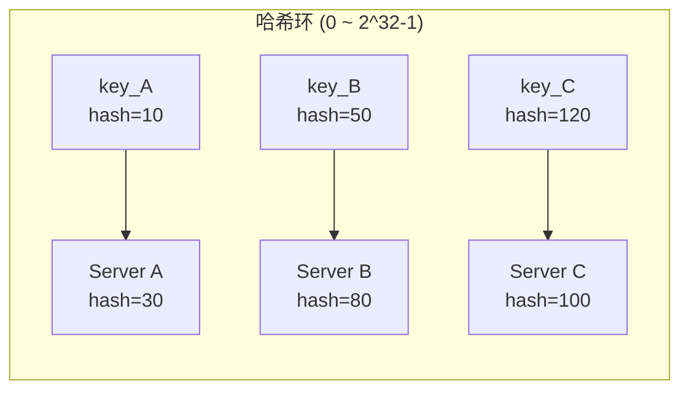
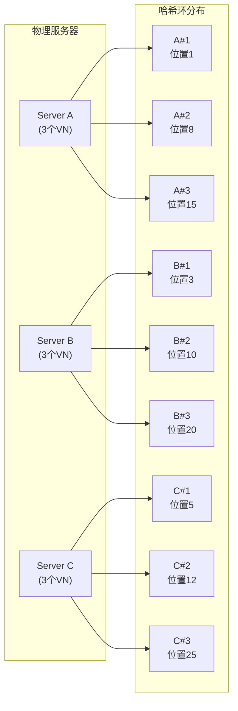
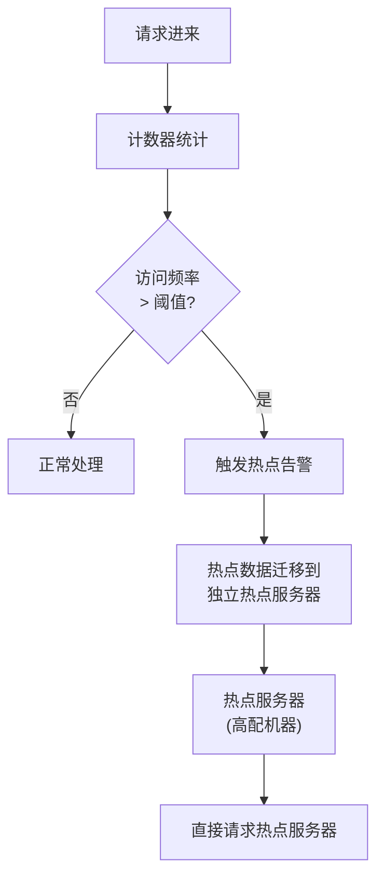
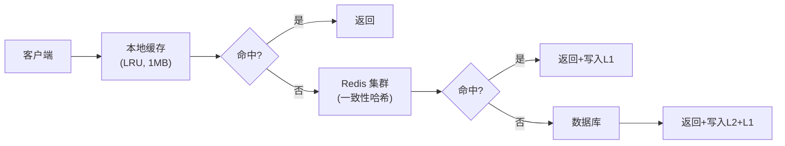

- "当你有 1000 万条数据、10 台缓存服务器时，新增一台服务器，需要迁移多少数据？"
- 普通哈希回答：1000 万 ÷ 10 = 100 万条，全量迁移！
- 一致性哈希回答：只需要迁移约 1/N（N=10），也就是 10 万条。
- 但这只是故事的开始。当流量高峰来临，明星塌房、秒杀活动、突发热点——一致性哈希能解决数据迁移问题，但它解决不了**热点问题**。本文深入探讨一致性哈希的进阶话题：**如何处理热点**。

<!-- more -->

## 从哈希到一致性哈希

### 普通哈希的问题

在引入一致性哈希之前，我们先回顾普通哈希：

```python
def traditional_hash(key: str, num_servers: int) -> int:
    """普通哈希：key % N"""
    server_index = hash(key) % num_servers
    return server_index
```

这个方案简单直接，**但在分布式场景下有个致命问题**：

- 假设原来有 10 台服务器，用户 ID 1-1000 万均匀分布。
- 现在新增第 11 台服务器。
- 90% 的数据映射位置都变了！需要迁移几乎全部数据。

这就是**Rehashing 问题**。

### 一致性哈希的诞生

一致性哈希（Consistent Hashing）由 MIT 的 Karger 等人在 1997 年提出，核心思想是：**把服务器和数据都映射到一个哈希环上，数据顺时针找到第一个服务器**。



**关键优势**：当新增或删除服务器时，**只有相邻区间的数据需要迁移**。

```python
class ConsistentHashRing:
    def __init__(self, servers: list[str]):
        self.ring = {}
        self.sorted_keys = []
        
        for server in servers:
            self._add_server(server)
    
    def _add_server(self, server: str):
        """把服务器添加到环上"""
        key = self._hash(server)
        self.ring[key] = server
        self.sorted_keys = sorted(self.ring.keys())
    
    def get_server(self, key: str) -> str:
        """顺时针找到第一个服务器"""
        hash_key = self._hash(key)
        
        # 二分查找第一个 >= hash_key 的服务器
        for server_key in self.sorted_keys:
            if server_key >= hash_key:
                return self.ring[server_key]
        
        # 回到起点
        return self.ring[self.sorted_keys[0]]
    
    def _hash(self, key: str) -> int:
        return hash(key) % (2 ** 32)
```

## 热点问题：一致性哈希的阿喀琉斯之踵

### 什么是热点问题？

一致性哈希解决了数据迁移问题，但它带来了另一个问题：**热点（Hot Spot）**。

**场景 1：流量不均匀**

假设 4 台缓存服务器_ring 分布如下：

```
Server A: 0 ~ 30 (30% 空间)
Server B: 31 ~ 60 (30% 空间)
Server C: 61 ~ 80 (20% 空间)
Server D: 81 ~ 99 (20% 空间)
```

如果 80% 的请求都落在 0~30 这个区间，Server A 会被打爆，其他服务器却空闲。

**场景 2：热点 Key**

```python
# 某明星官宣塌房
hot_keys = [
    "user_1000000",  # 明星本人
    "post_5000000",  # 爆炸性内容
    "comment_8000000",  # 热评
]

# 所有请求都打到同一台服务器
for key in hot_keys:
    server = ring.get_server(key)  # 可能全部命中 Server A
```

这就是著名的 **"明星问题"（Celebrity Problem）**——一个热点的 key 可能把整个系统搞挂。

## 解决方案一：虚拟节点（Virtual Nodes）

### 核心思想

与其让每个物理服务器占一个位置，不如让它占**多个位置**。这就是虚拟节点（Virtual Nodes，也叫 VNodes）的由来。

```python
class ConsistentHashRingWithVNodes:
    def __init__(self, servers: list[str], vnode_count: int = 150):
        self.ring = {}
        self.sorted_keys = []
        self.vnode_count = vnode_count
        
        # 每个物理服务器对应 vnode_count 个虚拟节点
        for server in servers:
            self._add_server(server, vnode_count)
    
    def _add_server(self, server: str, vnode_count: int):
        """添加服务器的所有虚拟节点"""
        for i in range(vnode_count):
            # 虚拟节点名称：server#1, server#2, ...
            vnode_name = f"{server}#VN{i}"
            key = self._hash(vnode_name)
            self.ring[key] = server  # 映射回物理服务器
    
    def get_server(self, key: str) -> str:
        hash_key = self._hash(key)
        
        for vk in self.sorted_keys:
            if vk >= hash_key:
                return self.ring[vk]
        
        return self.ring[self.sorted_keys[0]]
```

### 虚拟节点如何改善热点



**没有虚拟节点**：3 台服务器只有 3 个点，容易不均匀  
**有虚拟节点**：3 台服务器 × 150 个虚拟节点 = 450 个点，分布更均匀

### 虚拟节点的另一个好处

新增一台服务器时，不需要从每台服务器迁移数据，而是从每台服务器"借"一点数据：

```python
# 新增 Server D (150 个虚拟节点)
# 每个虚拟节点只需要从环上"借"约 1/(N+1) 的数据
# 总迁移量 = 150 个VN × 平均每个VN的数据量 ≈ 1/(N+1) 的总数据
```

## 解决方案二：热点检测与动态迁移

虚拟节点能缓解热点，但不能根本解决**绝对热点**问题。当某个 key 特别热时，无论怎么分片都会打到同一台机器。

### 热点检测流程



### 实现示例

```python
import time
from collections import defaultdict
from threading import Lock

class HotspotDetector:
    def __init__(self, threshold: int = 1000, window_seconds: int = 60):
        self.threshold = threshold
        self.window = window_seconds
        self.counts = defaultdict(lambda: defaultdict(int))
        self.hot_keys = set()
        self.lock = Lock()
    
    def record_access(self, key: str):
        """记录一次访问"""
        now = int(time.time())
        with self.lock:
            # 清理过期数据
            self._cleanup(now)
            
            # 计数
            self.counts[now][key] += 1
            
            # 检查是否超过阈值
            total = sum(
                self.counts[t][key] 
                for t in self.counts 
                if now - t < self.window
            )
            
            if total > self.threshold:
                self.hot_keys.add(key)
    
    def is_hot(self, key: str) -> bool:
        """判断是否为热点"""
        return key in self.hot_keys
    
    def _cleanup(self, now: int):
        """清理过期计数"""
        expire_time = now - self.window
        expired_keys = [t for t in self.counts if t < expire_time]
        for t in expired_keys:
            del self.counts[t]


class HotspotAwareRouter:
    def __init__(self, hash_ring: ConsistentHashRing, detector: HotspotDetector):
        self.ring = hash_ring
        self.detector = detector
        self.hotspot_server = "hotspot-server-1"  # 专用热点服务器
    
    def route(self, key: str) -> str:
        """智能路由"""
        if self.detector.is_hot(key):
            # 热点 key 直接打到专用热点服务器
            return self.hotspot_server
        
        # 普通 key 走一致性哈希
        return self.ring.get_server(key)
```

## 解决方案三：本地缓存 + 限流

### 多级缓存策略

对于极端热点，可以在客户端加本地缓存：



```python
from functools import lru_cache

class LocalCache:
    def __init__(self, max_size: int = 10000):
        self.cache = {}
        self.access_time = {}
        self.max_size = max_size
    
    @lru_cache(maxsize=1000)
    def get(self, key: str) -> str:
        # 实际应该用真实的缓存实现
        return self.cache.get(key)
    
    def put(self, key: str, value: str):
        if len(self.cache) >= self.max_size:
            # LRU 淘汰
            oldest_key = min(self.access_time, key=self.access_time.get)
            del self.cache[oldest_key]
            del self.access_time[oldest_key]
        
        self.cache[key] = value
        self.access_time[key] = time.time()
```

### 限流保护

即使有缓存，也要防止瞬间流量打挂服务：

```python
import asyncio
from typing import Callable

class RateLimiter:
    def __init__(self, max_requests: int, window_seconds: int):
        self.max_requests = max_requests
        self.window = window_seconds
        self.requests = []
    
    async def acquire(self) -> bool:
        """获取令牌"""
        now = time.time()
        
        # 清理过期请求
        self.requests = [t for t in self.requests if now - t < self.window]
        
        if len(self.requests) >= self.max_requests:
            return False  # 被限流
        
        self.requests.append(now)
        return True
    
    async def execute(self, func: Callable, *args, **kwargs):
        """带限流的执行"""
        if await self.acquire():
            return await func(*args, **kwargs)
        else:
            raise RateLimitException("Too many requests")


# 每个服务器配置限流
server_limiters = {
    f"server-{i}": RateLimiter(max_requests=1000, window_seconds=1)
    for i in range(10)
}
```

## 解决方案四：读写分离与副本

### 读热点

热点数据读请求特别多？可以加**只读副本**：

```python
class ReadReplicaRouter:
    def __init__(self, primary: str, replicas: list[str]):
        self.primary = primary
        self.replicas = replicas
        self.replica_index = 0
    
    def route_read(self, key: str) -> str:
        """读请求打到副本"""
        # 轮询或一致性哈希选择副本
        replica = self.replicas[self.replica_index % len(self.replicas)]
        self.replica_index += 1
        return replica
    
    def route_write(self, key: str) -> str:
        """写请求打到主库"""
        return self.primary
```

### 写热点

如果热点是"大量并发写"（如抢红包、秒杀），上面的方法不够用，需要：

1. **消息队列削峰**：写请求先入队列，异步处理
2. **分桶**：把热点 key 拆成多个子 key，分散写入压力
3. **预扣减库存**：提前扣减库存，避免实际支付时的并发冲突

## 进阶：一致性哈希的变体

### 1.  Ketama 算法

Libketama 是最早的一致性哈希实现之一，特点：
- 使用 MD5 而非普通 hash
- 虚拟节点数固定为 100/N（N=服务器数）

```python
import hashlib

def ketama_hash(key: str) -> int:
    """Ketama 使用的 MD5 哈希"""
    md5 = hashlib.md5(key.encode()).digest()
    return (md5[3] << 24) | (md5[2] << 16) | (md5[1] << 8) | md5[0]
```

### 2. Jump Hash

Google 提出的 **Jump Hash**，特点：
- 无虚拟节点
- 增加服务器时数据迁移更平滑
- 适合确定性分片

```python
def jump_hash(key: str, num_buckets: int) -> int:
    """Jump Hash 实现"""
    key_hash = hash(key)
    
    b = -1
    j = 0
    
    while j < num_buckets:
        b = j
        key_hash = (key_hash * 1103515245 + 12345) & 0x7FFFFFFF
        j = (b + 1) * (key_hash / 0x7FFFFFFF)
    
    return b
```

### 3. Maglev Hash

Google 提出的 **Maglev Hash**，特点：
- 预生成查找表，O(1) 查找
- 增加服务器时迁移更均匀

## 实际案例：Redis 集群的一致性哈希

Redis Cluster 使用的 **Hash Slot** 机制，虽然不是传统意义上的一致性哈希，但思想相通：

```
Hash Slot = CRC16(key) % 16384

# 16384 个 slot 分给不同的 master 节点
- Node A: 0 ~ 5000
- Node B: 5001 ~ 10000  
- Node C: 10001 ~ 16384
```

**为什么选 16384？**
- 足够多，保证分布均匀
- 足够小，节点信息在网络包中传输不占太多空间
- 2^14 = 16384，位运算快

## 总结：热点问题的组合拳

| 方案 | 解决什么问题 | 适用场景 |
|------|-------------|---------|
| **虚拟节点** | 节点间负载不均 | 通用场景 |
| **热点检测** | 识别绝对热点 key | 有明显热点的业务 |
| **独立热点服务器** | 保护普通服务 | 极端热点 |
| **本地缓存** | 减少远程请求 | 读多热点 |
| **限流** | 防止瞬时过载 | 流量突增 |
| **读写分离** | 读热点 | 读多写少 |
| **消息队列** | 写热点 | 秒杀、抢购 |

**核心观点**：一致性哈希不是银弹，它解决了数据迁移问题，但带来了热点问题。真实系统需要**多层防御**：虚拟节点做基础分布 + 热点检测做预警 + 缓存和限流做保护。

**参考资料：**
- [Consistent Hashing - Hello Interview](https://www.hellointerview.com/learn/system-design/core-concepts/consistent-hashing)
- [Consistent Hashing - ByteByteGo](https://bytebytego.com/courses/system-design-interview/design-consistent-hashing)
- [The Hot Key Crisis in Consistent Hashing](https://systemdr.substack.com/p/the-hot-key-crisis-in-consistent)
- [Dynamo: Amazon's Highly Available Key-value Store](https://www.allthingsdistributed.com/2007/10/amazons_dynamo.html)
