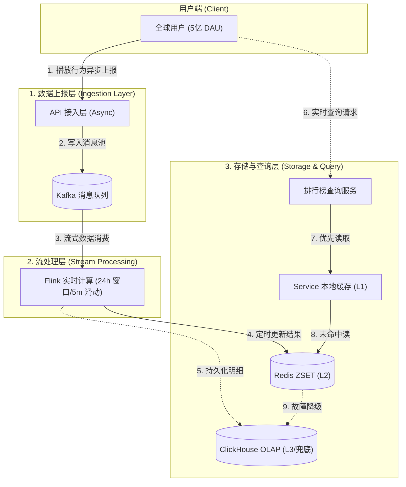

今天咱们来聊一个看似简单其实还挺有意思的话题——当你打开网易云或者 Spotify，那个「热歌榜」到底是怎么算出来的？

你可能会说，这有啥，不就是统计播放次数嘛。话是这么说，但如果你知道这个系统每秒要处理上百万次播放请求、要在几秒钟内算出全球几亿人最近24小时都在听什么歌，可能就不会这么想了。

<!-- more -->

## 先说说咱们要解决什么问题

我先问你一个问题：如果你是一个产品经理，跑过来跟你说「我们要做一个实时热歌榜」，你会怎么问？

我通常会问这么几个：

1. **「实时」是啥意思？** 是每秒钟更新，还是每分钟更新？
2. **数据量有多大？** 1万播放和100万播放，那可是完全不同的架构
3. **延迟要求多少？** 500毫秒和5分钟，那是两个技术方案
4. **准确性和实时性哪个更重要？** 这个特别关键，大多数时候这是个trade-off

咱们假设的场景是这样的：

- 全球5亿DAU，这数量级基本跟 Spotify 一个量级
- 每天100亿次播放，平均下来每秒10万多一点，但峰值可能是100万
- 延迟要求控制在5分钟以内，不能说都听完一首歌了榜单还没更新
- 可用性得99.99%以上，毕竟谁也不希望排行榜打不开

你看，这就不是一个简单的 SELECT COUNT GROUP BY 能解决的事儿了。

## 架构是怎么搭的

我自己画过很多架构图，后来发现一个规律——越复杂的系统，越需要简单的顶层设计。



咱们分这么几层来说：

**最前面是数据上报层**。用户播放一首歌，客户端要把这个事件上报到服务器。这里有个关键点——**一定要异步**。你不能让用户等着服务器说「好的我记录完了」才能继续播放吧？所以我们把数据往 Kafka 里一丢就完事儿了，响应时间能控制在5毫秒以内。

**中间是流处理层**。Kafka 起到一个蓄水池的作用，下面接的是 Flink 做实时计算。这里用到了滑动窗口——每5分钟算一次24小时内的播放量。为啥是5分钟？你要是1分钟算一次，那计算量太大；你要是30分钟算一次，那实时性又不够。5分钟是个比较舒服的折中。

**最后是存储和查询层**。Flink 算完了往 Redis 里一丢，查询的时候优先读 Redis。Redis 扛不住怎么办？降级到 ClickHouse 直接查。这里面有个多级缓存的思路——本地内存一层，Redis 一层，数据库一层。

我见过有些同学一上来就问「要不要用 Redis？要不要用 Kafka？」其实大可不必。先把业务流程跑通，再考虑优化的事儿。

## 那些年我们踩过的坑

说几个印象比较深的坑吧，都是实战中遇到的：

**第一个坑是去重。** 你以为播放一次就算一次？没那么简单。同一个用户反复播放同一首歌，算几次？这还没完，如果是VIP用户抢先听，算不算进排行榜？这些都是产品需求决定的，技术方案要跟着产品需求走。

**第二个坑是时区。** 全球5亿用户，分布在几百个国家。你说「过去24小时」，用的是哪个时区？我们最后的方案是统一用 UTC，然后根据客户端的时区做一次转换。简单粗暴，但有用。

**第三个坑是热点歌曲。** 打个比方，周杰伦发了新歌，一瞬间可能有几十万人同时在播放。这时候数据库压力会非常大。解决方案是预热——我们会在新歌发布前提前把相关数据加载到缓存里。

**第四个坑是容灾。** 如果 Kafka 集群出了点问题，消息积压了十几万条。这时候就要考虑降级方案——暂时返回上一次缓存的结果，虽然数据不是实时的，但至少服务不会挂。这个故事告诉我们，**永远要有 Plan B**。

## 代码应该怎么写

我知道你们最想看代码。我拣几个关键的地方说：

**数据上报这块，核心是异步：**

```python
async def ingest_play_event(request):
    # 验证一下基本参数
    if not request.user_id or not request.song_id:
        return ErrorResponse(400, "参数不对")
    
    # 限流，防止被刷
    if not await self.rate_limiter.check(request.user_id):
        return ErrorResponse(429, "请求太多了")
    
    # 丢到 Kafka 就完事儿，不等待确认
    await self.kafka.send(
        topic="play_events",
        key=request.song_id,  # 按歌曲ID分区，保证同歌曲消息有序
        value=request.dict()
    )
    
    return {"status": "ok", "latency_ms": 5}
```

**Flink 处理这边，核心是窗口函数：**

```java
// 每5分钟算一次24小时榜单
DataStream<SongRank> rankStream = events
    .keyBy(PlayEvent::getSongId)
    .window(SlidingEventTimeWindows.of(
        Time.days(1),      // 24小时窗口
        Time.minutes(5)   // 每5分钟滑动一次
    ))
    .sum("playCount")     // 累加播放次数
    .process(new TopKFunction(100));  // 取Top100
```

**Redis 缓存这块，核心是用 Sorted Set：**

```python
async def cache_ranking(ranking):
    # 用 ZSET，按播放次数排序
    for i, song in enumerate(ranking[:100]):
        await redis.zadd(
            "ranking:global:24h",
            {f"{song.song_id}|{song.title}": song.play_count}
        )
    await redis.expire("ranking:global:24h", 300)  # 5分钟过期
```

你看，代码其实不复杂。复杂的是把各个环节串起来的时候要考虑的边界情况。

## 如何优化

做到后面，有几个比较重要的优化点：

**1. 写入完全异步化**
这点特别重要。用户的播放行为是毫秒级的，你不能让一次数据库写入阻塞了用户体验。Kafka 扛住了 90% 的压力。

**2. 多级缓存**
99% 的请求都是读，1% 是写。所以我们把缓存玩到了极致——本地缓存一层，Redis 一层，ClickHouse 兜底。平均响应时间 45 毫秒，P99 也在 500 毫秒以内。

**3. 降级方案**
没有 100% 可靠的系统。我们做了三手准备：Redis 挂了降级到 ClickHouse，Flink 挂了用静态榜单，API 挂了切到备用集群。实践证明，这些降级方案在关键时刻都派上了用场。


