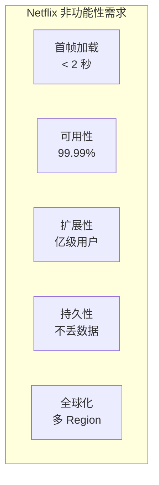
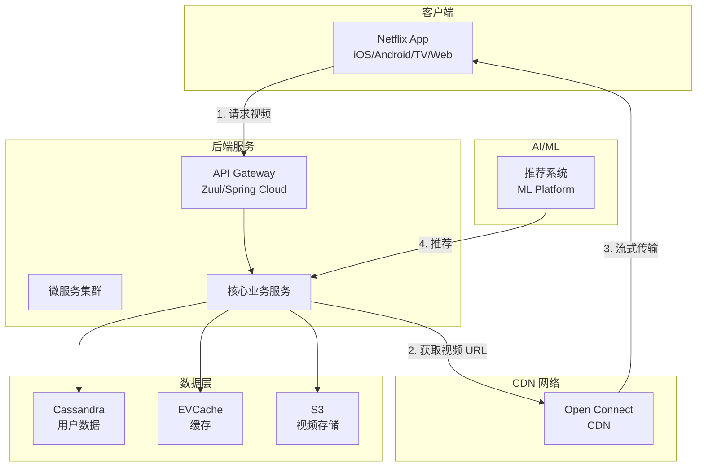
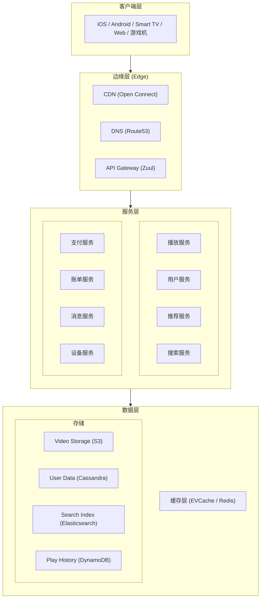
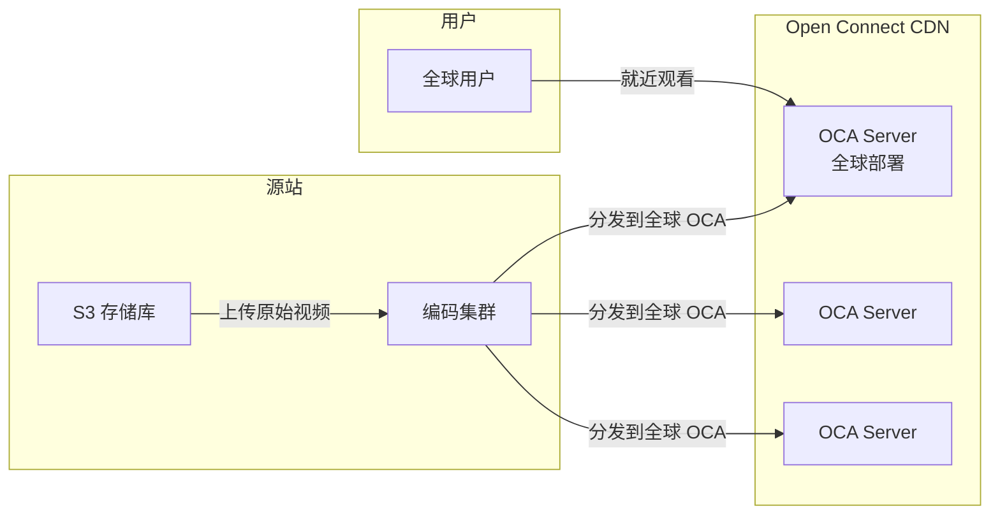
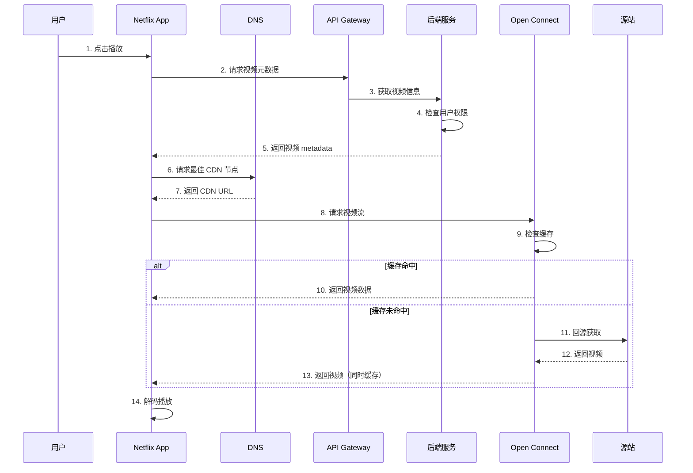
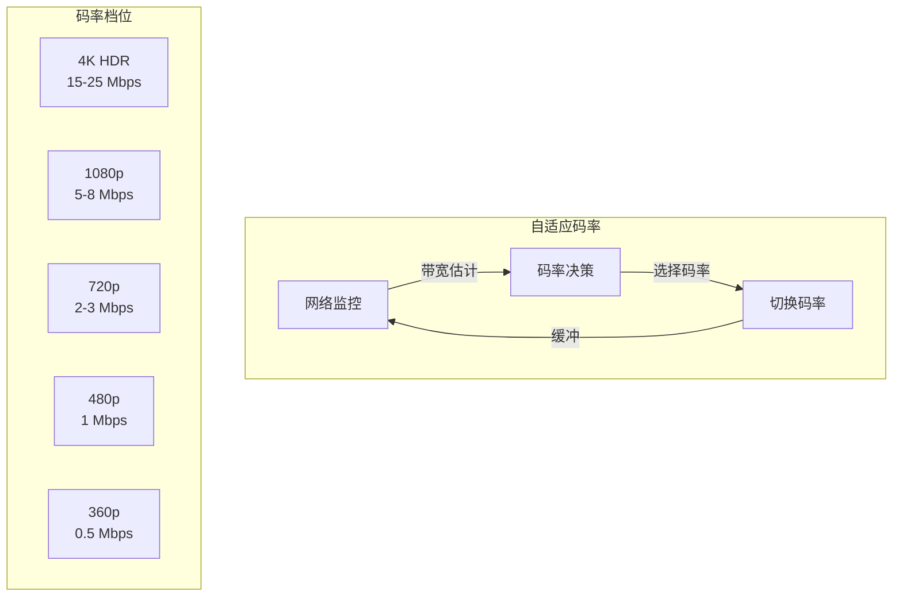
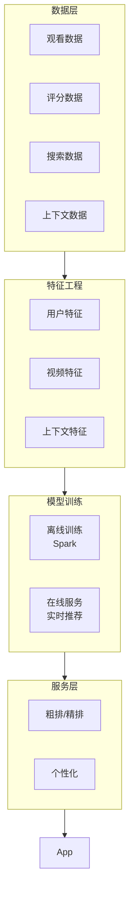
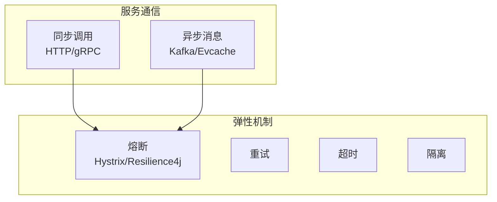
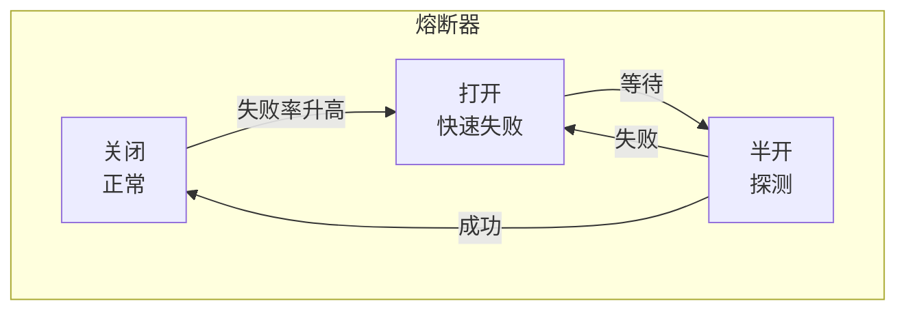
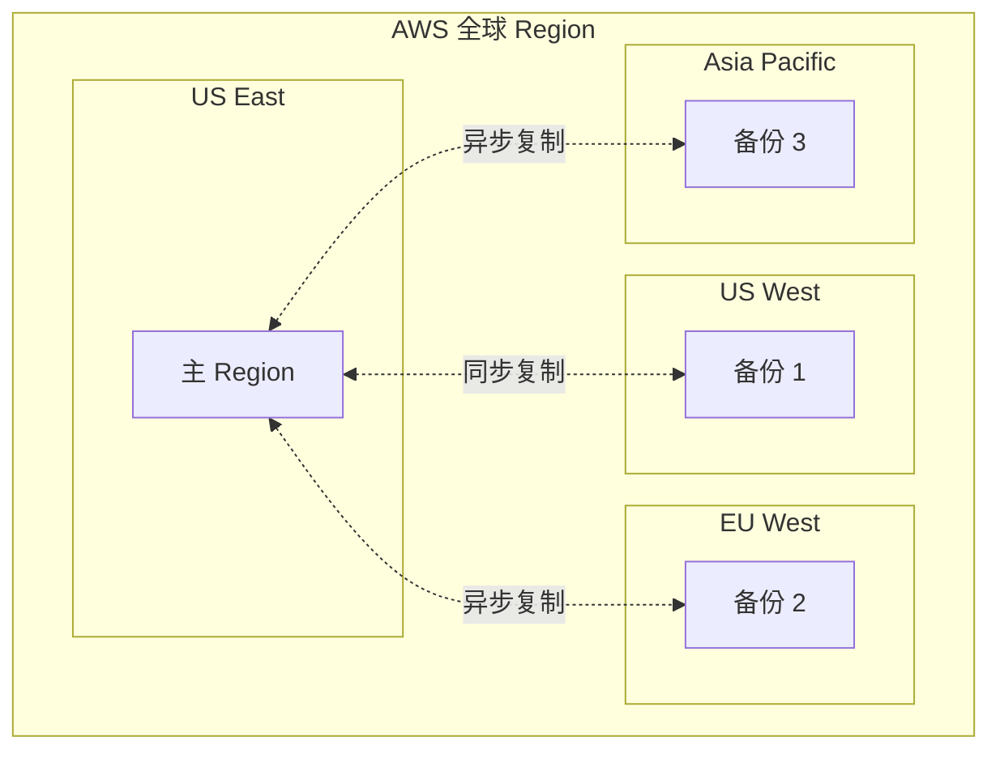

当你打开 Netflix，点击一部电影，然后开始流畅地播放——这背后是数万台服务器、数百个 CDN 节点、数十亿次推荐计算的成果。Netflix 是全球最复杂的分布式系统之一。

<!-- more -->

## 引言：Netflix 面临的挑战

Netflix 全球订阅用户超过 **2.6 亿**，每天播放 **数亿小时** 的视频内容。

这意味着什么？

- 每秒处理数百万次视频请求
- 全球 190 个国家同时播放
- 不同网络环境（2G 到 5G）
- 不同的设备（手机、电视、电脑、游戏机）
- 需要在用户按下"播放"后 **几秒内** 开始播放

这是一个 **超级复杂的分布式系统**，其架构值得每个工程师学习。

## 一、核心需求分析

### 1.1 功能需求

| 功能 | 描述 | 技术挑战 |
|------|------|---------|
| 视频播放 | 毫秒级首帧加载 | 编码优化、CDN |
| 推荐系统 | 个性化首页 | 大数据、机器学习 |
| 用户管理 | 登录、会员、Profile | 分布式 ID、状态同步 |
| 搜索 | 毫秒级搜索响应 | 搜索引擎 |
| 评论/评分 | 社交功能 | 读写分离 |
| 下载离线 | 本地缓存 | 移动端存储 |

### 1.2 非功能性需求



- **首帧加载时间**：< 2 秒
- **视频卡顿率**：< 1%
- **可用性**：99.99% SLA
- **支持设备**：数千种

## 二、整体架构设计

### 2.1 架构总览



### 2.2 分层架构



## 三、核心模块设计

### 3.1 视频存储与 CDN：Open Connect

Netflix 的核心竞争力之一是 **Open Connect**——自建的 CDN 网络。

#### 为什么自建 CDN？

| 方案 | 优点 | 缺点 |
|------|------|------|
| 第三方 CDN | 简单 | 成本高、可能被竞争对手使用 |
| **自建 CDN** | 成本低、就近访问、完全控制 | 前期投入大 |

#### Open Connect 架构



**关键设计**：

1. **全球部署**：在全球 1000+ ISP 机房部署服务器
2. **智能 DNS**：根据用户位置返回最近 CDN 节点
3. **预加载**：预测用户可能看的内容，提前缓存

```python
# 伪代码：预测性缓存
class PredictiveCache:
    def __init__(self, oca_servers):
        self.oca_servers = oca_servers
    
    def predict_and_cache(self, user_id):
        # 获取用户可能观看的推荐列表
        recommendations = self.get_recommendations(user_id)
        
        # 预加载到最近的 OCA 服务器
        for video_id in recommendations[:10]:
            if not self.is_cached(video_id):
                self.trigger_preload(video_id)
    
    def trigger_preload(self, video_id):
        # 异步预加载，不阻塞用户请求
        asyncio.create_task(self.oca_preload(video_id))
```

### 3.2 视频播放流程



### 3.3 自适应码率 (ABR)

Netflix 需要在各种网络环境下提供流畅播放，核心是 **ABR (Adaptive Bitrate)**：



**HLS / DASH 协议**：

```
视频被切分成多个小片段 (通常 2-10 秒)
┌──────┬──────┬──────┬──────┬──────┐
│ 1.ts │ 2.ts │ 3.ts │ 4.ts │ 5.ts │
└──────┴──────┴──────┴──────┴──────┘
       ↑
   每个片段有多个清晰度
   - 360p (低)
   - 720p (中)
   - 1080p (高)
   - 4K (超高)
```

```python
# 简化版码率选择算法
def select_bitrate(available_profiles, bandwidth, buffer_level):
    # 带宽优先策略
    target_bitrate = min(
        [p for p in available_profiles if p.bitrate <= bandwidth]
    )
    
    # 考虑缓冲
    if buffer_level < 2:  # 缓冲不足
        return min(available_profiles)
    elif buffer_level > 10:  # 缓冲充足
        return max(available_profiles)
    
    return target_bitrate
```

## 四、推荐系统架构

### 4.1 为什么推荐如此重要？

```
Netflix 推荐影响力：
- 80% 的用户观看来自推荐
- 推荐系统每年创造数十亿美元价值
```

### 4.2 推荐系统架构



### 4.3 推荐算法层次


**1. 候选生成 (Candidate Generation)**

- **协同过滤**：相似用户看什么
- **内容匹配**：同类型、同演员
- **矩阵分解**：SVD 等

**2. 排序 (Ranking)**

- **深度学习模型**：Wide & Deep, DeepFM
- **特征**：用户特征 + 视频特征 + 上下文特征

**3. 重排 (Re-ranking)**

- 多样性保证
- 业务规则（新品、推广内容）

```python
# 简化版推荐流程
class RecommendationPipeline:
    def recommend(self, user_id, context, limit=10):
        # Step 1: 候选生成
        candidates = self.candidate_generation(user_id)
        
        # Step 2: 排序
        scored = self.ranking(user_id, candidates, context)
        
        # Step 3: 重排
        result = self.rerank(scored, limit)
        
        # Step 4: 过滤
        result = self.apply_filters(result, user_id)
        
        return result
    
    def candidate_generation(self, user_id):
        # 协同过滤
        cf_candidates = self.cf_model.predict(user_id)
        
        # 内容匹配
        content_candidates = self.content_filter.get_similar(user_id)
        
        # 合并
        return merge(cf_candidates, content_candidates)
    
    def ranking(self, user_id, candidates, context):
        features = self.extract_features(user_id, candidates, context)
        scores = self.ml_model.predict(features)
        return sorted(zip(candidates, scores), key=lambda x: x[1], reverse=True)
```

## 五、微服务架构

### 5.1 Netflix 的微服务生态

Netflix 有 **数百个微服务**，每个服务负责一个领域：

| 服务 | 功能 |
|------|------|
| `playback-api` | 播放控制 |
| `metadata-api` | 视频元数据 |
| `personalization` | 个性化推荐 |
| `auth` | 认证授权 |
| `billing` | 账单支付 |
| `notifications` | 推送通知 |
| `search` | 搜索服务 |

### 5.2 服务间通信



**核心组件**：

| 组件 | 技术 |
|------|------|
| 服务注册与发现 | Eureka |
| 负载均衡 | Ribbon |
| 熔断器 | Hystrix / Resilience4j |
| API 网关 | Zuul / Spring Cloud Gateway |
| 配置中心 | Archaius |

### 5.3 熔断器模式



```java
// 简化版熔断器
public class CircuitBreaker {
    private final AtomicReference<State> state = new AtomicReference<>(State.CLOSED);
    private int failureCount = 0;
    private int successCount = 0;
    
    public void execute(Runnable command) {
        if (state.get() == State.OPEN) {
            throw new CircuitOpenException();
        }
        
        try {
            command.run();
            onSuccess();
        } catch (Exception e) {
            onFailure();
        }
    }
    
    private void onFailure() {
        failureCount++;
        if (failureCount > threshold) {
            state.set(State.OPEN);
        }
    }
}
```

## 六、数据存储

### 6.1 存储选型

| 数据类型 | 存储方案 | 理由 |
|----------|---------|------|
| 用户数据 | Cassandra | 高写入、可扩展 |
| 视频元数据 | PostgreSQL | 事务性、关系查询 |
| 观看历史 | DynamoDB | 高读写、KV 访问 |
| 搜索 | Elasticsearch | 全文搜索 |
| 缓存 | EVCache / Redis | 内存缓存 |
| 对象存储 | S3 | 海量非结构化数据 |

### 6.2 Cassandra 在 Netflix

Netflix 是 Cassandra 的最大用户之一：

```
Cassandra 集群规模：
- 超过 10,000 个节点
- 每天处理 PB 级别数据
- 99.999% 可用性
```

```sql
-- 用户观看历史表设计
CREATE TABLE user_watch_history (
    user_id    uuid,
    video_id   uuid,
    timestamp  timeuuid,
    progress   int,           -- 播放进度 (秒)
    completed  boolean,       -- 是否看完
    PRIMARY KEY (user_id, timestamp, video_id)
) WITH CLUSTERING ORDER BY (timestamp DESC);
```

## 七、高可用与容灾

### 7.1 多 Region 部署



### 7.2 故障转移

| 场景 | 处理 |
|------|------|
| 单机故障 | 自动重启 / 切换 |
| AZ 故障 | 跨 AZ 切换 |
| Region 故障 | DNS 切换到备份 Region |
| 数据库故障 | 主从切换 |

## 八、总结

### 8.1 核心设计原则

1. **就近访问**：CDN 部署到用户身边
2. **自适应**：ABR 适应各种网络
3. **预测**：预加载、预测性缓存
4. **微服务**：解耦、独立扩展
5. **容灾**：多 Region、多副本

### 8.2 关键技术选型

| 模块 | 技术 |
|------|------|
| CDN | Open Connect (自建) |
| 视频编码 | H.264 / H.265 / AV1 |
| 协议 | HLS / DASH |
| 微服务框架 | Spring Cloud |
| 数据库 | Cassandra / PostgreSQL / DynamoDB |
| 缓存 | EVCache / Redis |
| 搜索 | Elasticsearch |
| 消息队列 | Kafka |

### 8.3 学到的经验

**对于工程师的启示**：

1. **CDN 是流媒体的核心**——能放在边缘的，绝不放在中心
2. **预测比响应更重要**——提前加载，比等用户请求再处理更快
3. **ABR 是用户体验的关键**——自适应码率让"网络"变得透明
4. **推荐系统创造价值**——80% 的观看来自推荐
5. **微服务需要配套**——熔断、限流、监控是必备

## 参考资料

- [Netflix Technology Blog](https://netflixtechblog.com/)
- [Open Connect - Netflix](https://openconnect.netflix.com/)
- [Building Netflix's Recommendation System](https://netflixtechblog.com/building-a-nonlinear-optimization-engine-1478c7ccc9f5)
- [Netflix API: Gatekeeper](https://netflixtechblog.com/gatekeeper-moving-fast-at-scale-7113c157af8e)
- [AWS re:Invent: Netflix Architecture](https://www.youtube.com/watch?v=4Kdtmu3R3a4)
