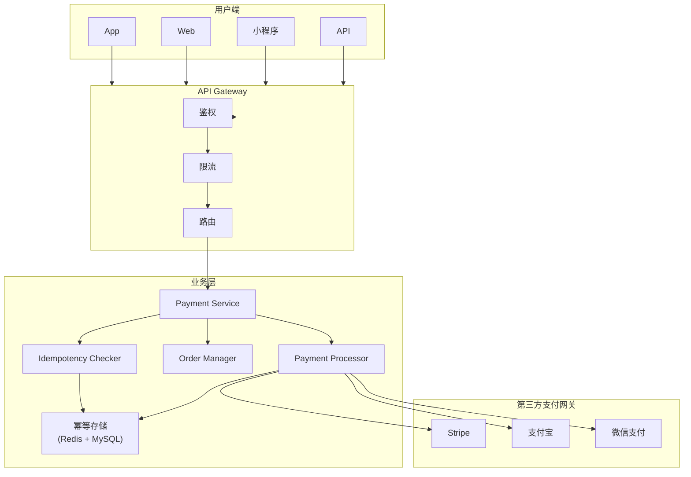
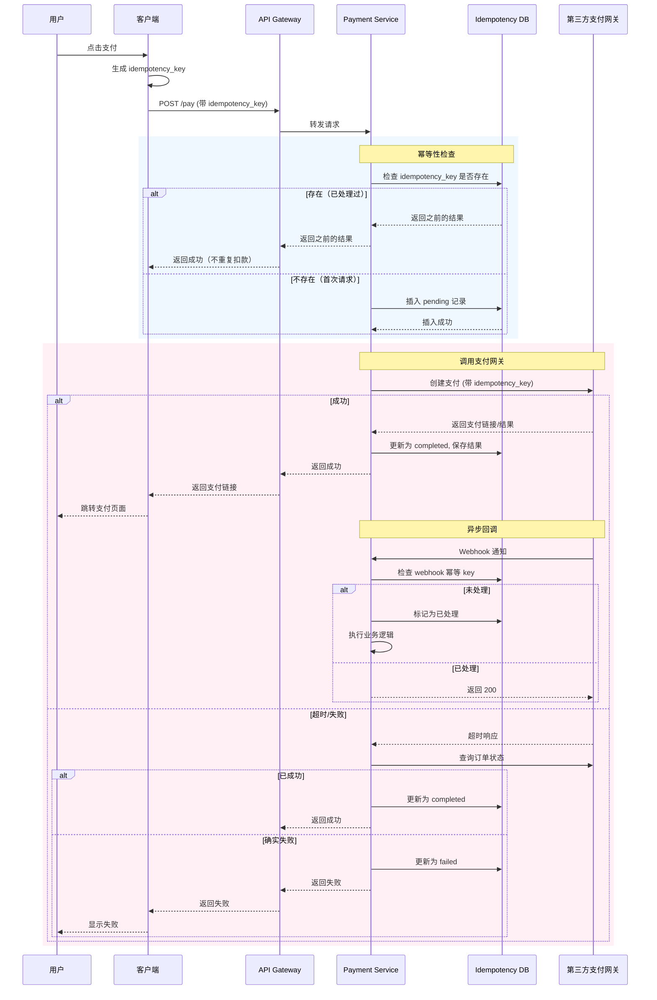

- "你在付款时点击'支付'按钮两次，账户会被扣两次钱吗？"
- 这个问题暴露了支付系统最核心的挑战：**在不可靠的网络世界里，如何保证每一笔钱只扣一次？**
- 在此我们探讨一下支付系统中的幂等性设计，特别是与第三方支付网关交互时的最佳实践。

<!-- more -->

## 为什么支付系统的幂等性如此重要？

在支付系统中，幂等性不是"锦上添花"，而是**生死攸关**的基础设施。

### 现实中的"双重扣款"场景

```
用户点击"支付" → 请求发出 → 网络超时 → 用户没看到结果
    ↓
用户再次点击"支付" → 请求再次发出 → 两次请求都到了后端
    ↓
如果没有幂等性保护 → 用户被扣两次钱 💸💸
```

这种场景比你想象的更常见：
- 用户手机网络抖动，请求超时
- 后端处理时间太长，客户端以为失败了
- 支付网关返回超时，但实际已经扣款成功
- 负载均衡器重试导致的重复请求

**每一起双重扣款事故，都意味着用户信任的流失和客服成本的飙升。**

### 什么是幂等性？

幂等性（Idempotency）源自数学概念，指**执行一次和执行多次的效果相同**。

在 API 设计中：
- `GET /user/123` — 幂等，查多少次都不会改变资源
- `POST /order` — **不一定幂等**，每次 POST 可能创建新订单
- `DELETE /order/123` — 幂等，删除多次和删除一次结果相同
- `PUT /order/123` — 幂等，覆盖多次和覆盖一次结果相同

支付场景的特殊性在于：**我们不仅要保证自己系统的幂等性，还要确保与第三方支付网关的交互也是幂等的。**


## 核心概念：Idempotency Key

### 什么是 Idempotency Key？

Idempotency Key（幂等键）是一个由客户端生成的**唯一标识符**，用于标记某一笔具体的支付请求。

```
客户端生成: idempotency_key = "order_12345_user_67890_timestamp"
```

把这个 key 放在请求头里告诉服务器："我用这个 key 发起请求，如果你已经处理过这个 key 的请求，直接返回之前的结果，别再扣一次钱。"

### Idempotency Key 的生成规范

```python
import uuid
import hashlib
import time

def generate_idempotency_key(user_id: str, order_id: str, amount: float) -> str:
    """
    生成幂等键的推荐方式
    """
    # 方案1：使用 UUID（最简单）
    key_v1 = str(uuid.uuid4())
    
    # 方案2：使用业务相关信息的 hash（可读性好，推荐）
    raw = f"{user_id}:{order_id}:{amount}:{int(time.time() / 3600)}"  # 按小时粒度
    key_v2 = hashlib.sha256(raw.encode()).hexdigest()[:32]
    
    return key_v2
```

**生成原则：**
1. **唯一性** — 同一笔订单、同一金额、同一用户，key 必须唯一
2. **可预测** — 用业务字段 hash 而非纯随机，方便排查问题
3. **有生命周期** — key 应该有过期时间（比如 24-48 小时）


## 整体架构设计




## 幂等性实现方案

### 方案一：数据库唯一约束（最常用）

```sql
-- 幂等性记录表
CREATE TABLE idempotency_records (
    id BIGINT PRIMARY KEY AUTO_INCREMENT,
    idempotency_key VARCHAR(64) NOT NULL,
    
    -- 业务关联信息
    user_id BIGINT NOT NULL,
    order_id VARCHAR(64) NOT NULL,
    amount DECIMAL(12, 2) NOT NULL,
    
    -- 请求状态
    status ENUM('pending', 'processing', 'completed', 'failed') NOT NULL DEFAULT 'pending',
    
    -- 第三方返回结果（用于重复请求时返回）
    provider_response JSON,
    provider_order_id VARCHAR(128),  -- 第三方订单号
    error_message TEXT,
    
    -- 时间戳
    created_at BIGINT NOT NULL,
    updated_at BIGINT NOT NULL,
    
    -- 唯一约束！
    UNIQUE KEY uk_idempotency_key (idempotency_key),
    INDEX idx_order_id (order_id),
    INDEX idx_user_id (user_id)
) ENGINE=InnoDB DEFAULT CHARSET=utf8mb4;
```

```python
import asyncio
from datetime import datetime
from sqlalchemy import insert, select, update
from sqlalchemy.exc import IntegrityError

class PaymentService:
    def __init__(self, db, payment_gateway):
        self.db = db
        self.gateway = payment_gateway
    
    async def create_payment(self, user_id: str, order_id: str, 
                             amount: float, idempotency_key: str):
        """
        幂等支付流程
        """
        # Step 1: 检查是否已存在
        existing = await self._check_idempotency(idempotency_key)
        if existing:
            return self._handle_existing_request(existing)
        
        # Step 2: 尝试创建幂等记录（数据库唯一约束保证原子性）
        record_id = await self._create_idempotency_record(
            idempotency_key, user_id, order_id, amount
        )
        
        # Step 3: 调用第三方支付网关
        try:
            result = await self.gateway.create_payment(
                order_id=order_id,
                amount=amount,
                idempotency_key=idempotency_key  # 传给网关
            )
            
            # Step 4: 更新记录状态为成功
            await self._update_payment_status(
                record_id, 'completed', result
            )
            
            return result
            
        except Exception as e:
            # Step 5: 处理失败
            await self._update_payment_status(
                record_id, 'failed', error=str(e)
            )
            raise
    
    async def _check_idempotency(self, idempotency_key: str):
        """检查是否已有处理记录"""
        query = select(IdempotencyRecord).where(
            IdempotencyRecord.idempotency_key == idempotency_key
        )
        result = await self.db.execute(query)
        return result.scalar_one_or_none()
    
    async def _create_idempotency_record(self, idempotency_key: str, 
                                          user_id: str, order_id: str, 
                                          amount: float) -> int:
        """创建幂等记录（如果 key 已存在会抛异常）"""
        now = int(datetime.utcnow().timestamp())
        
        try:
            # 先尝试插入
            stmt = insert(IdempotencyRecord).values(
                idempotency_key=idempotency_key,
                user_id=user_id,
                order_id=order_id,
                amount=amount,
                status='pending',
                created_at=now,
                updated_at=now
            )
            result = await self.db.execute(stmt)
            await self.db.commit()
            return result.lastrowid
            
        except IntegrityError:
            # Key 已存在，说明并发请求，返回 None
            await self.db.rollback()
            return None
    
    async def _handle_existing_request(self, record):
        """处理已存在的请求"""
        if record.status == 'completed':
            # 已成功，直接返回之前的结果
            return {
                'status': 'success',
                'order_id': record.provider_order_id,
                'idempotency_key': record.idempotency_key
            }
        elif record.status == 'processing':
            # 正在处理中，可能是并发请求
            # 等待一段时间后重试查询，或者直接返回"处理中"
            raise PaymentProcessingException("Payment is being processed")
        else:
            # 之前失败了，可以重试
            raise PaymentFailedException(f"Previous payment failed: {record.error_message}")
```

### 方案二：Redis 实现（高性能场景）

对于高并发场景，Redis 是更好的选择：

```python
import json
import redis
import asyncio

class IdempotencyRedis:
    def __init__(self, redis_client: redis.Redis):
        self.redis = redis_client
        self.ttl = 24 * 60 * 60  # 24小时过期
    
    async def acquire_lock(self, idempotency_key: str) -> bool:
        """
        尝试获取处理权限
        """
        key = f"idem_lock:{idempotency_key}"
        # SET NX: 仅当 key 不存在时设置
        return self.redis.set(key, "1", nx=True, ex=30)
    
    async def save_result(self, idempotency_key: str, result: dict):
        """
        保存处理结果
        """
        key = f"idem_result:{idempotency_key}"
        self.redis.setex(
            key, 
            self.ttl, 
            json.dumps(result, ensure_ascii=False)
        )
    
    async def get_result(self, idempotency_key: str) -> dict:
        """获取已保存的结果"""
        key = f"idem_result:{idempotency_key}"
        data = self.redis.get(key)
        return json.loads(data) if data else None
    
    async def release_lock(self, idempotency_key: str):
        """释放锁"""
        key = f"idem_lock:{idempotency_key}"
        self.redis.delete(key)


class PaymentServiceWithRedis:
    def __init__(self, redis_client: redis.Redis, payment_gateway):
        self.idem = IdempotencyRedis(redis_client)
        self.gateway = payment_gateway
    
    async def create_payment(self, idempotency_key: str, order_id: str, 
                             amount: float, user_id: str):
        # Step 1: 检查是否已有结果
        existing = await self.idem.get_result(idempotency_key)
        if existing:
            return existing
        
        # Step 2: 尝试获取处理锁（防止并发重复请求）
        if not await self.idem.acquire_lock(idempotency_key):
            # 没拿到锁，说明有其他请求在处理
            # 等待一下再查结果
            await asyncio.sleep(2)
            existing = await self.idem.get_result(idempotency_key)
            if existing:
                return existing
            raise Exception("Payment is being processed by another request")
        
        try:
            # Step 3: 调用第三方
            result = await self.gateway.create_payment(
                order_id=order_id,
                amount=amount,
                idempotency_key=idempotency_key
            )
            
            # Step 4: 保存结果
            await self.idem.save_result(idempotency_key, {
                'status': 'success',
                'order_id': order_id,
                'provider_order_id': result.get('provider_order_id')
            })
            
            return result
            
        finally:
            await self.idem.release_lock(idempotency_key)
```


## 与第三方支付网关的交互

### Stripe 的幂等性支持

Stripe 原生支持 Idempotency Key，这是最好的情况：

```python
import stripe

stripe.api_key = "sk_test_..."

def create_stripe_payment(amount: int, currency: str, idempotency_key: str):
    """
    Stripe 的幂等性：把 key 放在 Idempempotency-Key header 里
    """
    try:
        response = stripe.PaymentIntent.create(
            amount=amount,
            currency=currency,
            idempotency_key=idempotency_key,  # Stripe 自动处理
            metadata={"order_id": "order_12345"}
        )
        return response
    except stripe.error.IdempotencyError as e:
        # Stripe 返回 409，表示这个 key 已经有结果了
        # 重新获取之前的 PaymentIntent
        return stripe.PaymentIntent.retrieve(e.last_request_response.id)
```

**Stripe 的幂等性规则：**
- Key 有效期：**24 小时**
- 相同 key + 相同请求 → 返回相同结果
- 相同 key + 不同请求 → 返回 409 Conflict

### 国内支付网关的幂等性处理

国内支付网关（支付宝、微信支付）的幂等性设计各有不同：

| 网关 | 幂等方式 | 注意事项 |
|------|---------|---------|
| **支付宝** | `out_trade_no`（商户订单号） | 必须唯一，同一订单重复请求返回原结果 |
| **微信支付** | `out_trade_no` | 同上，建议用 UUID |
| **银联** | `orderId` | 需要预申请 |

```python
class AlipayGateway:
    def create_payment(self, out_trade_no: str, total_amount: float):
        """
        支付宝用 out_trade_no 作为幂等键
        """
        # 这个 out_trade_no 就是我们的 idempotency_key
        # 支付宝会自动识别重复请求
        response = self.client.api.alipay.trade.page.pay(
            out_trade_no=out_trade_no,
            total_amount=str(total_amount),
            subject="订单支付",
            product_code="FAST_INSTANT_TRADE_PAY"
        )
        return response
    
    def query_payment(self, out_trade_no: str):
        """查询支付结果（用于超时后确认状态）"""
        return self.client.api.alipay.trade.query(
            out_trade_no=out_trade_no
        )


class WeChatPayGateway:
    def create_payment(self, out_trade_no: str, total_fee: int):
        """
        微信支付用 out_trade_no 作为幂等键
        """
        response = self.client.post(
            "/pay/unifiedorder",
            data={
                "out_trade_no": out_trade_no,  # 幂等键
                "body": "订单支付",
                "total_fee": total_fee,
                "trade_type": "NATIVE"
            }
        )
        return response
    
    def query_payment(self, out_trade_no: str):
        """查询订单状态"""
        return self.client.post(
            "/pay/orderquery",
            data={"out_trade_no": out_trade_no}
        )
```

### 调用第三方网关的标准流程

```python
async def call_payment_gateway_with_idempotency(
    gateway: PaymentGateway,
    idempotency_key: str,
    order_id: str,
    amount: float
):
    """
    标准流程：带超时重试的网关和调用
    """
    max_retries = 3
    retry_delay = 1  # 秒
    
    for attempt in range(max_retries):
        try:
            # 尝试调用
            result = await gateway.create_payment(
                order_id=order_id,
                amount=amount,
                idempotency_key=idempotency_key
            )
            return result
            
        except GatewayTimeoutError:
            # 网关超时，不确定是否成功
            # 查一下状态
            status = await gateway.query_payment(idempotency_key)
            if status == "SUCCESS":
                return status  # 实际成功了，返回结果
            elif status == "PENDING":
                # 等待后继续查
                await asyncio.sleep(retry_delay)
                continue
            else:
                # 确实失败了，重试
                retry_delay *= 2
                if attempt < max_retries - 1:
                    await asyncio.sleep(retry_delay)
                continue
                
        except GatewayError as e:
            # 可恢复的错误，重试
            if attempt < max_retries - 1:
                await asyncio.sleep(retry_delay * (attempt + 1))
                continue
            raise
    
    raise PaymentException("Payment gateway unavailable after retries")
```


## 回调通知（Webhook）的幂等性

支付网关不仅是我们主动调用它们，它们也会**异步回调通知**我们支付结果。这个环节同样需要幂等性保护。

### Webhook 处理的典型问题

```
支付成功 → 网关发送 webhook → 我们的服务器收到
    ↓
服务器处理成功 → 返回 200 OK
    ↓
网络问题，网关没收到 200 → 网关重发 webhook
    ↓
服务器再次收到 → 如果没有幂等性 → 重复处理 → 用户被重复入账！
```

### Webhook 幂等性方案

```python
class WebhookHandler:
    def __init__(self, db):
        self.db = db
    
    async def handle_payment_callback(self, provider: str, payload: dict):
        # 从 payload 提取关键信息
        trade_no = payload.get("trade_no")          # 第三方订单号
        out_trade_no = payload.get("out_trade_no") # 我们自己的订单号
        trade_status = payload.get("trade_status")
        
        # 生成 webhook 幂等 key
        webhook_key = f"webhook:{provider}:{out_trade_no}:{trade_status}"
        
        # 检查是否已处理
        existing = await self._get_processed_webhook(webhook_key)
        if existing:
            return {"status": "ok", "message": "already_processed"}
        
        # 业务处理：更新订单状态、入账
        async with self.db.transaction():
            await self._update_order_status(out_trade_no, trade_status)
            await self._accounting_entry(out_trade_no, payload)
        
        # 记录已处理
        await self._save_processed_webhook(webhook_key)
        
        return {"status": "ok"}
    
    async def _get_processed_webhook(self, webhook_key: str):
        """检查 webhook 是否已处理"""
        query = select(WebhookRecord).where(
            WebhookRecord.webhook_key == webhook_key
        )
        result = await self.db.execute(query)
        return result.scalar_one_or_none()
    
    async def _save_processed_webhook(self, webhook_key: str):
        """保存已处理的 webhook"""
        stmt = insert(WebhookRecord).values(
            webhook_key=webhook_key,
            processed_at=int(datetime.utcnow().timestamp())
        )
        await self.db.execute(stmt)
        await self.db.commit()
```

### Webhook 安全防护

除了幂等性，还要防止**伪造的回调**：

```python
class SecureWebhookHandler:
    def __init__(self, gateway: PaymentGateway):
        self.gateway = gateway
    
    async def handle_callback(self, provider: str, payload: dict, 
                             signature: str):
        # Step 1: 验证签名
        if not self.gateway.verify_signature(payload, signature):
            raise WebhookVerificationError("Invalid signature")
        
        # Step 2: 验证来源 IP
        if not self.gateway.is_trusted_ip(provider, get_client_ip()):
            raise WebhookVerificationError("Untrusted source IP")
        
        # Step 3: 幂等处理
        return await self._idempotent_process(payload)
```


## 完整流程图




## 最佳实践总结

### ✅ 推荐做法

1. **总是生成 Idempotency Key**
   - 用 `user_id + order_id + amount` 的 hash
   - 或者用 UUID，但要把业务信息存到 metadata 里

2. **数据库唯一约束是最后防线**
   - 即使有 Redis，也要在 MySQL 里存一份
   - 唯一约束保证绝对不重复

3. **第三方网关的 Key 要传递**
   - Stripe、支付宝、微信都支持幂等键
   - 用它们原生的机制，它们做得更可靠

4. **Webhook 也要幂等**
   - 回调可能重复发送
   - 用 `provider + order_id + status` 做唯一 key

5. **记录完整上下文**
   - 保存请求参数、响应内容
   - 出问题时能追溯

### ❌ 常见错误

1. **用时间戳做 Key** — 并发请求可能生成相同时间戳
2. **只靠前端防止重复点击** — 网络超时时代码控制不住
3. **不处理回调的重复** — webhook 重发是常态
4. **Key 没有过期时间** — 存储会无限膨胀


## 总结

支付系统的幂等性设计，本质上是在回答一个问题：**"这笔钱是否已经处理过？"**

核心策略：
1. **客户端生成唯一 Key** — 作为请求的身份证
2. **服务端记录处理结果** — 用唯一约束保证原子性
3. **网关交互时传递 Key** — 利用第三方原生支持
4. **回调同样需要保护** — webhook 重复是常态

在不可靠的网络世界里，幂等性是保护用户资金安全的最后一道防线。


**参考资料：**
- [Stripe Idempotency](https://stripe.com/blog/idempotency)
- [AWS: Making retries safe with idempotent APIs](https://aws.amazon.com/builders-library/making-retries-safe-with-idempotent-APIs/)
- [Designing a Payment System - Gergely Orosz](https://newsletter.pragmaticengineer.com/p/designing-a-payment-system)
