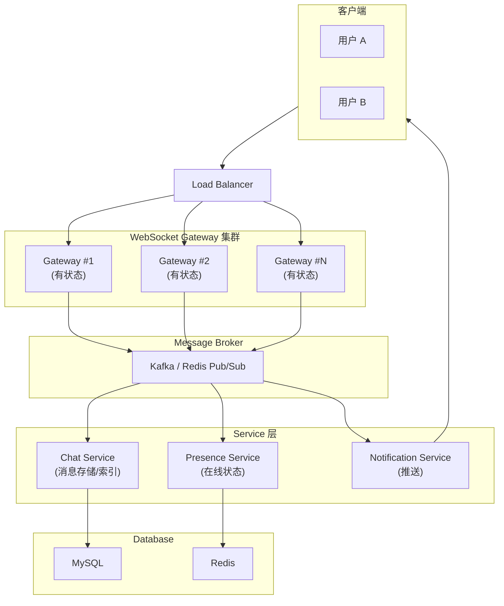
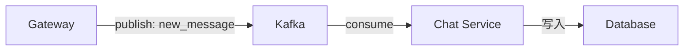
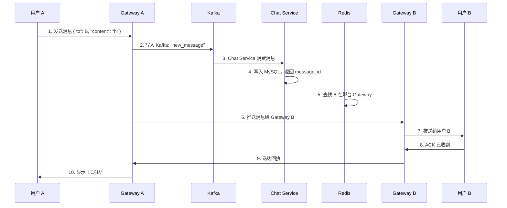
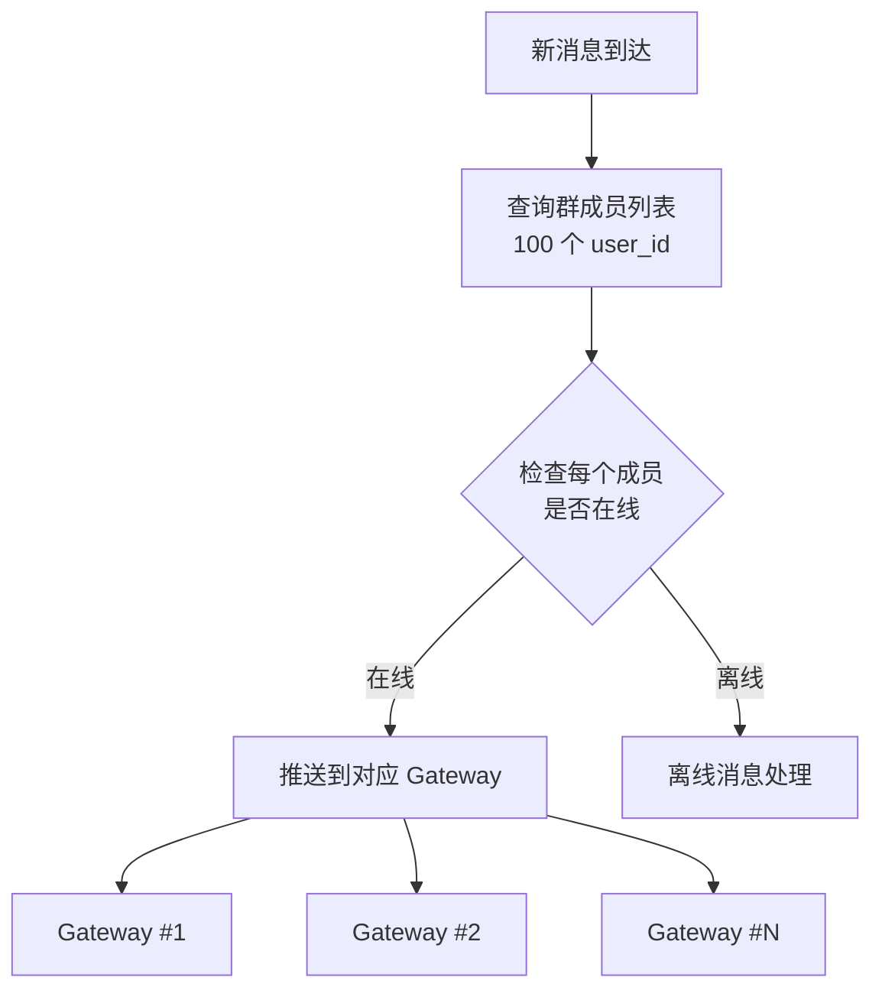
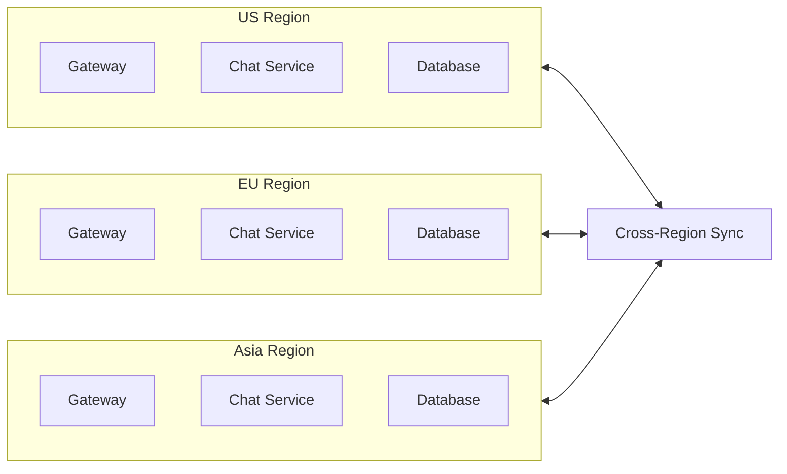

"Designing a chat system like WhatsApp is the FizzBuzz of System Design." 这是senior面试中一个比较高频的系统设计，本文将尝试从 0 到 1 设计一个生产级的实时消息系统。

<!-- more -->

## 需求分析：我们要设计什么？

在开始画架构图之前，先把需求理清楚。一个实时消息 App 通常需要支持：

### 核心功能（Core Features）

| 功能 | 描述 |
|------|------|
| 1v1 聊天 | 用户之间实时收发消息 |
| 群聊 | 多人群组，支持上百人 |
| 消息持久化 | 离线也能看到历史消息 |
| 已读回执 | 知道对方什么时候读了 |
| 在线状态 | 看到好友是否在线 |
| 消息推送 | 离线时收到推送通知 |
| 媒体消息 | 图片、语音、视频 |

### 非功能性需求（Non-Functional Requirements）

- **实时性**：消息延迟 < 200ms
- **可用性**：99.99% SLA，容灾切换
- **一致性**：不丢消息、不重复
- **扩展性**：支持从 1 万到 10 亿用户


## 整体架构：先画一张图



这个架构看起来复杂，但核心逻辑很清晰：**Gateway 负责长连接，Service 负责业务逻辑，Broker 负责解耦**。


## 核心组件详解

### 1. WebSocket Gateway：连接的入口

WebSocket 是实时消息的首选协议——建立一次连接，双方可以随时互相发送数据，不像 HTTP 那样每次都要"请求-响应"。

```python
# 简化的 WebSocket Handler
class ChatWebSocketHandler(WebSocketHandler):
    async def open(self):
        user_id = self.get_user_id_from_token()
        self.user_id = user_id
        
        # 把用户注册到在线集合
        await redis.sadd(f"online_users", user_id)
        
        # 关联 user_id → gateway instance
        await redis.hset(f"user_gateway:{user_id}", {
            "gateway_id": self.gateway_id,
            "connection_id": self.connection_id
        })
    
    async def on_message(self, message):
        msg = json.loads(message)
        msg_type = msg.get("type")
        
        if msg_type == "chat_message":
            await self.handle_chat_message(msg)
        elif msg_type == "ack":
            await self.handle_delivery_ack(msg)
    
    async def on_close(self):
        # 用户断开，从在线集合移除
        await redis.srem(f"online_users", self.user_id)
```

**Gateway 是有状态的**——它需要知道每个用户连接在哪台机器上。这样当 A 发送消息给 B 时，我们可以找到 B 当前连接的 Gateway，直接推送过去。

### 2. Message Broker：解耦与分发

为什么需要 Message Broker（消息中间件）？

直接让 Gateway 调用 Database 写入消息不是不行，但有几个问题：
- 写入速度受限于 Database
- 如果有多个 Gateway，如何保证消息顺序？
- 群聊消息要发给 N 个人，每个都直接调用会很慢

所以我们引入 Broker：Gateway 只管把消息丢进队列，后续处理异步进行。



Kafka 是这个场景的热门选择——吞吐量大、持久化好、可以回溯。Redis Pub/Sub 也可以，但更适合小规模场景。

### 3. 消息存储：Database 设计

消息是核心数据，需要考虑：
1. **写入速度**——高峰期每秒百万消息
2. **查询效率**——快速拉取历史消息
3. **分页**——不能一次加载所有历史

```sql
-- 消息表设计
CREATE TABLE messages (
    id BIGINT PRIMARY KEY,
    conversation_id BIGINT NOT NULL,  -- 对话 ID (1v1 或群 ID)
    sender_id BIGINT NOT NULL,
    message_type VARCHAR(20),          -- text, image, voice, etc.
    content TEXT,
    created_at BIGINT NOT NULL,
    
    -- 用于分页
    conversation_id_created_at_idx INDEX ON (conversation_id, created_at)
) PARTITION BY HASH(conversation_id) PARTITIONS 32;  -- 按对话分片
```

**分片策略**：按 `conversation_id` 哈希分片，而不是按 `user_id`。因为查消息都是按"某个对话"查，按对话分片能保证一个对话的消息在一个分片上，查询效率最高。


## 消息流程：一次完整的发送

让我们走一遍完整的消息流程：



核心步骤：
1. **Gateway 接收** → 验证 token，写入队列
2. **异步持久化** → Service 消费后写入 DB
3. **实时推送** → 查在线表，找到接收者的 Gateway，推送
4. **ACK** → B 收到后发回确认，A 端显示"已送达"


## 群聊：复杂度上升一个量级

1v1 聊天是简单的——消息发给一个人。群聊呢？

### 挑战

- 100 人的群，A 发一条消息，要推给 99 个人
- 群成员可能分散在不同的 Gateway 上
- 有人离线，消息怎么处理？（等上线再推？or 跳过？）
- 群成员变化（有人加群/退群）如何同步？

### 解法：Fan-out



**异步 Fan-out**：不直接在 Gateway 做，而是把消息丢给一个专门的 Fan-out Service，它负责查询群成员、逐个推送。这样 Gateway 不会阻塞。

### 离线消息处理

如果用户不在线：
1. **不处理**——等用户自己打开 App 时从服务器拉取
2. **离线推送**——通过 APNs / FCM 发送推送通知

方案 2 更友好，但成本更高。通常的做法是：只对最近 N 条离线消息发推送，或者用户配置"开启离线通知"才发。


## 在线状态（Presence）：谁在线？

这是一个看似简单但很容易踩坑的功能。

### 基础实现

```python
# 每次连接时
await redis.sadd("online_users", user_id)

# 每次断开时
await redis.srem("online_users", user_id)

# 查询某用户是否在线
is_online = await redis.sismember("online_users", target_user_id)
```

### 进阶：Last Seen

光知道"在不在线"不够，很多人想知道"他上次活跃是什么时候"。

```python
# 定期更新 last_seen
async def update_last_seen(user_id):
    await redis.hset(f"user:last_seen:{user_id}", {
        "timestamp": time.time()
    })

# 获取最后一次活跃时间
last_seen = await redis.hget(f"user:last_seen:{user_id}", "timestamp")
```

### 坑点

**心跳（Heartbeat）**：用户挂着 App 但没发消息，你怎么知道他还在？答案是心跳——定期发送 Ping，Gateway 收到后更新 Redis 里的时间。如果超过一定时间没收到心跳，就认为离线。


## 扩展性：如何支持 10 亿用户？

前面的架构能跑通，但要支持 10 亿用户，还需要：

### 1. 多 Region 部署

全球用户分布在美国、欧洲、亚洲。每个 Region 部署完整的服务，Region 之间通过专线同步消息。



### 2. 读写分离

99% 的请求是"读消息"，只有 1% 是"发消息"。所以：
- 多个 Read Replica 分担读取压力
- 只在 Primary 写入

### 3. 缓存策略

热点数据（最近的消息、群成员列表）放 Redis：

```python
# 读取消息时
async def get_messages(conversation_id, limit=50):
    # 先从缓存读
    cache_key = f"messages:{conversation_id}:latest"
    cached = await redis.lrange(cache_key, 0, limit-1)
    if cached:
        return cached
    
    # 缓存 miss，从 DB 读
    messages = await db.query("""
        SELECT * FROM messages 
        WHERE conversation_id = %s 
        ORDER BY created_at DESC LIMIT %s
    """, conversation_id, limit)
    
    # 写入缓存
    await redis.rpush(cache_key, *messages)
    await redis.expire(cache_key, 3600)  # 1 小时过期
    
    return messages
```


## 进阶特性

### 已读回执

```python
# 用户 B 读了 A 的消息
{
    "type": "read_receipt",
    "message_id": 12345,
    "reader_id": B,
    "read_at": 1699999999
}

# 存储到 DB
# 推送回 A: "message 12345 has been read"
```

### 消息反应（Emoji）

Emoji 反应不改变消息内容，只是附加一条"用户 X 对消息 Y 点了 ❤️"。实现很简单——单独一张表存反应。

### 阅后即焚

在消息表加一个 `expires_at` 字段，时间到了物理删除。或者更简单——客户端收到后显示，关闭对话后客户端删除。


## 总结

设计一个 WhatsApp 级别的消息系统，核心就三点：

1. **长连接**——WebSocket + Gateway 集群
2. **消息可靠**——Kafka 做缓冲，MySQL 持久化
3. **实时推送**——找到用户所在的 Gateway，直接推送

剩下的都是优化：群聊怎么快、离线怎么办、怎么支持更多人。这些问题没有标准答案——取决于你的业务规模、团队技术栈、运维能力。


**参考来源：**
- [WhatsApp Architecture - High Scalability](https://highscalability.com/designing-whatsapp/)
- [System Design: WhatsApp - Karan Pratap Singh](https://dev.to/karanpratapsingh/system-design-whatsapp-fld)
- [Building a Real-Time Messaging System - CodeFarm](https://codefarm0.medium.com/building-a-real-time-messaging-system-design-deep-dive-d66e583657f5)
