2026年，稳定币年交易量已突破 11 万亿美元。但当我们用 USDT 给海外家人转账时，背后要跨越的不仅是区块链，还有一个由各国监管、技术标准和合规要求构成的复杂迷宫。在此我们探讨稳定币在全球化进程中面临的技术与政策双重挑战。

<!-- more -->

## 理想与现实：稳定币跨境转账的愿景

### 愿景很美好

想象一下：你人在美国，需要给中国的家人每月汇 1000 美元。

**传统方式**：
- Western Union：手续费 $15-30，到账 1-3 天
- SWIFT 转账：手续费 $25-50，到账 3-5 个工作日
- 汇率损失：中间价差 2-4%

**稳定币方式**：
- 手续费：<$1
- 到账时间：分钟级
- 汇率：链上直接兑换，价差 <0.5%

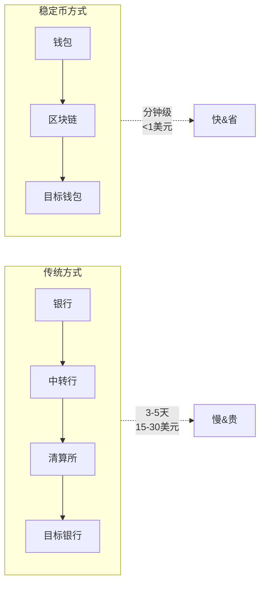

!!! info  The Payments Association, 2026
      "稳定币消除了多个中介环节，实现了近乎即时的结算，解决了跨境支付中最持久的延迟和成本来源之一。"

### 但现实很骨感

当你真的尝试用稳定币跨境转账时，会发现：
- 这边的交易所不支持提现到对方的国家
- 对方需要先有钱包和 KYC 才能收钱
- 转账可能被风控冻结
- 不同国家的监管要求不一样

这不仅是技术问题，更是政策问题。

## 第一部分：政策与监管挑战

### 1. 全球监管格局：七国争霸

2026 年，全球主要经济体对稳定币的监管框架逐步清晰，但**各地区差异巨大**：

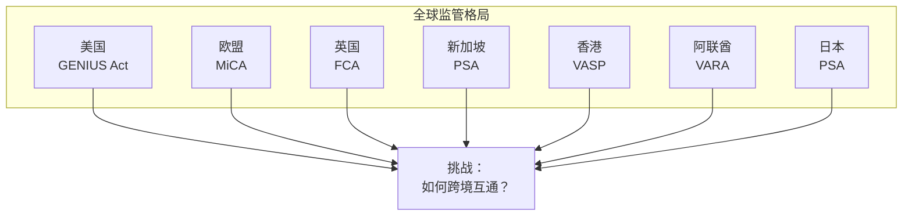

#### 主要监管框架对比

| 地区 | 法规 | 核心要求 | 特点 |
|------|------|---------|------|
| **美国** | GENIUS Act | 1:1 储备、牌照、审计 | 最严格 |
| **欧盟** | MiCA | 1:1 储备、EMEA 牌照 | 最成熟 |
| **英国** | FCA | 储备隔离、消费者保护 | 友好创新 |
| **新加坡** | PSA | 灵活牌照、逐步开放 | 亚太枢纽 |
| **香港** | VASP | 明确牌照、连接内地 | 桥梁角色 |


!!! info BVNk, 2026
      "2026年，稳定币已进入七大主要经济体的监管主流。美国、欧盟、英国、新加坡、香港、阿联酋、日本均已出台稳定币法规。"  


### 2. 跨境监管的核心难题

#### 难题一：谁发行的，谁监管？

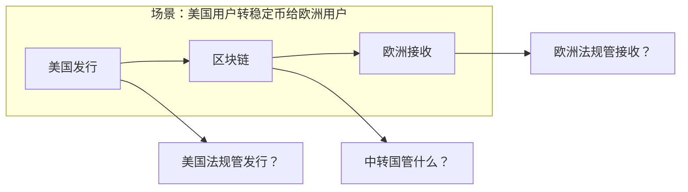

**问题**：
- USDT 由美国 Tether 发行，但服务器在全球
- 用户可能在任何国家接收
- 交易经过多个区块链和交易所

#### 难题二：储备资产的跨境归属

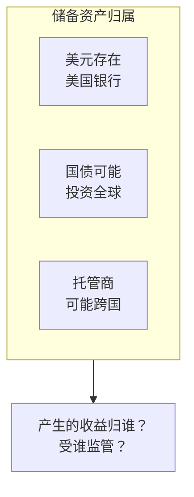

**案例**：
- USDC 的储备由 Circle 管理，存在美国银行
- USDT 的部分储备投资于全球商业票据
- 不同司法管辖区的法院对储备资产有不同的处置权

#### 难题三：Travel Rule（旅行规则）

!!! info Tazapay, 2026
      "FATF 的 Travel Rule 要求：超过 3000 美元的稳定币转账必须包含发送方和接收方的身份信息。"

**流程**：

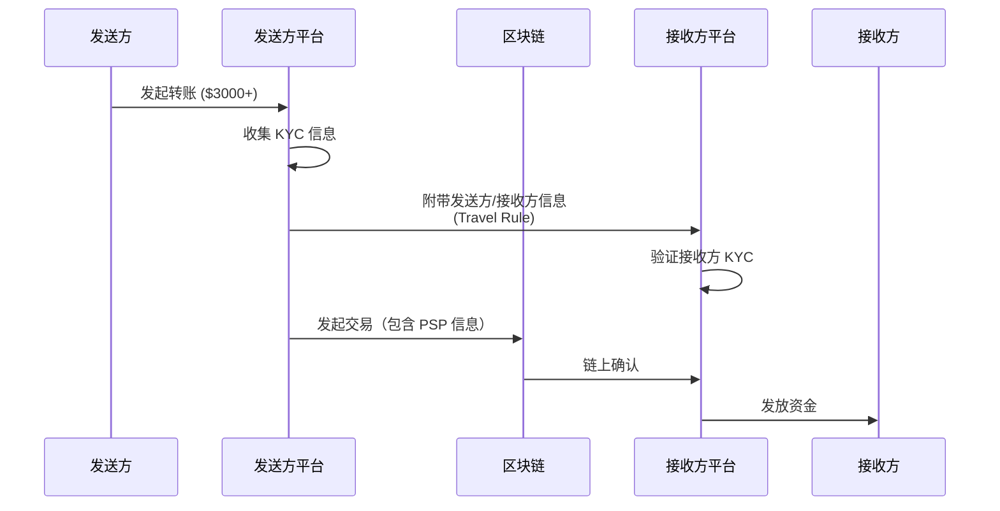

**挑战**：
- 不同地区对阈值定义不同（$1,000 - $3,000 不等）
- 隐私 vs 反洗钱的平衡
- 跨平台信息共享的技术难题

### 3. 政策风险的具体案例

#### 案例一：印度的"禁止"困境

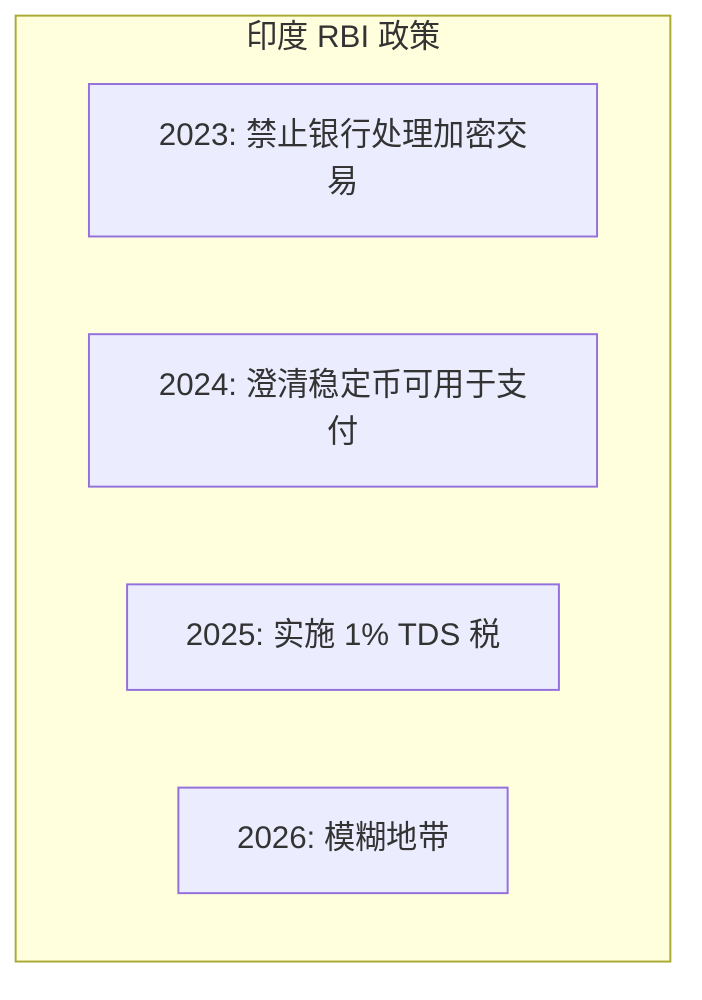

**结果**：
- 印度用户可以持有稳定币，但交易成本高
- 跨境汇款需通过"灰色渠道"
- 合规成本抵消了稳定币的低手续费优势

#### 案例二：中国的禁令与香港的桥接

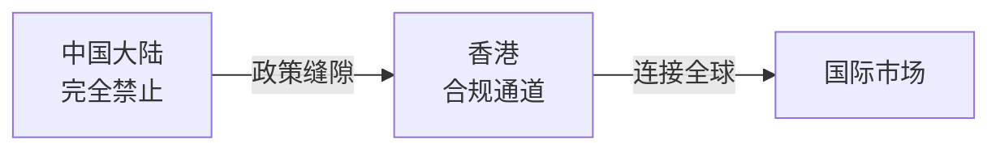

**现状**：
- 中国大陆禁止稳定币交易
- 香港成为"境外"稳定币枢纽
- 复杂的两段式转账流程

## 第二部分：技术挑战

### 1. 区块链互操作性问题

#### 跨链的技术复杂性

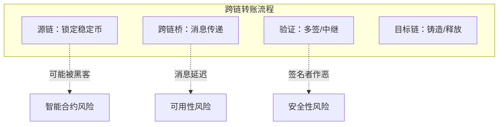

**跨链桥安全问题**：
- 2022-2025 年：跨链桥黑客攻击损失超 $50 亿
- 中心化跨链桥是单点故障
- 去中心化跨链桥复杂度高，性能差

#### 解决方案对比

| 方案 | 代表项目 | 优点 | 缺点 |
|------|---------|------|------|
| 锁定+铸造 | Wormhole | 通用性强 | 流动性割裂 |
| 原子交换 | — | 原子性 | 需要流动性 |
| 中继+验证 | Axelar | 去中心化 | 复杂度高 |
| 流动性网络 | Circle CCTP | 快速 | 需要合作伙伴 |

### 2. KYC/AML 的技术挑战

#### 链上 vs 链下身份

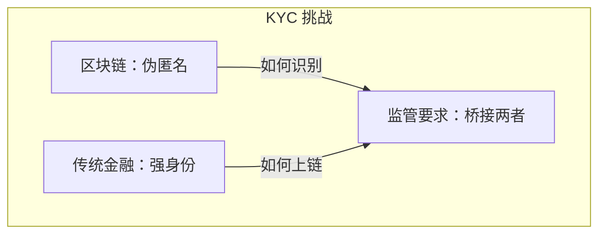

**技术方案**：

| 方案 | 描述 | 挑战 |
|------|------|------|
| **PSP 托管** | 通过合规交易所中转 | 中心化风险 |
| **零知识证明** | 验证身份但不泄露 | 实施复杂 |
| **链上声誉** | 基于历史行为评分 | 隐私争议 |
| **分层验证** | 按金额分级 KYC | 监管不确定性 |

#### 实际代码示例：合规检查

```solidity
// 简化版合规检查合约
contract CompliantStableCoin {
    mapping(address => bool) public isVerified;
    mapping(address => uint256) public verificationLevel;
    
    uint256 public tier1Limit = 1000;    // $1,000
    uint256 public tier2Limit = 10000;   // $10,000
    
    function transfer(address to, uint256 amount) external {
        // 检查发送方是否通过 KYC
        require(isVerified[msg.sender], "Sender not verified");
        
        // 根据金额级别检查
        if (amount > tier2Limit) {
            require(verificationLevel[msg.sender] >= 2, "Level 2 required");
        } else if (amount > tier1Limit) {
            require(verificationLevel[msg.sender] >= 1, "Level 1 required");
        }
        
        // Travel Rule 记录
        if (amount >= 3000) {
            recordTravelRule(msg.sender, to, amount);
        }
        
        _transfer(msg.sender, to, amount);
    }
}
```

### 3. 结算最终性争议

#### 什么是结算最终性？

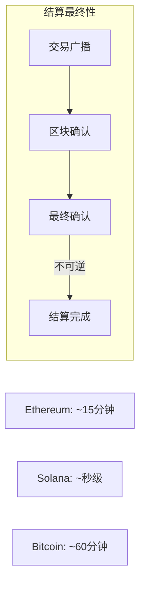

**问题**：
- 区块链"最终确认"是概率性的，不是绝对的
- 法律上什么才算"到账"？
- 纠纷如何仲裁？

#### 不同区块链的最终性

| 区块链 | 最终确认时间 | 特点 |
|--------|------------|------|
| Bitcoin | 60 分钟 | 最安全但最慢 |
| Ethereum | 15 分钟 | 平衡 |
| Solana | < 1 秒 | 快但历史较短 |
| Polygon | 几分钟 | Layer 2 折中 |

### 4. 性能与可扩展性瓶颈

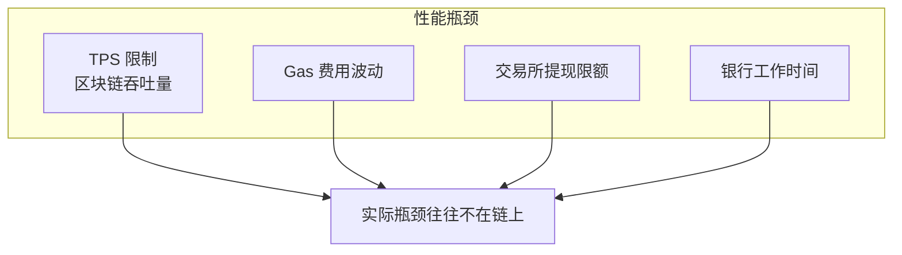

**数据**：
- Ethereum: ~15-30 TPS
- Solana: ~65,000 TPS（理论）
- Visa: ~24,000 TPS

**现实**：
- 链上 TPS 往往不是瓶颈
- 真正的瓶颈在：交易所 KYC、银行结算、合规审查

## 第三部分：行业应对方案

### 1. 多层合规架构

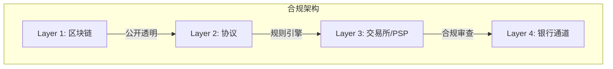

### 2. 监管沙盒与试点

| 地区 | 试点项目 | 状态 |
|------|---------|------|
| **英国** | FCA 沙盒 | 2025 启动 |
| **新加坡** | MAS 试点 | 2024 已有 |
| **阿联酋** | VARA 创新区 | 2025 开放 |
| **澳大利亚** | APRA 咨询 | 2026 进行中 |

### 3. 标准化努力

| 组织 | 方向 | 进展 |
|------|------|------|
| **FATF** | Travel Rule 统一 | 2025 R16 更新 |
| **FSB** | 跨境支付标准 | 2026 框架发布 |
| **ISO** | 代币化标准 | 2027 预期 |
| **WEF** | 互操作性指南 | 2026 发布 |

## 第四部分：未来展望

### 短期（2026-2027）

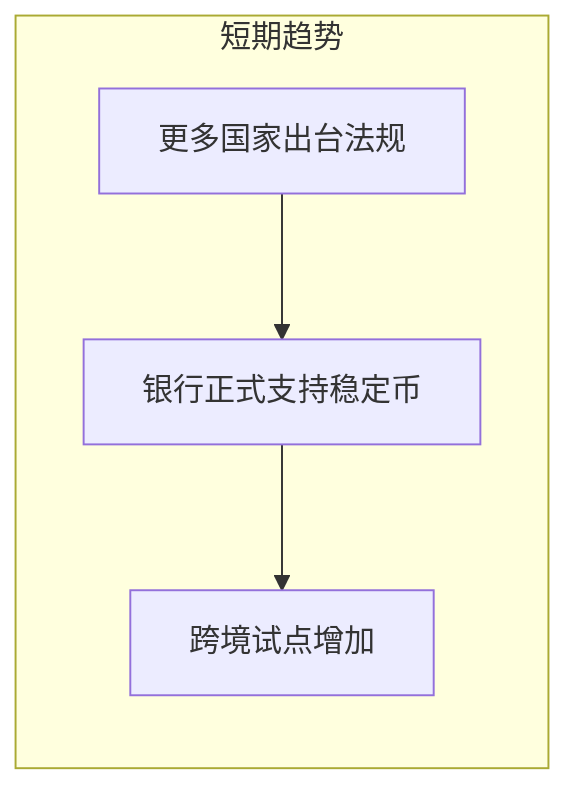

- 主要经济体法规基本完善
- 传统银行开始提供稳定币服务
- 区域性跨境走廊（如香港-新加坡）先行

### 中期（2027-2028）

- **央行数字货币（CBDC）与稳定币互操作**
- **AI 驱动的合规自动化**
- **统一的跨境标准出现**

### 长期（2028-2030）

- **全球一体化支付网络**
- **实时跨境结算成为默认**
- **"数字美元"生态成熟**

## 总结：挑战即机遇

### 核心挑战

| 类别 | 挑战 | 应对 |
|------|------|------|
| **政策** | 监管不一致 | 多层合规架构 |
| **技术** | 跨链复杂性 | 标准化协议 |
| **合规** | KYC/AML 碎片化 | AI 自动化 |
| **法律** | 结算最终性 | 明确法律框架 |

### 机遇

!!! info   World Economic Forum, 2026
      "稳定币正在从小众实验演变为跨境商务、人道主义援助和中小企业金融的嵌入式基础设施。"

### 一句话总结

 **2026 年的稳定币跨境转账，就像 1995 年的电子商务——技术已经可行，但基础设施建设才刚刚开始。**

**参考资料：**
- [The Payments Association: Cross-border payments in 2026](https://thepaymentsassociation.org/article/cross-border-payments-2026-friction-reform/)
- [BVNk: Global stablecoin regulations 2026](https://bvnk.com/blog/global-stablecoin-regulations-2026)
- [Forbes: Stablecoins Are Transforming Cross-Border Payments](https://www.forbes.com/councils/forbestechcouncil/2026/02/05/stablecoins-are-transforming-cross-border-payments/)
- [Tazapay: The Travel Rule for Cross-Border Payments 2026](https://tazapay.com/blog/travel-rule-cross-border-payments-2026)
- [World Economic Forum: How stablecoins can flatten and expand financial access](https://www.weforum.org/stories/2026/01/how-stablecoins-can-expand-financial-access/)
