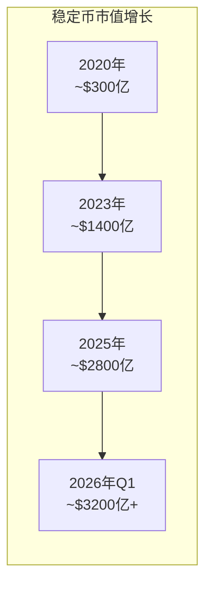
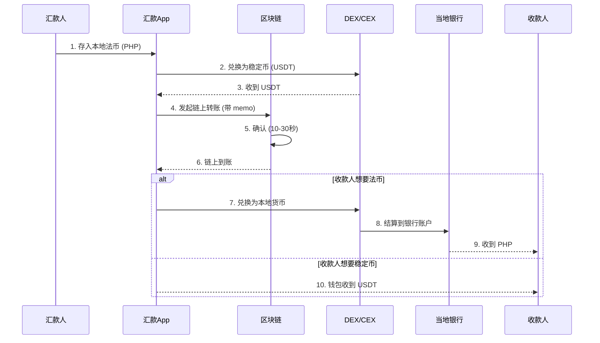

2025年，Stablecoin 处理了 **11.4 万亿美元**的交易量。  

但这只是一个开始。  

当 Visa 开始用 USDC 结算、MoneyGram 在拉美推出 USDC 提现服务、传统银行开始布局稳定币储备——跨境支付的格局正在被彻底改写。  


<!-- more -->

## 数字美元的新形态

### 什么是 Stablecoin？

Stablecoin（稳定币）是一种与法定货币（通常是美元）1:1 挂钩的加密货币。它的使命很纯粹：**在区块链上创造一种价值稳定的数字货币**。

| 类型 | 抵押方式 | 代表项目 | 特点 |
|------|---------|---------|------|
| 法币抵押 | 美元银行储备 | USDT, USDC, USAT | 最中心化，最安全 |
| 加密抵押 | ETH 等加密资产 | DAI, USDD | 去中心化，但有清算风险 |
| 算法稳定 | 算法调节 | UST（已崩盘） | 理论上最去中心化，但风险高 |

**2026年的格局**：法币抵押型稳定币占据绝对主导，市场上 95% 以上的稳定币都是这类。

### 市场规模爆发



- **2025年底**：稳定币市值突破 **2800 亿美元**
- **2025年全年**：链上交易量达 **11.4 万亿美元**
- **USDT**：占据 60.66% 市场份额
- **USDC**：24.64% 市场份额，正在快速增长
- **新进入者**：2026年1月 Tether 推出 USAT，直接挑战 USDC 的机构市场份额

## 跨境支付的痛点与 Stablecoin 的解法

### 传统跨境支付的问题

跨境汇款有多慢、多贵？以下是 2025 年的典型数据：

| 指标 | 传统方式 | Stablecoin 方式 |
|------|---------|----------------|
| **平均手续费** | 6.49% | < 1% |
| **结算时间** | 2-5 个工作日 | 分钟级 |
| **可用时间** | 工作日工作时间 | 7×24 即时 |
| **透明度** | 不透明 | 链上可查 |
| **准入门槛** | 需要银行账户 | 只需钱包 |

!!! note Forbes, 2026
     "跨境支付不是'快不快'的问题，而是'能不能'的问题。全球仍有 17 亿人没有银行账户。"

### Stablecoin 如何解决这些问题

#### 1. 成本降低 90%

传统跨境支付的成本结构：
- 银行中转行费用
- 外汇差价
- 合规审核成本
- 人工操作成本

Stablecoin 的成本结构：
- 区块链 Gas 费（通常几美分）
- 交易所兑换手续费（< 0.5%）
- 合规工具成本（规模化后趋近于零）

```python
# 传统 SWIFT 转账 vs Stablecoin 转账成本对比
traditional_cost = 1000 * 0.0649  # 6.49% = $64.9
stablecoin_cost = 1000 * 0.005    # 0.5% = $5

# 节省: $64.9 - $5 = $59.9 = 92% 节省
savings_percentage = (traditional_cost - stablecoin_cost) / traditional_cost * 100
```

#### 2. 结算速度：从天到分钟

传统模式：
```
汇款人 → 发起行 → 中转行 → 清算所 → 接收行 → 收款人
   |         |        |        |        |
  0h       2-4h     4-8h    8-24h   24-72h (实际到账)
```

Stablecoin 模式：
```
汇款人 → 钱包 → 区块链确认 → 钱包 → 收款人
   |       |       10-30秒     |
  0h     1s         -        ~1分钟到账
```

#### 3. 7×24 无间断

传统银行系统有"下班时间"：  
- SWIFT 不在周末和节假日处理
- 外汇市场有交易时段
- 各国清算所有固定结算时间

Stablecoin 运行在区块链上：  
- 7×24×365 无休
- 自动执行，无需人工干预
- 智能合约保证确定性

## 2026 年关键趋势

### 趋势一：监管框架明确，企业级采用加速

2025-2026 年，全球主要经济体陆续出台稳定币监管规则：

| 地区 | 法规 | 关键点 |
|------|------|-------|
| **美国** | 即将出台联邦稳定币法案 | 储备透明、发行牌照、禁止 algorithmic backing |
| **欧盟** | MiCA (2024生效) | 严格牌照制度、储备审计、投资者保护 |
| **英国** | FCA 监管 | 强调反洗钱、储备隔离 |
| **新加坡** | PSA 框架 | 友好但审慎，鼓励创新 |

!!! note Finextra, 2026
     "银行在2026年没有'稳定币问题'，只有'结算层策略'问题。稳定币悄悄成为了 24/7、即时结算的基础设施。"  

### 趋势二：传统金融机构全面入局

**Visa & Mastercard**
- 2023年起 Visa 用 USDC 与发行商结算
- 2025年底扩展到 Solana 和 Ethereum
- 稳定币卡片（Stablecoin Cards）成为 2026 年爆发点

**MoneyGram**
- 2025年9月在哥伦比亚推出 USDC 服务
- 用户可即时收到美元稳定币余额
- 可提现至本地银行或钱包

**商业银行**
- JPM Coin（摩根大通）已处理超过 3000 亿美元
- 贝莱德探索稳定币作为 Treasury 管理工具
- 各国央行考虑 CBDC 与稳定币的互操作性

### 趋势三：代币化流动性（Tokenized Liquidity）

传统跨境支付的 liquidity 分散在各地银行：
- 香港的美元流动性无法直接用于新加坡
- 每个"管道"都需要独立维护

Tokenized Liquidity 的新模式：
```
不同国家的流动性 → 统一到区块链上 → 实时跨链兑换 → 本地结算
```

好处：
- 减少 80% 的"管道"维护成本
- 流动性集中，汇率更好
- 真正实现"全球一体化资金池"

### 趋势四：新兴市场爆发

稳定币在新兴市场找到了最刚需的场景：

| 国家/地区 | 痛点 | Stablecoin 解决方案 |
|-----------|------|-------------------|
| **阿根廷** | 高通胀 (>50%)、汇率管制 | 持有 USDT 保值 |
| **委内瑞拉** | 本币崩溃、汇款困难 | 跨境美元支付 |
| **尼日利亚** | 外汇短缺、银行转账慢 | 稳定币即时结算 |
| **菲律宾** | 侨汇成本高 (平均 6%) | 手续费 < 1% |

!!! info Thunes Report, 2026
      "在菲律宾，2025年通过稳定币完成的侨汇已经超过 20 亿美元，占整个侨汇市场的 8%。"  

## 技术架构：Stablecoin 跨境支付是如何工作的？

### 核心流程



### 关键组件

1.**On/Off Ramp（入金/出金）**
   - 交易所： Binance, Coinbase, Kraken
   - 专用服务商： MoonPay, Transak, Simplex
   - P2P：LocalBitcoins 风格

2.**DEX（去中心化交易所）**
   - Uniswap, Curve（以太坊）
   - Jupiter, Raydium（Solana）

3.**跨链桥（Bridge）**
   - 资产跨链： Wormhole, Axelar, Stargate
   - 统一流动性层： Socket, Li.Fi

4.**合规层**
   - KYC/AML： Chainalysis, Elliptic
   - 制裁筛查： OFAC 过滤

## 挑战与风险

### 1. 监管不确定性

- 美国联邦稳定币法案仍未完全落地
- 不同司法管辖区规则冲突
- "灰色地带"可能带来合规风险

### 2. 储备透明度

- USDT 的储备长期被质疑（虽已改善）
- 银行挤兑风险（如果大量赎回）
- 需要第三方审计和实时披露

### 3. 链上风险

- 智能合约漏洞
- 跨链桥黑客攻击（2025年 Bridge 攻击损失 >$20亿）
- 网络拥堵导致 Gas 费飙升

### 4. 用户体验

- 私钥管理门槛
- 钱包地址错误不可逆
- 法币兑换的"最后一公里"

## 未来展望：2027-2030

### 短期（2026-2027）

- 稳定币市值突破 **5000 亿美元**
- 跨境支付市场份额达到 **15%**
- 主流银行全面支持稳定币托管

### 中期（2027-2028）

- **央行数字货币（CBDC）** 与稳定币互操作
- **实时外汇** 通过稳定币实现
- **嵌入式金融**：电商、平台内直接使用稳定币结算

### 长期（2028-2030）

- **全球一体化支付网络**：类似 SWIFT，但基于区块链
- **编程货币**：智能合约自动执行跨境供应链付款
- **无人化金融**：AI Agent 直接管理跨境资金流

## 总结

Stablecoin 正在做的事情，本质上是把跨境支付重新发明了一遍：

| 维度 | 过去 | 未来 |
|------|------|------|
| 成本 | 6%+ | <1% |
| 速度 | 天 | 分钟 |
| 可用性 | 银行工作时间 | 7×24 |
| 门槛 | 银行账户 | 钱包 |
| 透明度 | 黑盒 | 链上可查 |

!!!info  Maher Haddad, LinkedIn, 2026
      "跨境支付的未来不只是更快。它会更智能、更便宜、更普惠。"  

对于从业者：
- **汇款公司**：要么拥抱 Stablecoin，要么被淘汰
- **银行**：把 Stablecoin 纳入结算层战略
- **开发者**：关注 On/Off Ramp、合规工具、跨链基础设施

对于普通人：
- 换汇成本降低 90%
- 汇款回家更快更便宜
- 持有"数字美元"抵抗通胀

这是一个 万亿美元的机会，也是一场正在发生的金融革命。

**参考资料：**
- [Forbes: Stablecoins Are Transforming Cross-Border Payments](https://www.forbes.com/councils/forbestechcouncil/2026/02/05/stablecoins-are-transforming-cross-border-payments/)
- [Thunes: 5 Stablecoin Trends Shaping Global Payments in 2026](https://www.thunes.com/insights/trends/stablecoin-trends-shaping-global-payments/)
- [Finextra: How banks should approach stablecoins in 2026](https://www.finextra.com/blogposting/30865)
- [The Payments Association: Cross-border payments in 2026](https://thepaymentsassociation.org/article/cross-border-payments-2026-friction-reform/)
