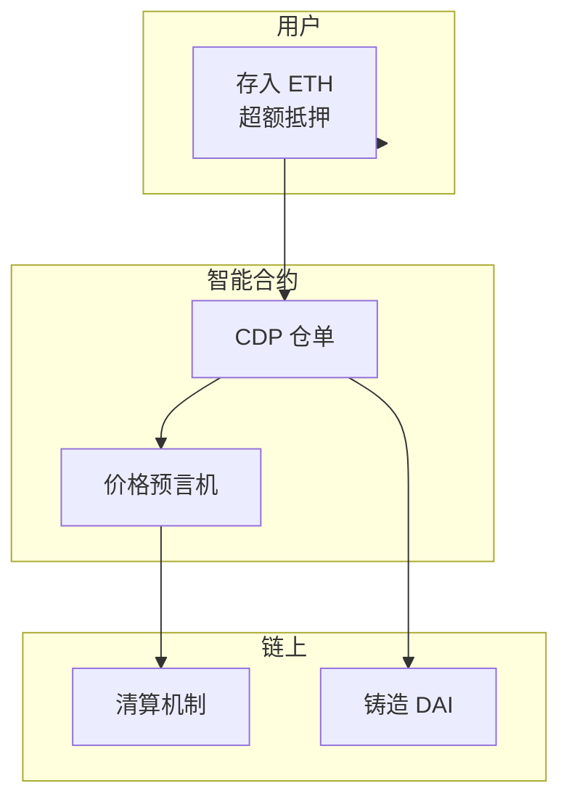
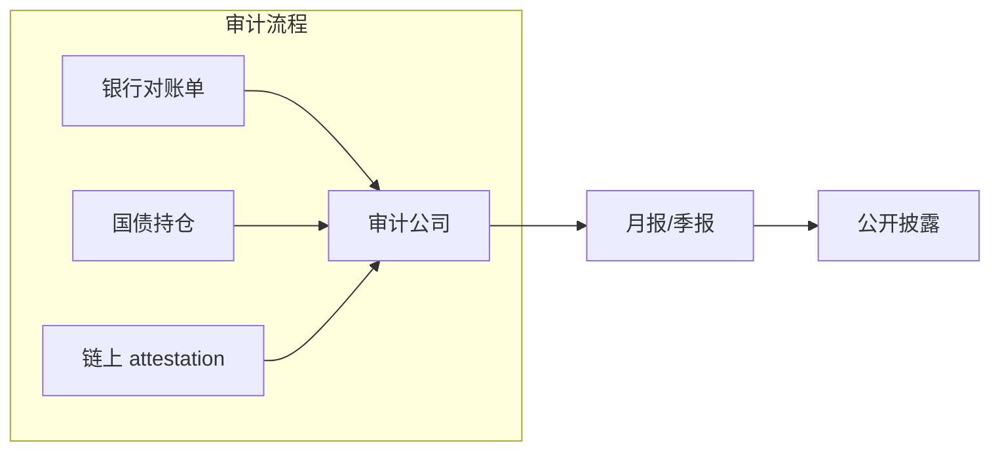
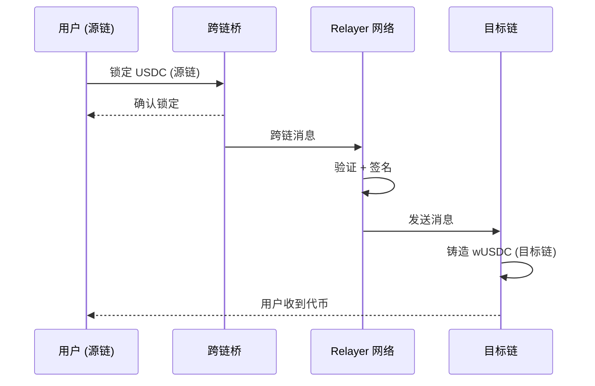

你知道当你转账 USDT 时，背后的资金是如何流动的吗？为什么有时候需要几天才能到账？为什么有时候会冻结？让我们一起解析 Stablecoin 的技术架构，从链上智能合约到链下银行储备，全面理解这个 3200 亿市场的运作原理吧。

<!-- more -->

## 引言

截至 2026 年 Q1，稳定币市场规模已突破 **3200 亿美元**，年交易量超过 **11 万亿美元**。

但大部分人对稳定币的理解仅限于："一种和美元 1:1 挂钩的加密货币"。

这篇文章将带你深入理解：
- 稳定币的链上智能合约如何运作
- 链下储备资产是如何管理和审计的
- 为什么有时候转账会很慢
- 多链部署的技术挑战

## 稳定币的类型与技术实现

### 1. 法币抵押型（Fiat-Collateralized）

这是最主流的类型，代表：USDT、USDC、USAT

```
┌─────────────────────────────────────────────────────────┐
│                    用户层                                │
│  ┌─────────┐    ┌─────────┐    ┌─────────┐             │
│  │ 铸造    │    │ 转账    │    │ 赎回    │             │
│  └────┬────┘    └────┬────┘    └────┬────┘             │
│       │              │              │                    │
│       └──────────────┴──────────────┘                    │
│                      │                                   │
│                      ▼                                   │
│         ┌─────────────────────┐                         │
│         │   智能合约 (链上)     │                         │
│         │  - 铸造 (mint)       │                         │
│         │  - 转账 (transfer)   │                         │
│         │  - 赎回 (redeem)     │                         │
│         │  - 供应量调控        │                         │
│         └──────────┬──────────┘                         │
└────────────────────┼────────────────────────────────────┘
                     │
                     ▼
┌─────────────────────────────────────────────────────────┐
│                   储备层 (链下)                          │
│  ┌──────────────┐  ┌──────────────┐  ┌──────────────┐  │
│  │ 银行账户     │  │ 国债/短期     │  │ 审计报告      │  │
│  │ (美元储备)   │  │ 投资组合      │  │ (月度披露)   │  │
│  └──────────────┘  └──────────────┘  └──────────────┘  │
└─────────────────────────────────────────────────────────┘
```

#### 铸造流程（Mint）

```solidity
// 简化版 ERC-20 稳定币合约
contract StableCoin {
    mapping(address => uint256) public balanceOf;
    uint256 public totalSupply;
    address public operator;  // 授权的运营商
    
    function mint(address to, uint256 amount) external {
        require(msg.sender == operator, "Not authorized");
        
        // 链上：增加供应量
        balanceOf[to] += amount;
        totalSupply += amount;
        
        // 链下：运营商收到法币后执行 mint
        // 用户向银行账户存入美元
        // 运营商验证后调用 mint
    }
    
    function redeem(address from, uint256 amount) external {
        require(msg.sender == operator, "Not authorized");
        
        // 链上：销毁代币
        balanceOf[from] -= amount;
        totalSupply -= amount;
        
        // 链下：运营商将美元汇出到用户银行账户
    }
}
```

#### 关键设计点

| 机制 | 说明 |
|------|------|
| **发行权中心化** | 只有授权运营商可以 mint/redeem，防止滥发 |
| **链上可验证** | 总供应量实时可查，但储备需要链下审计 |
| **1:1 锚定** | 理论上 1 USDC = 1 美元储备 |

### 2. 加密抵押型（Crypto-Collateralized）

代表项目：DAI、USDD



**超额抵押模型**：
- 存入价值 $200 的 ETH，铸造 $100 的 DAI
- 抵押率 200%
- 当 ETH 下跌到可能不足以支撑 DAI 时，触发清算

```solidity
// 简化版 CDP 合约
contract CDPEngine {
    struct Position {
        address owner;
        uint256 collateral;  // 抵押物数量
        uint256 debt;         // 铸造的 DAI 数量
    }
    
    uint256 public liquidationRatio = 150;  // 150% 清算线
    
    function mint(address to, uint256 amount, uint256 collateralAmount) external {
        Position storage pos = positions[to];
        
        // 检查清算比率
        uint256 collateralValue = getCollateralValue(collateralAmount);
        uint256 totalValue = collateralValue - amount;
        uint256 ratio = (totalValue * 100) / amount;
        
        require(ratio >= liquidationRatio, "Below liquidation ratio");
        
        pos.collateral += collateralAmount;
        pos.debt += amount;
        _mint(to, amount);
    }
    
    function liquidate(address owner) external {
        Position storage pos = positions[owner];
        uint256 collateralValue = getCollateralValue(pos.collateral);
        uint256 ratio = (collateralValue * 100) / pos.debt;
        
        require(ratio < liquidationRatio, "Position is healthy");
        
        // 清算逻辑...
    }
}
```

### 3. 算法稳定币（Algorithmic）

代表：曾经的 UST（已崩盘）

算法稳定币的致命问题：**无法应对黑天鹅事件**。

2022 年 UST 崩盘给行业的教训是：**没有任何算法可以替代真实储备**。

## 链下储备体系：资金是如何管理的？

### 储备资产类型

| 资产类型 | 比例 | 风险 |
|---------|------|------|
| 现金 + 银行存款 | 30-40% | 低流动性风险 |
| 美国短期国债 (T-Bills) | 40-50% | 市场价值波动 |
| 商业票据 | 10-20% | 信用风险 |
| 逆回购协议 | 5-10% | 低风险 |

### 审计机制



主流稳定币的审计频率：
- **USDC**：每月审计，实时 attestation（通过 POA）
- **USDT**：不定期审计（被诟病）
- **USAT**（Tether 新品）：声称每日审计

### 储备证明（Proof of Reserves）

链上 attestation 是 2025-2026 年的重要改进：

```solidity
// USDC 使用的 attestation 机制
interface IReserveAttestation {
    function latest attestationId() external view returns (bytes32);
    function latestBalance() external view returns (uint256);
    function latestAttestation() external view returns (Attestation memory);
}

// 链下服务定期提交链上证明
contract AttestationStation {
    bytes32 public latestAttestation;
    
    function submitAttestation(
        bytes32 hash,
        uint256 balance,
        bytes calldata signature
    ) external onlyAttester {
        // 验证签名...
        latestAttestation = hash;
    }
}
```

## 多链部署的技术架构

### 为什么需要多链？

- **用户在不同链**：Ethereum、Solana、Polygon、Arbitrum...
- **Gas 费用**：以太坊 Gas 贵，用户想在便宜链上交易
- **速度**：Solana 快，以太坊慢

### 跨链桥架构



### 常见跨链方案对比

| 方案 | 代表项目 | 速度 | 安全性 | 费用 |
|------|---------|------|--------|------|
| 锁定+铸造 | Wormhole, Stargate | 中等 | 中等 | 中等 |
| 流动性网络 | Circle CCTP | 快 | 高 | 低 |
| 原子交换 | — | 快 | 高 | 高 |

### Circle CCTP 的技术实现

Circle 的 Cross-Chain Transfer Protocol (CCTP) 是目前最安全的方案：

```solidity
// CCTP 核心逻辑
contract CircleTransmitter {
    function transmitMessage(
        bytes calldata payload,
        uint32 destinationDomain,
        bytes32 recipient,
        bytes calldata hookData
    ) external returns (uint64) {
        // 源链：销毁 USDC
        burnTokens(msg.sender, payload.amount);
        
        // 发送消息到目标链
        return _sendMessage(destinationDomain, payload);
    }
}

contract CircleReceiver {
    function processMessage(
        bytes calldata payload,
        bytes calldata signature
    ) external {
        // 验证消息
        require(verifyMessage(payload, signature), "Invalid signature");
        
        // 目标链：铸造 USDC
        mintTokens(payload.recipient, payload.amount);
    }
}
```

## 转账延迟与冻结的技术原因

### 为什么有时候很慢？

| 原因 | 说明 |
|------|------|
| **链上确认** | 需要区块链确认，Ethereum ~15分钟，Solana ~几秒 |
| **跨链中转** | 涉及跨链桥，需要额外时间 |
| **合规审查** | 大额或异常交易可能被风控拦截 |
| **储备不足** | 赎回时如果美元储备不足，需要时间调度 |

### 冻结机制

```solidity
// 运营商可以冻结地址（合规要求）
contract StableCoinWithFreeze {
    mapping(address => bool) public frozen;
    
    function freeze(address account) external onlyOperator {
        frozen[account] = true;
    }
    
    function transfer(address to, uint256 amount) external {
        require(!frozen[msg.sender], "Account frozen");
        require(!frozen[to], "Recipient frozen");
        // 正常转账逻辑...
    }
}
```

**注意**：USDT 的冻结功能曾用于执法部门请求，这是合规的代价。

## 未来架构演进

### 1. 链上储备证明（On-Chain Reserve Proof）

完全去中心化的储备验证：
- 银行账户通过预言机直接链上呈现
- 实时而非月度审计

### 2. 利息分成（Yield Sharing）

2026 年新趋势：持有稳定币也能获得收益

```solidity
// 收益分成的稳定币
contract YieldStableCoin {
    mapping(address => uint256) public accruedYield;
    
    function claimYield() external {
        uint256 yield = calculateYield(msg.sender);
        accruedYield[msg.sender] += yield;
    }
}
```

### 3. AI + 稳定币

!!!info Stablecoin Insider
     "AI Agents 和稳定币正在驱动 2026 年的即时机器支付。"

```
AI Agent → 稳定币支付 → 自动化结算 → 实时到账
```

## 总结

| 层级 | 关键点 |
|------|-------|
| **链上** | 智能合约控制 mint/redeem，ERC-20 标准 |
| **链下** | 银行储备 + 国债 + 审计 |
| **跨链** | 锁定/铸造 vs 流动性网络 |
| **合规** | KYC/AML + 冻结功能 |

理解这些架构，才能真正理解稳定币的风险与机会。

---

**参考资料：**
- [Chainlink: Stablecoins 2026 Guide](https://chain.link/education-hub/stablecoins)
- [World Economic Forum: Stablecoins Interoperability](https://www.weforum.org/stories/2026/01/stablecoins-bridge-not-a-threat-why-interoperability-will-define-future-global-finance/)
- [Finextra: Stablecoins in 2026](https://www.finextra.com/the-long-read/1597/stablecoins-in-2026-how-digital-dollars-become-financial-plumbing)
