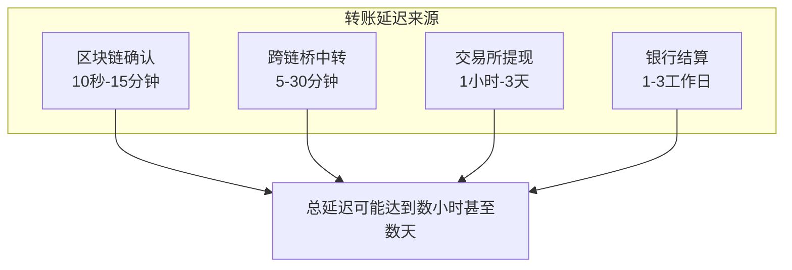
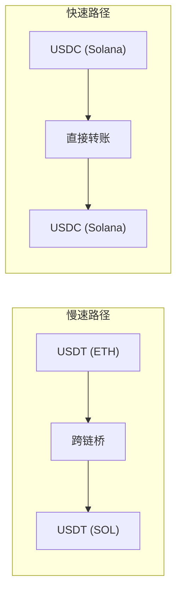
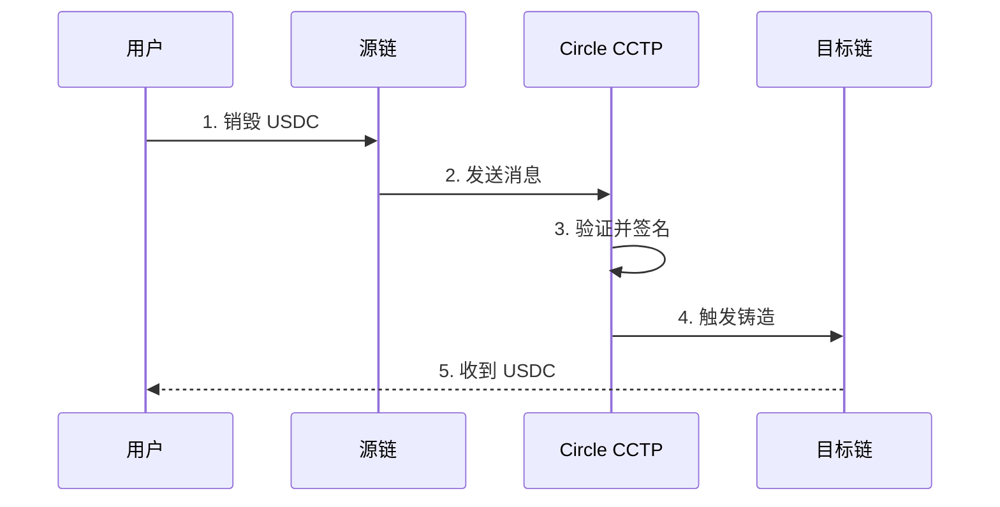
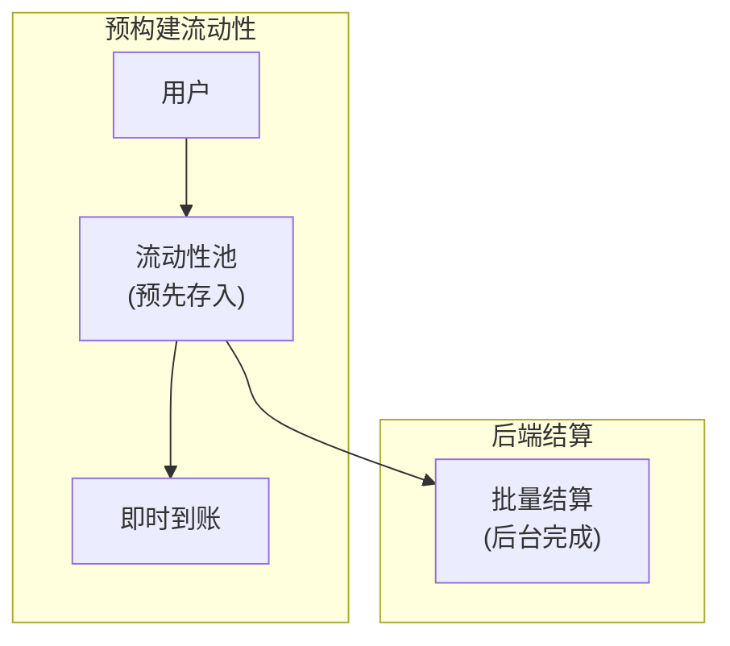
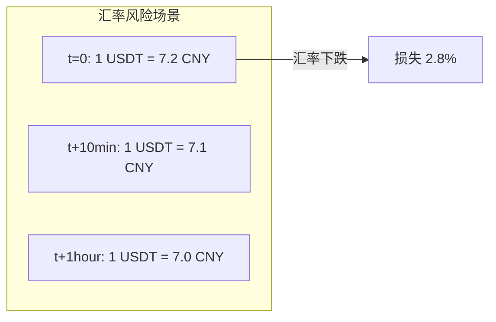

当你用稳定币转账时，是否遇到过转账延迟几分钟甚至几十分钟的情况？当你需要换汇时，是否担心汇率波动导致损失？在此我们简单探讨稳定币转账的性能优化技巧，以及如何在跨境支付中锁定汇率。

<!-- more -->

## 引言

稳定币转账的核心承诺是：**更快、更便宜**。

但现实情况是：
- 同样是稳定币转账，有的几秒到账，有的要等十几分钟
- 换汇时汇率波动，一不小心就亏了几个点
- 同样的金额，不同渠道费用差好几倍

这篇文章将告诉你：
1. 如何优化稳定币转账速度
2. 如何锁定汇率，避免汇率波动风险
3. 2026 年最新的最佳实践

## 第一部分：如何提速稳定币转账？

### 1.1 转账慢的根源



### 1.2 提速技巧一：选择更快的区块链

| 区块链 | 确认时间 | 适合场景 |
|--------|---------|---------|
| **Solana** | < 1 秒 | 极致速度 |
| **Avalanche** | 1-2 秒 | 快速且便宜 |
| **Polygon** | 2-5 秒 | 低费用 |
| **Arbitrum/Optimism** | 3-10 分钟 | Layer 2 |
| **Ethereum** | 5-15 分钟 | 高安全性 |
| **Bitcoin** | 30-60 分钟 | 不推荐 |

**实战建议**：

```python
# 选择最优链的伪代码
def select_fastest_chain(amount, from_currency, to_currency):
    chains = {
        'solana': {'speed': 1, 'fee': 0.0001},
        'polygon': {'speed': 3, 'fee': 0.001},
        'arbitrum': {'speed': 5, 'fee': 0.002},
        'ethereum': {'speed': 10, 'fee': 0.01},
    }
    
    # 根据金额选择
    if amount < 10000:
        return 'solana'  # 小额走最快
    elif amount < 100000:
        return 'polygon'  # 中额走均衡
    else:
        return 'arbitrum'  # 大额走安全
```

### 1.3 提速技巧二：使用原生资产而非跨链桥

**核心原则**：**同链转账 > 跨链转账**



**解决方案**：
- 发送方和接收方使用**同一区块链**
- 例如：都用 Solana 上的 USDC，而非 ETH 上的 USDT 转到 SOL 上的 USDT

### 1.4 提速技巧三：选择合适的跨链方案

如果必须跨链，选择**最快的跨链方案**：

| 方案 | 速度 | 安全性 | 费用 |
|------|------|--------|------|
| **Circle CCTP** | 快 | 高 | 低 |
| **Wormhole** | 中等 | 中 | 中 |
| **Stargate** | 中等 | 中 | 中 |
| **传统锁定+铸造** | 慢 | 高 | 高 |

**Circle CCTP (Cross-Chain Transfer Protocol)** 是 2026 年最快最安全的方案：



### 1.5 提速技巧四：批量转账

如果是批量付款（如工资、供应商款），使用**批量处理**：

```python
# 批量转账优化
async def batch_transfer(recipients, amount_each):
    # 错误做法：逐个转账
    for recipient in recipients:
        await transfer(recipient, amount_each)  # 慢！
    
    # 正确做法：批量处理
    # 1. 先把所有收款人加到一个群组
    # 2. 用群消息功能一次性发送
    # 3. 或者使用智能合约批量分发
```

### 1.6 提速技巧五：预构建流动性

对于高频转账场景，**预构建流动性池**：



**实现方式**：
- 在目标地区预先存入稳定币
- 用户转账时，从本地池即时扣款
- 后台异步结算

## 第二部分：如何锁定汇率？

### 2.1 汇率波动风险



### 2.2 方法一：使用 DEX 限价单

**原理**：设置目标价格，只有达到该价格时才执行成交。

```python
# Uniswap V3 限价单伪代码
class DexLimitOrder:
    def create_limit_order(self, token_in, token_out, amount, limit_price):
        """
        创建限价单
        """
        # 1. 创建流动性头寸，只允许特定价格范围成交
        position = self.uniswap_v3.create_position(
            token0=token_in,
            token1=token_out,
            amount=amount,
            price_range=(limit_price * 0.999, limit_price * 1.001),
            tick_lower=self.price_to_tick(limit_price * 0.999),
            tick_upper=self.price_to_tick(limit_price * 1.001)
        )
        
        # 2. 当价格达到限价时，头寸会自动成交
        return position
```

**支持的 DEX**：
- **Uniswap V3**：支持限价范围单
- **1inch**：智能路由 + 限价功能
- **Gelato**：自动化限价单

### 2.3 方法二：使用 Chainlink 价格预言机

**原理**：使用预言机锁定执行价格。

```solidity
// 使用 Chainlink 预言机锁定汇率
contract PriceLockedSwap {
    AggregatorV3Interface public priceFeed;
    
    function swapWithPriceLock(
        address tokenIn,
        address tokenOut,
        uint256 amountIn,
        uint256 maxSlippage  // 最大滑点，如 300 = 0.3%
    ) external {
        // 获取当前价格
        (, int256 price, , , ) = priceFeed.latestRoundData();
        
        // 计算最大可接受价格
        uint256 maxAcceptablePrice = uint256(price) * (10000 + maxSlippage) / 10000;
        
        // 执行 swap
        // 如果实际价格超过 maxAcceptablePrice，交易会失败
    }
}
```

### 2.4 方法三：使用 Forward 合约（远期合约）

**原理**：锁定未来某个时间点的执行价格。

```solidity
// 简化版远期合约
contract ForwardContract {
    struct Forward {
        address holder;
        address token;
        uint256 amount;
        uint256 lockedPrice;
        uint256 executionTime;
        bool executed;
    }
    
    mapping(bytes32 => Forward) public forwards;
    
    function createForward(
        address token,
        uint256 amount,
        uint256 lockedPrice,
        uint256 daysToExecute
    ) external returns (bytes32) {
        bytes32 forwardId = keccak256(abi.encodePacked(
            msg.sender, token, amount, block.timestamp
        ));
        
        forwards[forwardId] = Forward({
            holder: msg.sender,
            token: token,
            amount: amount,
            lockedPrice: lockedPrice,
            executionTime: block.timestamp + daysToExecute * 1 days,
            executed: false
        });
        
        return forwardId;
    }
}
```

### 2.5 方法四：分批换汇 + 成本平均

**原理**：不一次性换汇，而是分批执行，平滑汇率波动。

```python
# 成本平均策略
def dollar_cost_average_swap(total_amount, num_batches, interval_seconds):
    """
    分批换汇，平滑汇率波动
    """
    batch_amount = total_amount / num_batches
    results = []
    
    for i in range(num_batches):
        # 执行一批换汇
        result = execute_swap(batch_amount)
        results.append(result)
        
        # 等待一段时间（除非是最后一批）
        if i < num_batches - 1:
            time.sleep(interval_seconds)
    
    # 计算平均汇率
    avg_rate = sum(r['rate'] for r in results) / len(results)
    return {
        'total_swapped': total_amount,
        'avg_rate': avg_rate,
        'batches': results
    }
```

**示例**：
```
一次性换汇 10000 USDC：
- 假设汇率 7.20，10分钟后变成 7.10
- 实际到手：10000 × 7.10 = 71000 CNY

分批换汇（5批 × 2000）：
- 第1批：7.20 → 14400
- 第2批：7.18 → 14360
- 第3批：7.15 → 14300
- 第4批：7.12 → 14240
- 第5批：7.10 → 14200
- 总计：71500 CNY（比一次性多 500 CNY）
```

### 2.6 方法五：使用 CeFi 平台的锁价功能

很多中心化交易所和支付平台提供**锁价功能**：

| 平台 | 锁价时间 | 费用 |
|------|---------|------|
| **Binance** | 10 分钟 | 免费 |
| **Kraken** | 5 分钟 | 免费 |
| **MoonPay** | 实时 | 1-2% |
| **Transak** | 实时 | 1-2% |

```javascript
// Binance 锁价 API 示例
const result = await binance.p2p.createTrade({
    priceLockTime: 600,  // 锁价 10 分钟
    fiatAmount: 10000,
    fiatCurrency: 'CNY',
    tradeType: 'BUY',
    asset: 'USDT'
});

// 用户有 10 分钟时间完成支付
// 汇率锁定，不会变动
```

## 第三部分：最优实践组合

### 3.1 场景一：个人小额转账（<$1,000）

**目标**：最快速度 + 最低费用

```
推荐方案：
1. 使用 Solana 或 Polygon 链
2. 使用 USDC（比 USDT 更快被接受）
3. 同链转账，直接到账
```

**预期时间**：< 30 秒
**费用**：< $0.01

### 3.2 场景二：跨境汇款（$1,000-$100,000）

**目标**：速度 + 汇率保障

```
推荐方案：
1. 使用 Circle CCTP 跨链（最快最安全）
2. 使用限价单锁定汇率
3. 分批换汇平滑波动
```

**预期时间**：1-5 分钟
**费用**：0.5-1%

### 3.3 场景三：大额转账（>$100,000）

**目标**：安全 + 汇率最优

```
推荐方案：
1. 选择多条路由比价（1inch）
2. 使用远期合约锁定汇率
3. 分批执行，每批间隔数小时
```

**预期时间**：1-24 小时
**费用**：0.1-0.5%

## 第四部分：工具推荐 2026

### 4.1 跨链转账工具

| 工具 | 特点 | 费用 |
|------|------|------|
| **Circle CCTP** | 最快、最安全 | 低 |
| **1inch** | 智能路由比价 | 中 |
| **Stargate** | 流动性好 | 中 |
| **Wormhole** | 支持多链 | 中 |

### 4.2 汇率锁定工具

| 工具 | 用途 | 费用 |
|------|------|------|
| **Uniswap V3** | DEX 限价单 | 0.3% |
| **1inch** | 聚合比价 | 0.5% |
| **Chainlink** | 预言机价格 | 免费 |
| **Gelato** | 自动化锁价 | 0.5% |

### 4.3 支付平台

| 平台 | 锁价时间 | 适合场景 |
|------|---------|---------|
| **Binance P2P** | 10 分钟 | 个人换汇 |
| **Remitly** | 实时 | 侨汇 |
| **Wise** | 锁定 | 银行转账替代 |
| **WorldRemit** | 实时 | 快速到账 |

## 第五部分：常见问题

### Q1：为什么有时候转账很慢？

**常见原因**：
1. 区块链拥堵（Gas 费过低）
2. 跨链需要额外确认
3. 交易所人工审核
4. KYC/AML 合规检查

**解决**：选择不拥堵的链、使用更高的 Gas、选择合规渠道

### Q2：汇率锁定失败怎么办？

**预案**：
1. 设置合理的滑点容忍度（如 1%）
2. 分批换汇降低单次风险
3. 使用有锁价功能的平台

### Q3：最推荐的转账组合是什么？

**2026 年最佳组合**：
- **链**：Solana（速度）或 Polygon（费用）
- **稳定币**：USDC（最被接受）
- **跨链**：Circle CCTP
- **换汇**：1inch 限价单

## 总结

### 提速要点

| 技巧 | 效果 | 难度 |
|------|------|------|
| 选择更快链 | ⭐⭐⭐⭐⭐ | 易 |
| 同链转账 | ⭐⭐⭐⭐⭐ | 易 |
| Circle CCTP | ⭐⭐⭐⭐ | 中 |
| 批量处理 | ⭐⭐⭐ | 中 |
| 预构建流动性 | ⭐⭐⭐⭐⭐ | 难 |

### 锁价要点

| 方法 | 效果 | 难度 |
|------|------|------|
| DEX 限价单 | ⭐⭐⭐⭐ | 中 |
| 预言机合约 | ⭐⭐⭐⭐⭐ | 难 |
| 远期合约 | ⭐⭐⭐⭐⭐ | 难 |
| 分批换汇 | ⭐⭐⭐ | 易 |
| CeFi 锁价 | ⭐⭐⭐⭐ | 易 |

### **一句话总结**：快速度 + 汇率保障 = **选对链 + 限价单 + 分批执行**

**参考资料：**
- [Circle CCTP Documentation](https://www.circle.com/blog/cctp)
- [Uniswap V3 Documentation](https://uniswap.org)
- [1inch Aggregation Protocol](https://1inch.io)
- [Chainlink Price Feeds](https://chain.link/data-feeds)
- [EY: Cost savings and speed drive stablecoin adoption](https://www.ey.com/)
