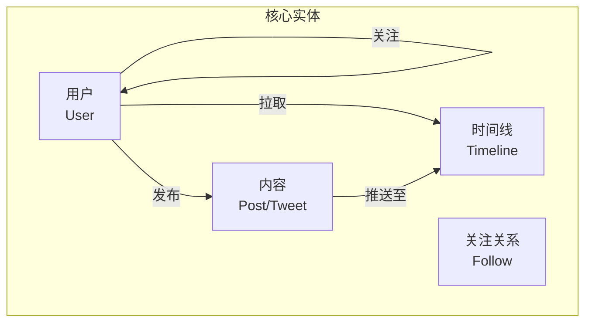
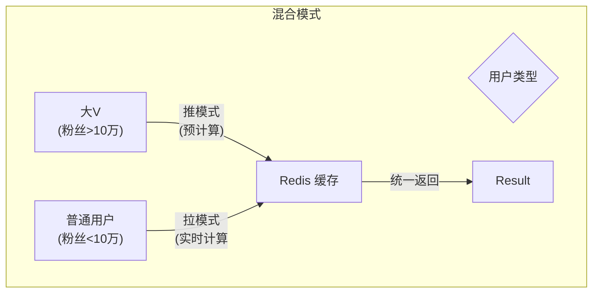
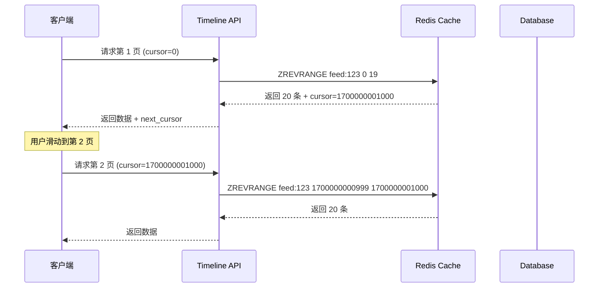
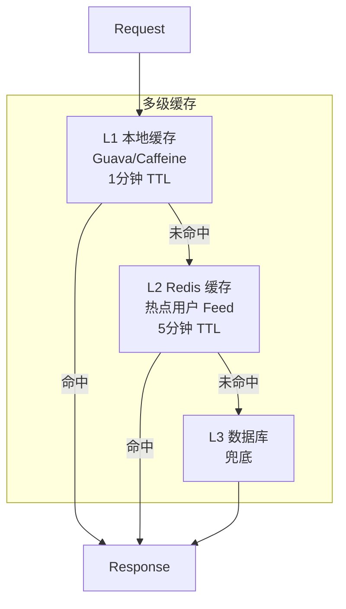
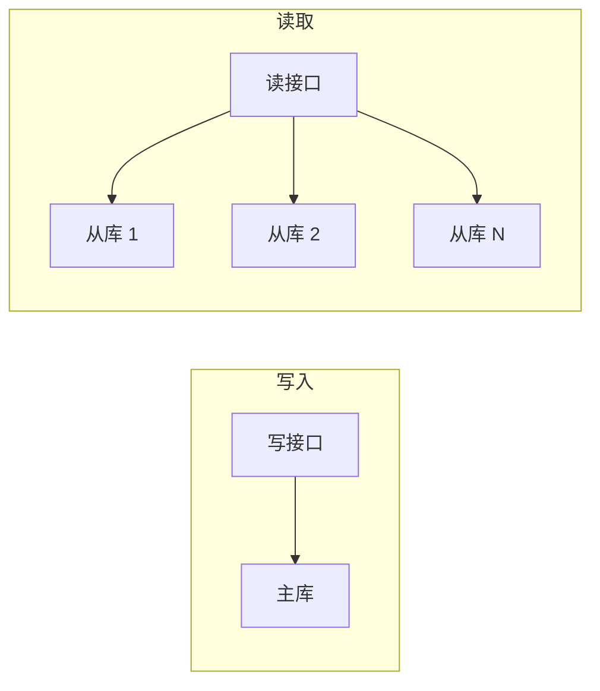

这个一个老生常谈的系统设计话题，不妨再回顾一下。

当你打开 Twitter、微博或者小红书，滑动手机屏幕，一条条动态实时出现在你眼前——这个看似简单的"刷微博"动作，背后是每秒处理数十万条动态生成的复杂系统。本文深入解析 Feed 流系统的核心架构，从推模式到拉模式，从缓存策略到分页设计，完整呈现这个社交平台核心基础设施的设计之道。

<!-- more -->

## 引言：Feed 流系统是什么？

Feed 流（信息流）是社交平台的核心功能：

- **Twitter**：你关注的人的推文
- **微博**：你关注的大V的博文
- **小红书**：你关注的博主的笔记
- **抖音/快手**：算法推荐给你的短视频

核心问题：**如何从数以亿计的内容中，筛选出用户想看的，并按时序呈现？**

## 一、核心概念与模型

### 1.1 Feed 流的核心实体



### 1.2 数据模型设计

```sql
-- 用户表
CREATE TABLE users (
    user_id BIGINT PRIMARY KEY,
    username VARCHAR(50),
    created_at TIMESTAMP
);

-- 关注关系表
CREATE TABLE follows (
    follower_id BIGINT,
    followee_id BIGINT,
    created_at TIMESTAMP,
    PRIMARY KEY (follower_id, followee_id)
);

-- 内容表
CREATE TABLE posts (
    post_id BIGINT PRIMARY KEY,
    user_id BIGINT,
    content TEXT,
    created_at TIMESTAMP,
    INDEX idx_user_created (user_id, created_at)
);

-- 用户动态表（用于推模式）
CREATE TABLE user_feed (
    user_id BIGINT,
    post_id BIGINT,
    created_at TIMESTAMP,
    PRIMARY KEY (user_id, created_at, post_id)
);
```

## 二、核心架构：推 vs 拉

### 2.1 两种模式对比

```mermaid
flowchart TB
    subgraph Push["推模式 (Push)<br/>写入时计算"]
        Post["发布内容"]
        PushService["推模式服务"]
        FollowerList["粉丝列表"]
        Fanout["Fanout Service"]
        FeedTable["每个粉丝的<br/>Feed 表"]
        
        Post --> PushService
        PushService --> Fanout
        Fanout --> FollowerList
        FollowerList --> FeedTable
    end
    
    subgraph Pull["拉模式 (Pull)<br/>读取时计算"]
        Request["用户请求"]
        PullService["拉取服务"]
        FollowList["关注列表"]
        PostTable["内容表"]
        Merge["合并排序"]
        Result["返回结果"]
        
        Request --> PullService
        PullService --> FollowList
        FollowList --> PostTable
        PostTable --> Merge
        Merge --> Result
    end
```



### 2.2 推模式 (Push)

**核心思想**：当用户发布内容时，立即计算并写入所有粉丝的 Feed 表

```python
class PushService:
    async def publish_post(self, user_id, post_id):
        # 1. 获取该用户的所有粉丝
        followers = await self.follow_db.get_followers(user_id)
        
        # 2. 批量写入每个粉丝的 Feed
        await self.redis.pipeline([
            redis.zadd(f"feed:{follower_id}", {post_id: timestamp})
            for follower_id in followers
        ])
        
        # 3. 同步写入数据库
        await self.db.batch_insert(user_feed_records)
```

**优点**：
- 读取时速度快，不需要计算
- 适合粉丝数量少的用户

**缺点**：
- 粉丝多时写入压力大（Fanout 爆炸）
- 新用户关注列表很大时体验差

### 2.3 拉模式 (Pull)

**核心思想**：用户请求 Feed 时，实时查询关注列表的内容并排序

```python
class PullService:
    async def get_timeline(self, user_id, limit=50):
        # 1. 获取关注列表
        following = await self.follow_db.get_following(user_id)
        
        # 2. 并行拉取每个关注者的最新内容
        tasks = [
            self.post_db.get_user_posts(followee_id, limit=100)
            for followee_id in following
        ]
        results = await asyncio.gather(*tasks)
        
        # 3. 合并并按时间排序
        all_posts = []
        for posts in results:
            all_posts.extend(posts)
        
        all_posts.sort(key=lambda x: x.created_at, reverse=True)
        
        return all_posts[:limit]
```

**优点**：
- 写入压力小
- 数据实时（不会有延迟）

**缺点**：
- 读取时需要大量计算
- 关注列表大时延迟高

### 2.4 混合模式 (Hybrid)

**业界最佳实践**：Twitter、微博采用混合模式



**策略**：
- **大 V**：使用推模式，发布时预计算到 Fanout Cache
- **普通用户**：使用拉模式，读取时实时计算
- **混合**：根据用户粉丝数量动态选择

## 三、核心模块设计

### 3.1 Fanout Service（推模式核心）

```java
public class FanoutService {
    
    @Autowired
    private UserFollowService followService;
    
    @Autowired
    private FeedCacheService feedCacheService;
    
    public void fanoutPost(Long postId, Long authorId) {
        // 1. 获取粉丝列表
        List<Long> followers = followService.getFollowers(authorId);
        
        // 2. 分批处理，避免内存爆炸
        List<List<Long>> batches = Lists.partition(followers, 500);
        
        for (List<Long> batch : batches) {
            // 3. 异步写入缓存
            fanoutToCache(batch, postId);
        }
    }
    
    private void fanoutToCache(List<Long> followers, Long postId) {
        // 使用 Redis ZSet 存储，按时间戳排序
        String postKey = "post:" + postId + ":created_at";
        long timestamp = System.currentTimeMillis();
        
        RedisTemplate<String, Object> template = getRedisTemplate();
        
        for (Long followerId : followers) {
            String feedKey = "feed:" + followerId;
            
            // ZADD 到粉丝的 Feed 列表
            template.opsForZSet().add(feedKey, postId, timestamp);
            
            // 保持 Feed 只保留最近 1000 条
            template.opsForZSet().removeRange(feedKey, 0, -1001);
        }
    }
}
```

### 3.2 Timeline Service（读取服务）

```python
class TimelineService:
    def __init__(self, redis_client, db_client):
        self.redis = redis_client
        self.db = db_client
    
    async def get_timeline(self, user_id: int, cursor: int = 0, limit: int = 20):
        # 1. 从 Redis 拉取
        feed_key = f"feed:{user_id}"
        
        # 获取游标之后的最新数据
        results = await self.redis.zrevrangebyscore(
            feed_key,
            max=cursor,
            start=0,
            num=limit,
            withscores=True
        )
        
        if results:
            # 2. 补充内容详情
            post_ids = [r[0] for r in results]
            posts = await self.db.get_posts_by_ids(post_ids)
            
            # 3. 构建响应
            return TimelineResponse(
                posts=posts,
                next_cursor=results[-1][1]  # 最后一个时间戳作为游标
            )
        
        # 4. Redis 无数据，降级到数据库
        return await self.get_timeline_from_db(user_id, cursor, limit)
```

### 3.3 分页设计



**游标分页 vs 偏移分页**：

| 方式 | 优点 | 缺点 |
|------|------|------|
| 游标 (Cursor) | 性能稳定，不随页数增加而变慢 | 不能跳页 |
| 偏移 (Offset) | 可以跳页 | 页数大时性能差 |

## 四、缓存策略

### 4.1 多级缓存架构



### 4.2 缓存预热

```python
class CacheWarmer:
    def __init__(self, redis, db):
        self.redis = redis
        self.db = db
    
    async def warm_user_feed(self, user_id: int):
        """预热用户的 Feed 缓存"""
        # 1. 获取用户的 Timeline
        posts = await self.get_user_timeline(user_id, limit=200)
        
        # 2. 写入 Redis
        feed_key = f"feed:{user_id}"
        pipe = self.redis.pipeline()
        
        for post in posts:
            pipe.zadd(feed_key, {post.id: post.created_at})
        
        pipe.expire(feed_key, 300)  # 5 分钟过期
        await pipe.execute()
```

## 五、高并发优化

### 5.1 读写分离



### 5.2 热点用户处理

```python
class InfluencerService:
    def __init__(self, redis, db):
        self.redis = redis
        self.db = db
    
    async def publish_post(self, user_id, content):
        # 1. 检查是否是热点用户
        follower_count = await self.redis.get(f"follower_count:{user_id}")
        
        if int(follower_count) > 100000:
            # 大 V：异步推模式
            await self.async_fanout(user_id, content)
        else:
            # 普通用户：直接写入
            await self.sync_publish(user_id, content)
    
    async def async_fanout(self, user_id, content):
        # 写入消息队列，异步处理
        await self.kafka.send("fanout_task", {
            "user_id": user_id,
            "content": content
        })
```

## 六、排序与个性化

### 6.1 基础排序

```python
def basic_sort(posts: List[Post]) -> List[Post]:
    """按时间倒序"""
    return sorted(posts, key=lambda x: x.created_at, reverse=True)
```

### 6.2 智能排序

```python
def smart_sort(posts: List[Post], user_id: int) -> List[Post]:
    """综合排序：时间 + 互动 + 权重"""
    
    # 获取用户历史互动
    likes = get_user_likes(user_id)
    retweets = get_user_retweets(user_id)
    
    scored_posts = []
    for post in posts:
        score = 0
        
        # 时间衰减因子
        hours_ago = (now - post.created_at) / 3600
        time_score = 1 / (1 + hours_ago * 0.1)
        
        # 互动加权
        interaction_score = (
            post.like_count * 1.0 +
            post.retweet_count * 2.0 +
            post.reply_count * 1.5
        ) / 100
        
        # 关注权重
        follow_weight = 3.0 if post.author_id in user_following else 1.0
        
        final_score = time_score * interaction_score * follow_weight
        scored_posts.append((post, final_score))
    
    # 按分数排序
    scored_posts.sort(key=lambda x: x[1], reverse=True)
    return [p[0] for p in scored_posts]
```

## 七、总结

### 7.1 架构选型

| 模式 | 适用场景 | 代表产品 |
|------|---------|---------|
| 推模式 | 粉丝少、内容多 | 微信公众号 |
| 拉模式 | 粉丝多、内容少 | 微博(早期) |
| **混合模式** | **通用** | **Twitter、微博** |

### 7.2 核心设计原则

1. **读写分离**：写入推模式，读取用缓存
2. **分级处理**：大 V 单独处理，避免 Fanout 爆炸
3. **降级兜底**：缓存失效时降级到数据库
4. **分页游标**：避免深度分页性能问题

### 7.3 技术选型

| 模块 | 技术选型 |
|------|---------|
| 缓存 | Redis Cluster |
| 消息队列 | Kafka |
| 存储 | MySQL + HBase |
| 搜索 | Elasticsearch |

**一句话总结**：Feed 流系统的核心是**用空间换时间**（预计算）、**用缓存换性能**（多级缓存）、**用降级换可用**（容灾方案）。

