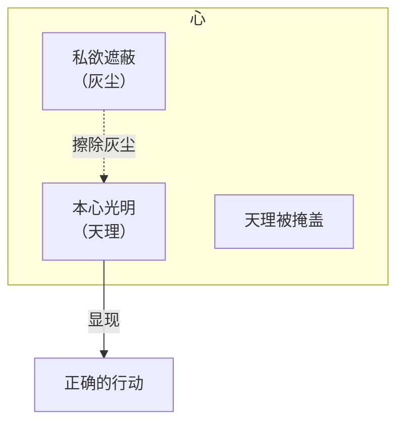
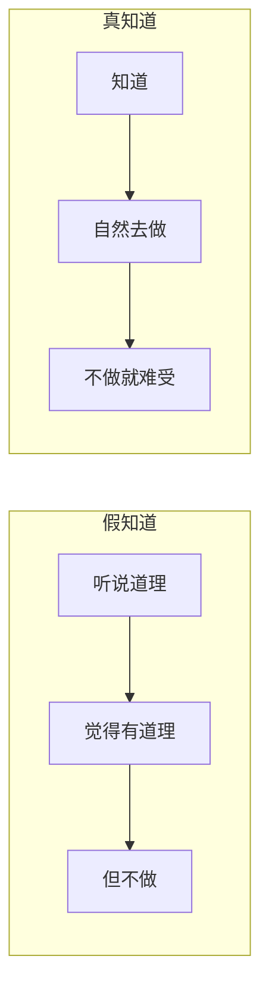
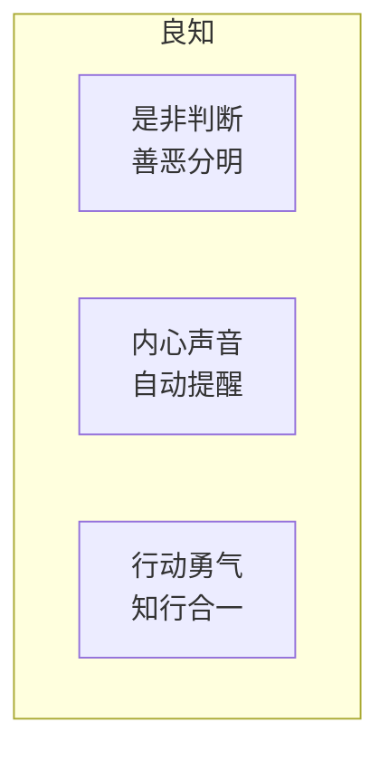
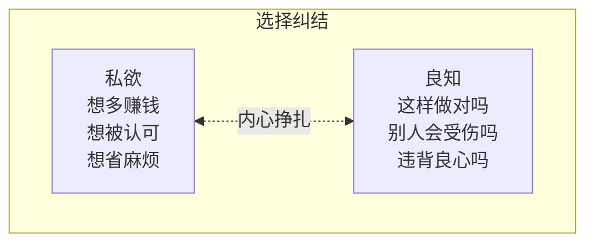
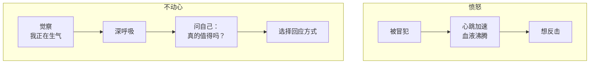
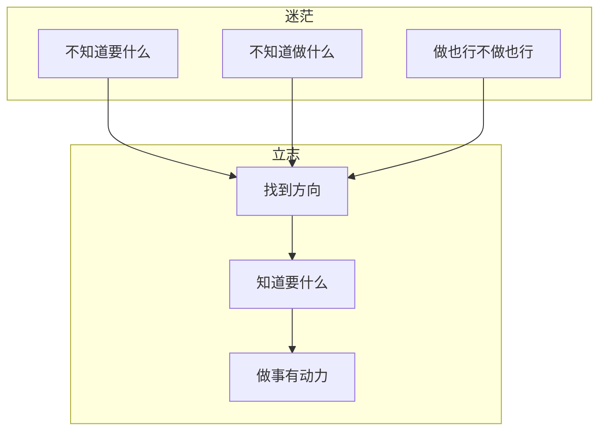
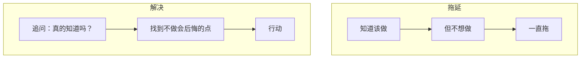

- 五百年前，明代大儒王阳明龙场悟道，创立了"心即理"、"知行合一"、"致良知"的心学体系。
- 五百年后的今天，当我们面对焦虑、迷茫、选择困难时，这套学说依然具有惊人的生命力。

<!-- more -->

## 引言：为什么是王阳明？

王阳明（1472-1529），名守仁，字伯安，浙江余姚人。

他的一生充满传奇：
- 少年时立志做"圣人"
- 28 岁中进士，曾任兵部尚书
- 35 岁因直言被贬贵州龙场驿
- 龙场悟道后开创心学一派
- 平定宁王之乱，以文臣身份立下军功
- 去世时留下一句："此心光明，亦复何言"

**为什么五百年后的今天，我们还要读王阳明？**

因为这个时代：
- 信息爆炸，我们知道很多道理，却依然过不好这一生
- 物质丰富，我们却越来越焦虑
- 选择太多，我们反而不知道该做什么

这些问题，王阳明在五百年前就给出了答案。

## 第一部分：心学的三个核心

### 1.1 心即理：一切都在心中

> "此心无私欲之蔽，即是天理，不须外面添一分。"

**什么意思？**

王阳明说，天理不在外面，而在心中。  
普通人觉得"天理"是外在的道德规范、社会规则，所以要去外面"求理"。  
但王阳明说：**你心里本来就 有天理，只是被私欲遮蔽了。**



**日常生活中的对应：**

| 困惑 | 心学的解读 |
|------|-----------|
| "我不知道该怎么做" | 你心里其实知道，只是被恐惧/欲望遮蔽了 |
| "我需要别人告诉我对错" | 对错不在别人嘴里，在你心里 |
| "我总是做错决定" | 不是能力问题，是私欲干扰了判断 |

**实践口诀**：  
遇到选择时，先问自己：**"我到底想要什么？"** 不是"别人会怎么看"，不是"能得到什么好处"，而是——**我真正认同什么？**

### 1.2 知行合一：知道就是做到

> "知是行之始，行是知之成。"

**最大的误解**

很多人把"知行合一"理解为"知道了就要去做"。  
但王阳明的意思是：**知道和做到本来就是一件事，不是两件事。**

**你做不到，说明你不知道。**



**举个例子：**

- 很多人"知道"抽烟不好，但还是在抽 → 这是"假知道"
- 真正"知道"抽烟不好的人，看见烟就不舒服，自然不抽 → 这是"真知道"

**在日常工作中的应用：**

| 场景 | 假知道 | 真知道 |
|------|--------|--------|
| 学习 | "我知道要每天学习" | 不学习就难受，自然去学 |
| 健身 | "我知道要健身" | 几天不健身浑身不舒服 |
| 陪伴家人 | "我知道要陪家人" | 忙完工作就想回家 |

**实践方法**：  
不要问自己"我该怎么做"，而是问自己——**"我真的相信这个道理吗？"** 如果你还在犹豫，说明还不是"真知道"。

### 1.3 致良知：听从内心的声音

> "致良知"是王阳明晚年最核心的教导。

**什么是良知？**

王阳明说，**每个人都有良知**，这是人区别于动物的根本。  
良知就是**是非之心**——你知道什么是对，什么是错。



**但为什么我们常常"昧着良心"做事？**

因为**私欲遮蔽了良知**。

- 明明知道该诚实，但为了利益还是说谎
- 明明知道该陪伴家人，但为了工作还是忽略
- 明明知道该拒绝，但为了面子还是答应

**致良知，就是"擦亮心上的灰尘"，让良知重新显现。**

## 第二部分：心学在日常生活的应用

### 2.1 当你焦虑时——"事上磨练"

> "人须在事上磨练，做功夫，乃有益。"

**现代人的焦虑**

- 担心未来
- 后悔过去
- 纠结现在

**王阳明的回答**：**不要空想，去做事。**

```
焦虑的本质 = 想的太多，做的太少

解决方案 = 在事上磨练
```

**具体做法：**

```python
# 心学版本的"应对焦虑"
def handle_anxiety():
    # 错误做法：一直想
    while True:
        think_about_future()  # 越想越焦虑
        think_about_past()     # 越想越后悔
    
    # 正确做法：去做事
    while True:
        do_something()        # 专注眼前的事
        observe_mind()        # 观察自己的念头
        return_to_present()   # 回到当下
```

**案例**：

> 王阳明被贬龙场时，环境恶劣，瘴气弥漫，跟随他的仆从都病倒了。  
> 他没有焦虑抱怨，而是**该读书读书，该开荒开荒，该教化当地人就教化**。  
> 就在这种"事上磨练"中，他悟出了"知行合一"的道理。

### 2.2 当你纠结选择时——"致良知"

> "良知只是个是非之心，是非只是个好恶。"

**选择困难的本质**

不是不知道选项的好坏，而是**私欲和良知在打架**。



**实践方法：**

1. **把所有选项写下来**
2. **问自己：哪个选择让我"心安"？**
3. **不要问"哪个利益最大"，要问"哪个是正确的"**

**案例**：

> 一个学生问王阳明："如果我在路上看到小孩落水，救还是不救？"  
> 王阳明说："这还用问？看到就应该救。"  
> 学生说："可是我不会游泳，救不了啊。"  
> 王阳明说："**不是你会不会的问题，是你有没有那颗心。** 你有这颗心，自然会想办法去救。"

### 2.3 当你愤怒时——"不动心"

> "凡文过掩慝，此心天理不明，则人欲间之矣。"

**情绪管理的本质**

不是"压抑情绪"，而是**不被情绪带走**。



**实践技巧：**

1. **停下来**：感觉要生气时，先停 3 秒
2. **问自己**：我在气什么？是事实，还是我的解读？
3. **回到良知**：这样做符合我认同的价值观吗？

**王阳明的故事**：

> 宁王朱宸濠叛乱，王阳明以文臣身份率军平叛。  
> 手下将领打了败仗，来请罪。  
> 王阳明说：**"胜负乃兵家常事，何罪之有？"** 面色如常。  
> 后来打了胜仗，部下来报喜，王阳明也很平静。  
> 弟子问："老师是用兵如神，有什么特别的方法吗？"  
> 王阳明说：**"**不动心**。凡事顺其自然，该怎么做就怎么做，不被胜负之心牵动。"**

### 2.4 当你迷茫时——"立志"

> "志不立，天下无可成之事。"

**迷茫的根源**

不是没有路，而是**没有方向**。



**如何立志？**

王阳明说：**"志当存高远。"**

但这个"志"，不是"我要赚多少钱"、"我要当多大官"，而是——**我此生要成为一个什么样的人。**

```python
# 立志的方法
def find_life_purpose():
    # 错误立志（外在目标）
    wrong_goals = [
        "我要赚 1 个亿",
        "我要当 CEO",
        "我要买大房子"
    ]
    
    # 正确立志（内在价值）
    right_goals = [
        "我要成为一个正直的人",
        "我要做一个对社会有贡献的人",
        "我要成为一个好父亲/母亲",
        "我要此心光明"
    ]
    
    return right_goals
```

**实践方法**：

1. **每天问自己：如果生命只剩一年，我后悔没做什么？**
2. **写下你的墓志铭：你希望别人怎么评价你？**
3. **找到一个榜样：你想成为什么样的人？**

### 2.5 当你拖延时——"知行合一"

> "知之真切笃实处即是行，行之明觉精察处即是知。"

**拖延的真相**

拖延不是因为你"懒"，而是你**不是真的知道**这件事重要。



**实践技巧：**

1. **5 秒法则**：想到就做，不要等
2. **最小行动**：先做 5 分钟，不管结果
3. **追问"为什么不做了"**：找到真正的阻力

## 第三部分：心学的现代解读

### 3.1 心学 vs 心理学

| 心理学 | 心学 |
|--------|------|
| 分析问题 | 直接解决问题 |
| 关注过去创伤 | 关注当下选择 |
| 理解"为什么" | 知道"怎么做" |

**心学的优势**：  
不纠结过去，不分析动机，而是——**现在开始，做正确的事。**

### 3.2 心学 vs 成功学

| 成功学 | 心学 |
|--------|------|
| 强调技巧、方法 | 强调心性、品德 |
| 追求外在成就 | 追求内在光明 |
| 教你"得到" | 教你"放下" |

**心学的核心**：  
不是"怎么成功"，而是"怎么做人"。  
把人做好了，成功是自然的结果。

## 第四部分：每日实践清单

### 晨间三问

1. **今天最重要的一件事是什么？**
2. **做这件事，我的发心是什么？**
3. **如果这件事做砸了，我还能心安吗？**

### 夜间三省

1. **今天做了什么违背良心的事？**
2. **今天有什么该做但没做的？**
3. **明天我要改进什么？**

### 日常口诀

```
遇到选择 → 问良知
遇到困难 → 事上磨练
遇到情绪 → 不动心
遇到迷茫 → 立志向
遇到拖延 → 知行合一
```

## 第五部分：常见误区

### ❌ 误区一：心学是"唯心主义"

王阳明说的"心"，不是"主观想象"，而是**直觉判断是非的能力**。

这和现代心理学说的"良知"、"道德直觉"是类似的。

### ❌ 误区二：心学是"阿Q精神"

心学不是"只要心里想开了就行"，而是**要在事上验证**。

王阳明说："**知行合一**"——你说你知道，那就做给我看。

### ❌ 误区三：心学是"躺平"

恰恰相反，心学是**最积极的人生态度**。

"致良知"意味着你必须行动，必须承担责任，不能逃避。

## 结语：此心光明

王阳明临终前，弟子问还有什么遗言，他说：

> **"此心光明，亦复何言。"**

这句话翻译成白话就是：**我的心是光明的，这一生没有遗憾，你们不必为我悲伤。**

这是何等的自信与坦然。

我们普通人，可能达不到圣人的境界，但可以**每一天都朝着这个方向努力**：

- 做一个问心无愧的人
- 做一个知行合一的人
- 做一个致良知的人

**不是在明天，不是等退休，就是——现在开始。**

## 参考资料

- 《王阳明全集》
- 《传习录》徐爱录
- 《知行合一王阳明》度阴山
- 《王阳明哲学》蔡仁厚
