"何设计一个类似微信的聊天 App？"
微信作为一个支撑 10 亿+ 用户、日活数亿的超级 App，其架构蕴含的智慧值得每个工程师深入学习。

<!-- more -->

## 引言：聊天 App 的复杂度超乎想象

很多人觉得聊天 App 很简单："不就是发消息吗？"

但当你真正要设计一个日活数亿、消息必达、功能丰富的聊天系统时，会发现它可能是你接触过最复杂的系统之一：

- **实时性**：消息延迟要在 200ms 以内
- **可靠性**：消息不能丢、不能重复
- **高并发**：同时在线用户数千万
- **功能丰富**：文字、图片、语音、视频、表情、位置、红包、小程序...
- **跨设备**：手机、平板、电脑、Web 多端同步
- **全球化**：全球部署、低延迟访问

这已经不是一个"小而美"的系统，而是一个**超级分布式系统**。

## 一、需求分析：我们要设计什么？

### 1.1 核心功能

| 功能 | 描述 | 技术难点 |
|------|------|---------|
| 1v1 聊天 | 私聊、消息必达 | 实时推送、离线消息 |
| 群聊 | 多人聊天、满 500 人 | Fan-out 优化 |
| 消息类型 | 文字/图片/语音/视频/表情 | 媒体存储 |
| 已读回执 | 显示"已读" | 状态同步 |
| 在线状态 | 显示"在线/离线" | 心跳管理 |
| 消息撤回 | 撤回消息 | 分布式事务 |
| 朋友圈/状态 | 类似微信朋友圈 | Feed 流设计 |
| 语音/视频通话 | 实时音视频 | WebRTC |
| 消息搜索 | 搜索聊天记录 | 搜索引擎 |

### 1.2 非功能性需求

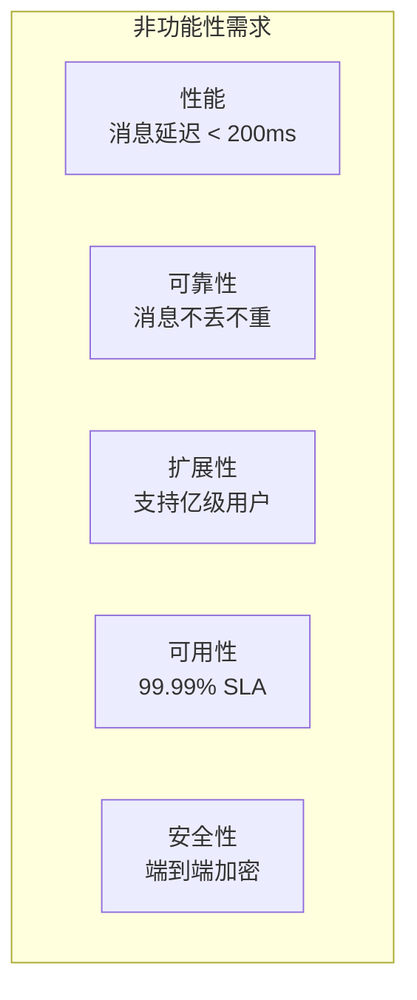

- **消息延迟**：端到端延迟 < 200ms（同一地域）
- **消息必达**：离线消息也要送达，消息不丢失
- **消息不重复**：避免重复展示
- **可用性**：99.99% SLA，全年故障时间 < 53 分钟
- **扩展性**：支持从 1 万到 10 亿用户
- **安全性**：端到端加密（E2EE）

## 二、整体架构设计

### 2.1 架构总览

```mermaid
flowchart TB
    subgraph Client["客户端"]
        App["微信/QQ<br/>移动端"]
        PC["桌面客户端"]
        Web["Web 版本"]
    end
    
    subgraph Gateway["接入层"]
        LB["负载均衡<br/>L4/L7"]
        WSG["WebSocket<br/>Gateway"]
        APIG["API<br/>Gateway"]
    end
    
    subgraph Service["服务层"]
        Msg["消息服务"]
        Auth["认证服务"]
        Relation["关系服务"]
        Profile["用户服务"]
        Push["推送服务"]
        File["文件服务"]
    end
    
    subgraph Storage["存储层"]
        Redis["Redis Cluster<br/>缓存/消息队列"]
        MySQL["MySQL Cluster<br/>消息/用户"]
        HBase["HBase<br/>历史消息"]
        ES["Elasticsearch<br/>搜索"]
        OSS["对象存储<br/>图片/视频"]
    end
    
    subgraph RTC["实时通信"]
        RTC["音视频服务<br/>WebRTC"]
    end
    
    App & PC & Web --> LB
    LB --> WSG & APIG
    WSG & APIG --> Msg & Auth & Relation & Profile & Push & File
    Msg & Auth & Relation & Push --> Redis
    Msg & Auth & Relation & Profile --> MySQL
    Msg --> HBase
    Msg --> ES
    File --> OSS
    App & PC --> RTC
```

### 2.2 分层设计

```
┌─────────────────────────────────────────────────────────┐
│                      客户端层                           │
│  (iOS / Android / Windows / Mac / Web)                │
└──────────────────────────┬──────────────────────────────┘
                           │
┌──────────────────────────▼──────────────────────────────┐
│                      接入层                              │
│  ┌─────────────┐  ┌─────────────┐  ┌─────────────┐     │
│  │ 负载均衡器   │  │ WebSocket   │  │   API       │     │
│  │  (L4/L7)    │  │  Gateway   │  │  Gateway   │     │
│  └─────────────┘  └─────────────┘  └─────────────┘     │
└──────────────────────────┬──────────────────────────────┘
                           │
┌──────────────────────────▼──────────────────────────────┐
│                      业务层                              │
│  ┌────────┐  ┌────────┐  ┌────────┐  ┌────────┐       │
│  │ 消息服务 │  │ 用户服务 │  │ 关系服务 │  │ 推送服务 │       │
│  └────────┘  └────────┘  └────────┘  └────────┘       │
│  ┌────────┐  ┌────────┐  ┌────────┐  ┌────────┐       │
│  │ 群服务  │  │ 文件服务 │  │ 通话服务 │  │ 朋友圈  │       │
│  └────────┘  └────────┘  └────────┘  └────────┘       │
└──────────────────────────┬──────────────────────────────┘
                           │
┌──────────────────────────▼──────────────────────────────┐
│                      存储层                              │
│  ┌────────┐  ┌────────┐  ┌────────┐  ┌────────┐       │
│  │ Redis  │  │ MySQL  │  │ HBase  │  │  ES    │       │
│  │ 缓存/  │  │ 业务   │  │ 历史   │  │ 搜索   │       │
│  │ 消息队列│  │ 数据   │  │ 消息   │  │       │       │
│  └────────┘  └────────┘  └────────┘  └────────┘       │
│  ┌─────────────────────────────────────────────┐       │
│  │           对象存储 (OSS/S3)                  │       │
│  │           图片/语音/视频/文件                 │       │
│  └─────────────────────────────────────────────┘       │
└─────────────────────────────────────────────────────────┘
```

## 三、核心模块设计

### 3.1 长连接管理：WebSocket Gateway

聊天系统的核心是**长连接**——建立一次 TCP 连接，双方可以随时互相发消息。

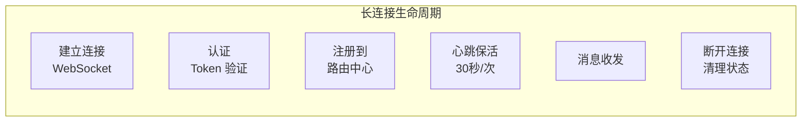

### 3.2 消息模型设计

```java
// 消息模型
class Message {
    Long msgId;           // 消息唯一 ID (snowflake)
    Long senderId;       // 发送者 ID
    Long receiverId;     // 接收者 ID (单人/群 ID)
    Integer type;        // 消息类型 (1:文本 2:图片 3:语音 4:视频...)
    String content;      // 消息内容
    Long timestamp;      // 发送时间
    Integer status;      // 消息状态 (0:发送中 1:已发送 2:已送达 3:已读)
    String msgKey;       // 幂等 Key (senderId + receiverId + timestamp)
}
```

**消息 ID 生成**：使用 Snowflake 算法

```python
# Snowflake: 64 位 ID = 1位符号 + 41位时间戳 + 10位机器ID + 12位序列号
def generate_msg_id():
    timestamp = int(time.time() * 1000) - 1609459200000  # 2021-01-01
    machine_id = get_machine_id()
    sequence = get_sequence()
    
    msg_id = (timestamp << 22) | (machine_id << 12) | sequence
    return msg_id
```

### 3.3 消息发送流程

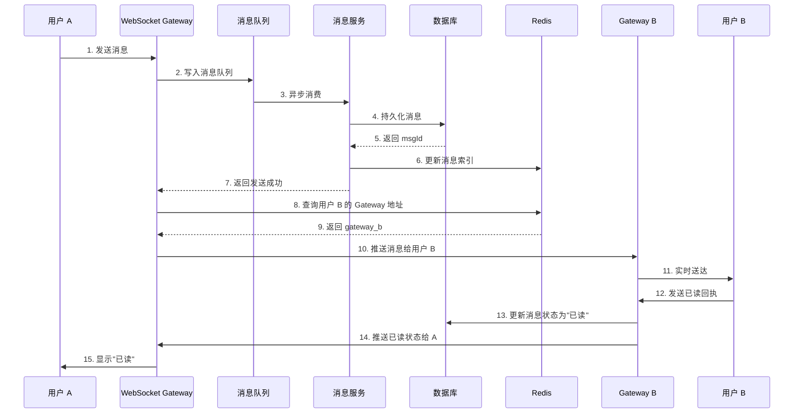

### 3.4 消息存储设计

#### 3.4.1 分表策略

```sql
-- 消息表按 receiver_id 分片
CREATE TABLE messages_00 (
    id BIGINT PRIMARY KEY,
    receiver_id BIGINT NOT NULL,
    sender_id BIGINT NOT NULL,
    type INT,
    content TEXT,
    created_at BIGINT,
    INDEX idx_receiver_created (receiver_id, created_at)
) PARTITION BY HASH(receiver_id) PARTITIONS 256;
```

**分片策略**：
- 按 `receiver_id` 哈希分片，保证同一用户的消息在同一分片
- 按月/按年归档，历史消息迁移到冷存储

#### 3.4.2 多层存储架构

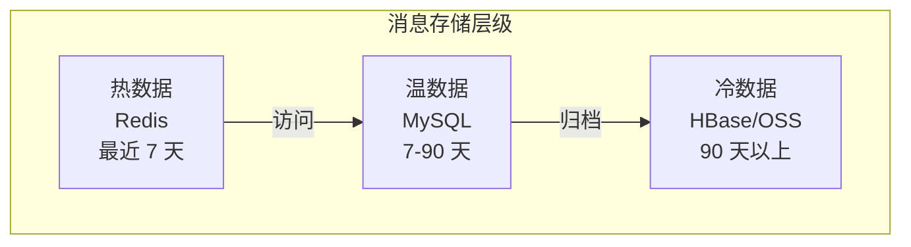

## 四、群聊系统设计

### 4.1 群消息的挑战

群聊和 1v1 聊天完全不同：

| 场景 | 1v1 聊天 | 群聊 (500人) |
|------|---------|-------------|
| 消息分发 | 1 人 | 499 人 |
| Fan-out | 简单 | 复杂 |
| 离线处理 | 1 人 | 499 人 |

### 4.2 群消息的 Fan-out 策略

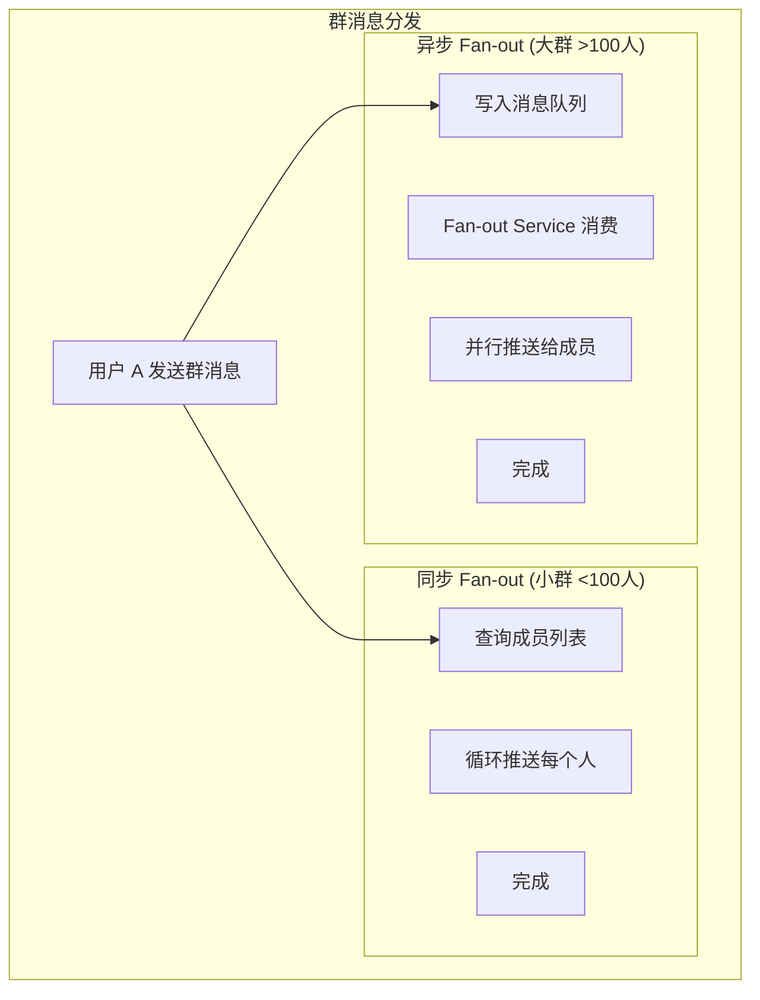

**优化策略**：

```python
# 群消息分发伪代码
async def send_group_message(group_id, sender_id, message):
    group = get_group(group_id)
    member_count = len(group.members)
    
    if member_count < 100:
        # 小群：同步 Fan-out
        for member_id in group.members:
            await push_to_user(member_id, message)
    else:
        # 大群：异步 Fan-out
        await mq.publish(f"group_msg_{group_id}", message)
        # Fan-out Service 异步处理
```

### 4.3 群消息的幂等性

```python
# 群消息幂等 Key
def generate_group_msg_key(group_id, sender_id, client_msg_id):
    return f"group_msg:{group_id}:{sender_id}:{client_msg_id}"

# 消费消息时检查
async def consume_group_message(message):
    key = generate_group_msg_key(message.group_id, message.sender_id, message.client_msg_id)
    
    # 检查是否已处理
    if await redis.exists(key):
        return  # 重复消息，直接丢弃
    
    # 处理消息
    await process_message(message)
    
    # 标记已处理（设置过期时间）
    await redis.setex(key, 86400, "1")  # 24 小时过期
```

## 五、在线状态与消息推送

### 5.1 在线状态管理

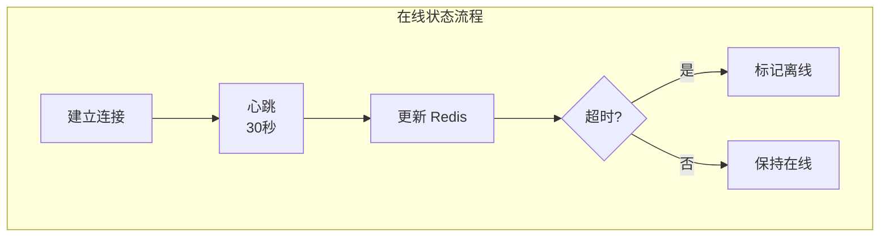

### 5.2 推送服务架构

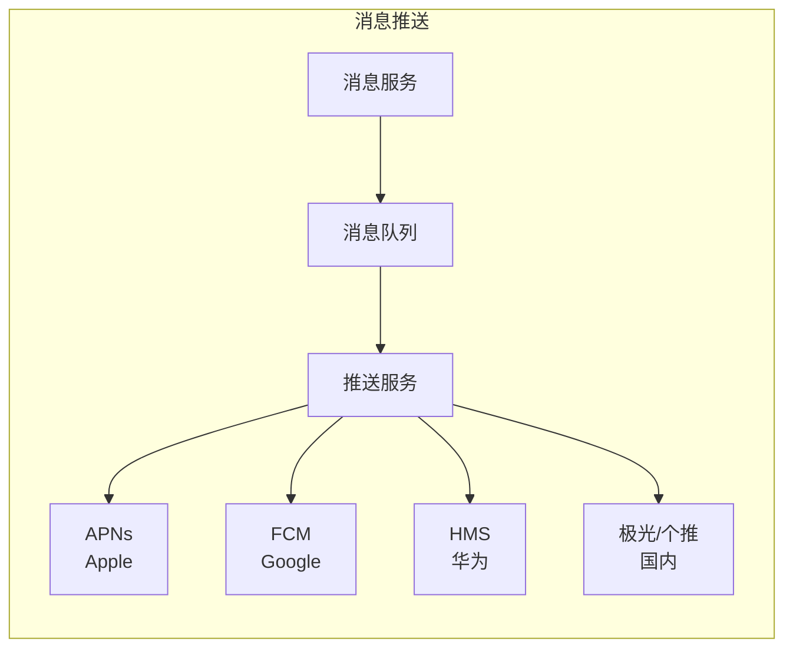

**推送策略**：

| 状态 | 推送方式 |
|------|---------|
| 在线 | WebSocket 实时推送 |
| 离线 | 推送系统 (APNs/FCM) |
| 夜间/勿扰 | 累计通知栏 |

## 六、消息漫游与多端同步

### 6.1 多端同步问题

用户在手机、平板、电脑上登录，消息需要实时同步：

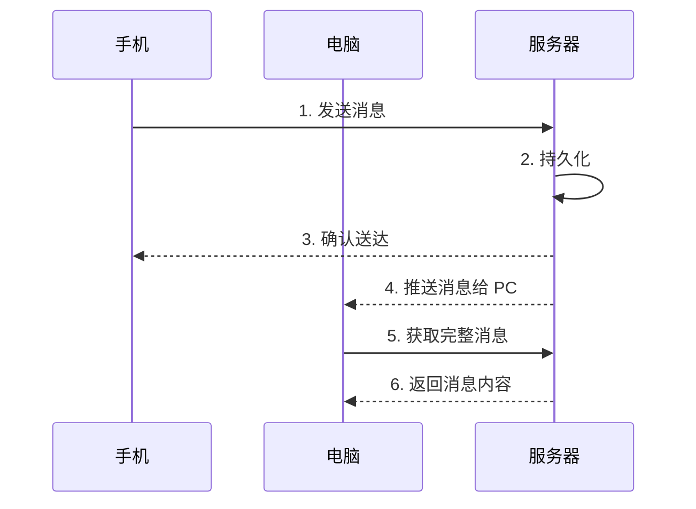

### 6.2 消息漫游实现

```python
# 消息漫游服务
class MessageRoamingService:
    def __init__(self, cache, db):
        self.cache = cache
        self.db = db
    
    async def get_messages(self, user_id, device_id, limit=50):
        # 1. 先从缓存获取最近消息
        cached = await self.cache.get(f"roaming:{user_id}:{device_id}")
        if cached:
            return cached
        
        # 2. 缓存 miss，从数据库获取
        messages = await self.db.query("""
            SELECT * FROM messages 
            WHERE receiver_id = %s 
            ORDER BY created_at DESC 
            LIMIT %s
        """, user_id, limit)
        
        # 3. 写入缓存
        await self.cache.set(f"roaming:{user_id}:{device_id}", messages, expire=3600)
        
        return messages
```

## 七、安全性设计

### 7.1 端到端加密 (E2EE)

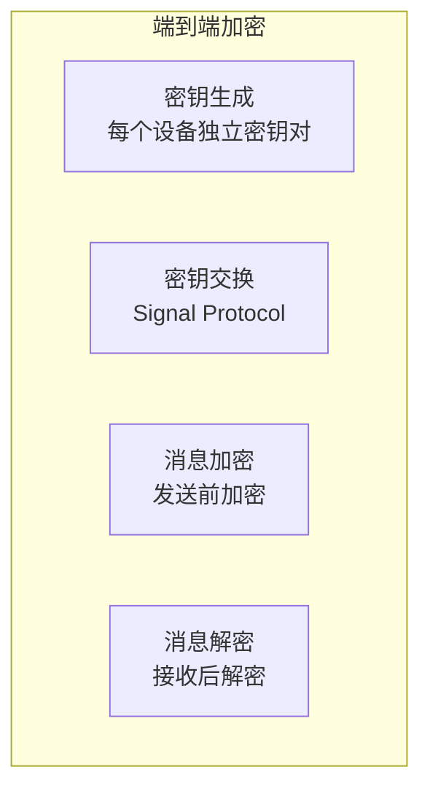

**Signal Protocol 的核心**：

```python
# 简化的 E2EE 流程
class E2EEncryption:
    def __init__(self):
        self.key_pair = generate_key_pair()  # Curve25519
    
    def encrypt(self, message, recipient_public_key):
        # 生成临时密钥对
        ephemeral_key = generate_key_pair()
        
        # ECDH 密钥协商
        shared_secret = ecdh(
            ephemeral_key.private,
            recipient_public_key
        )
        
        # AES-GCM 加密
        ciphertext = aes_encrypt(shared_secret, message)
        
        return {
            'ephemeral_public': ephemeral_key.public,
            'ciphertext': ciphertext
        }
```

### 7.2 传输安全

- **TLS 1.3**：全程 HTTPS/WSS 加密
- **证书固定 (Certificate Pinning)**：防止中间人攻击
- **设备绑定**：敏感操作需要设备验证

## 八、搜索功能设计

### 8.1 搜索架构

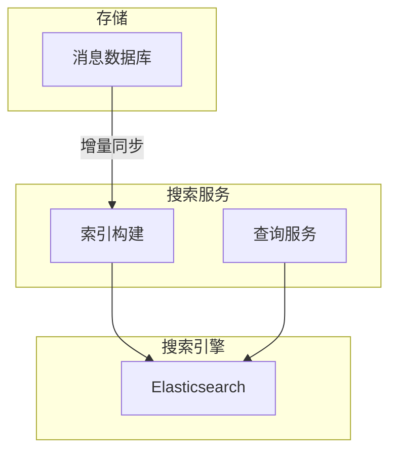

### 8.2 搜索优化

```python
# 搜索服务
class SearchService:
    def __init__(self, es_client):
        self.es = es_client
    
    async def search_messages(self, user_id, keyword, limit=20):
        # 搜索当前用户有权限的消息
        result = await self.es.search(
            index="messages",
            body={
                "query": {
                    "bool": {
                        "must": [
                            {"term": {"keyword": keyword}},
                            {"term": {"user_id": user_id}}  # 权限过滤
                        ]
                    }
                },
                "highlight": {
                    "fields": {"content": {}}
                },
                "size": limit
            }
        )
        
        return self.format_result(result)
```

## 九、扩展性与高可用

### 9.1 多 Region 部署

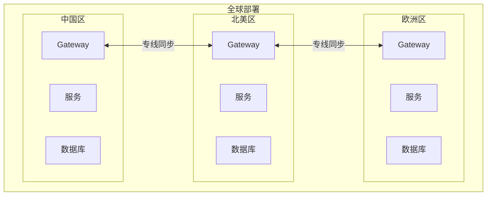

### 9.2 容灾与故障转移

| 组件 | 容灾策略 |
|------|---------|
| Gateway | 多集群部署，Load Balancer 切换 |
| 消息服务 | 主备切换，消息队列持久化 |
| 数据库 | 主从复制，跨机房部署 |
| 缓存 | Redis Cluster，自动故障转移 |

## 十、总结

### 10.1 核心设计原则

1. **长连接 + 短轮询结合**：WebSocket 保持实时性，HTTP 处理非实时请求
2. **消息队列解耦**：削峰填谷，保证系统稳定性
3. **多层存储架构**：热/温/冷数据分层，平衡性能与成本
4. **灰度发布**：新功能先在小范围验证
5. **监控告警**：全链路监控，问题早发现

### 10.2 关键技术选型

| 模块 | 技术选型 | 理由 |
|------|---------|------|
| 长连接 | WebSocket | 双向通信，低延迟 |
| 消息队列 | Kafka | 高吞吐，持久化 |
| 缓存 | Redis Cluster | 高性能，丰富数据结构 |
| 消息存储 | MySQL + HBase | 事务 + 大数据 |
| 搜索 | Elasticsearch | 全文搜索 |
| 对象存储 | S3/OSS | 海量文件存储 |

### 10.3 微信的特殊优化

> **彩蛋**：微信的哪些"神优化"？

1. **省电模式**：智能心跳，节省电量
2. **弱网优化**：消息聚合发送，减少请求
3. **本地缓存**：减少服务器请求
4. **增量同步**：只同步新增消息
5. **通道复用**：复用 TCP 连接

## 参考资料

- [System Design: WhatsApp - Hello Interview](https://www.hellointerview.com/learn/system-design/problem-breakdowns/whatsapp)
- [Designing a Real-Time Chat App - ByteByteGo](https://bytebytego.com/)
- [Messenger System Design - Facebook Engineering](https://engineering.fb.com/)
- [Discord Architecture - proformal](https://discord.com/blog)
