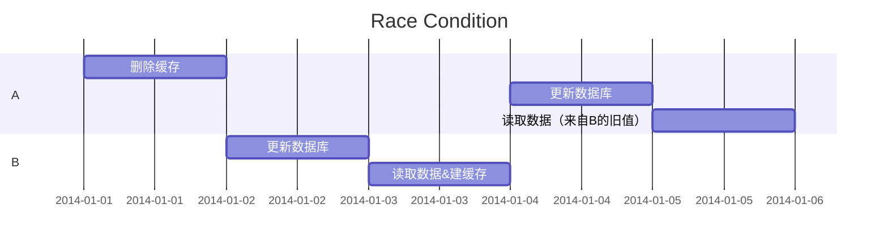
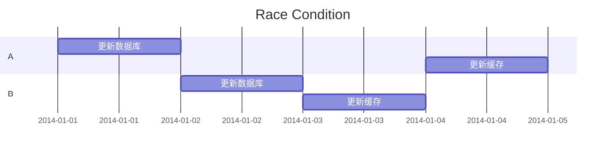
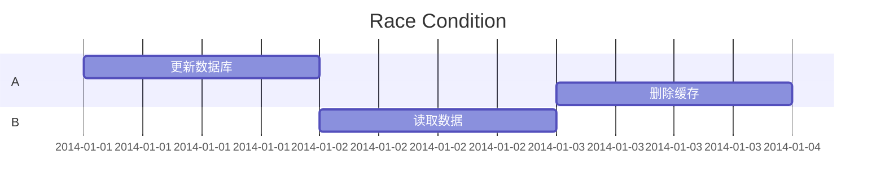
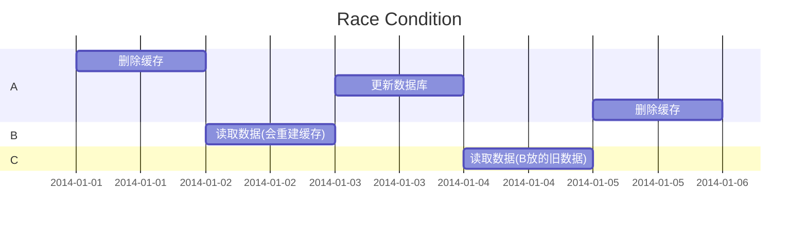

在现代软件架构中，缓存是提高系统性能和扩展性的关键组件之一。然而，缓存的有效管理，特别是缓存更新策略，对于保持数据一致性和系统可靠性至关重要。

本文将简单探讨和比较几种常见的缓存更新策略，以及它们各自的优缺点。

Note: 启发自 [《从程序员到架构师：大数据量 缓存、高并发、微服务 多团队协同等核心场景实战》](https://book.douban.com/subject/35834352/)一书的`第四章：读缓存`。

<!-- more -->

## 更新缓存的挑战
更新缓存涉及到两个基本步骤：`更新数据库`和`更新缓存`。

尽管这两步听起来简单，但在实际操作中需要考虑多个问题：
1. 是否先更新数据库还是先更新缓存？
2. 更新缓存时是先删除还是直接更新？
3. 如果第一步成功而第二步失败，该如何处理？
4. 如果两个线程同时更新同一个数据，如何保证数据一致性？

这些问题的复杂性导致了多种缓存更新组合方案的产生。

!!! note Info
    假设，我们采用Redis作为缓存，MySQL作为数据库。

## 缓存更新策略的比较
### 组合1：先更新缓存，再更新数据库

虽然redis支持事务，但是不支持回滚。因此，这种方案可能导致更新数据库失败后，只能手动回滚redis的操作。

如果在多线程同时更新的时候，会导致不一致的问题，如果更新过程中加锁，虽然可以保证数据一致性，但会大大降低系统的可用性。

因此，这种方案成本较高，不推荐使用。

### 组合2：先删除缓存，再更新数据库

这种方案避免了更新失败需要回滚缓存的问题，但可能引入缓存与数据库不一致的情况。

如图，A和B几乎都在同一时间更新数据X，A先删除了缓存，但是B在A完成数据库更新前，就完成了缓存重建的工作，最后A读取X的时候就是缓存的B的旧值。

按照惯例，依旧可以通过加锁来解决这个问题，但是这样会大大降低系统的可用性。

这里就涉及了高可用性和一致性取舍的问题。这就需要根据具体业务和需求来讨论了。

### 组合3：先更新数据库，再更新缓存

如果更新数据库成功，而更新缓存失败，本身问题不大，不需回滚，后期在读取的时候，系统会自动尝试建缓存。

这样又悲剧了，A把缓存又改成了旧值。

又来了：+🔒，蛋都碎了，为了更新缓存，给数据库读写加锁，有点杀鸡用牛刀了。

### 组合4：先更新数据库，再删除缓存

这种方案解决了组合3中的一些问题，尤其是在处理并发更新时。通过删除缓存来强制后续的读操作去数据库中获取最新值，从而保证了数据的一致性。但是又引入了新的问题：`这个时候B读取的时候，读到的是旧值`。

### 组合5：先删除缓存，更新数据库，再删除缓存

这个方案试图通过在更新操作前后都删除缓存来最小化数据不一致的风险。尽管这种方案并不完美(如下图，`C会读到B存放在缓存中的旧数据`)，但它在减少脏数据读取的概率方面做得更好。

## 解决方案的选择
选择哪种缓存更新策略取决于具体的应用场景和对一致性、可用性以及系统性能的要求。没有一种方案是完美的，每种方案都有可能读取到脏数据，但是通过合理的设计可以最小化这种风险。

!!! note 原文引用书作者的建议
    任何一个方案都不是完美的，但如果剩下1%的问题需要花好几倍的代价去解决，从技术上来讲得不偿失，这就要求架构师去说服业务方，去平衡技术的成本和收益。
